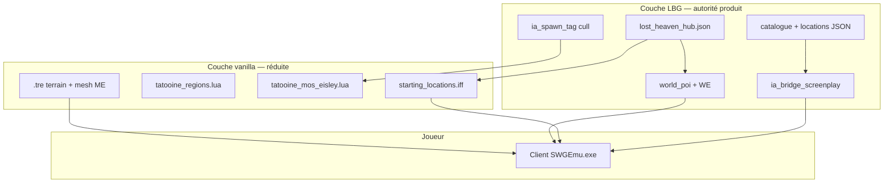

# ADR 0009 — Scrapaltai & Lost Heaven (remplacement hub Mos Eisley)

**Statut** : accepté (2026-06-01)  
**Contexte** : le monde Prime est quasi vidé (`ia_spawn_tag.lua`) mais le **client SWG** affiche encore Tatooine vanilla (Mos Eisley, Anchorhead, etc.). L’objectif produit est de **recentrer le jeu** sur une ville LBG dans le désert, avec un nom de planète affiché **Scrapaltai** et une cité **Lost Heaven**, tout en gardant l’**id zone moteur** `tatooine` (cf. [ADR 0007](0007-core3-prime-ia-tatooine.md)).

**Hors scope immédiat** : client Godot (représentation 3D) — le client joueur reste **`lbgemu` / SWGEmu.exe**.

**Fichiers liés** :

- [`content/core3/locations/lost_heaven_hub.json`](../content/core3/locations/lost_heaven_hub.json) — ancre + POI planifiés + spawn joueur cible
- [`docs/world_editor_plan.md`](../world_editor_plan.md) — placement IG Dev+
- [`docs/adr/0008-world-editor-world-poi.md`](0008-world-editor-world-poi.md) — `world_poi` vs housing joueur

---

## Décisions

| Sujet | Choix |
|-------|--------|
| Id technique planète | **`tatooine`** (inchangé — config Core3, Lua, MariaDB, `CORE3_IA_ZONE`) |
| Nom affiché / lore | **Scrapaltai** (planète), **Lost Heaven** (ville hub) |
| Ancre ville | Désert **est**, loin de Mos Eisley — voir `lost_heaven_hub.json` (`world_anchor` ~4800, -800) |
| Mos Eisley vanilla | **Non** cible gameplay ; spawns vanilla cullés ; hub PNJ / trainers **migrés** vers Lost Heaven |
| Spawn nouveaux persos | **Lost Heaven** (starport) **remplace** Mos Eisley — patch `starting_locations.iff` + teleport secours Lua |
| Bâtiments ville | POI staff via **`world_poi`** + templates structure (`StructureManager`) — pas ville joueur `CityRegion` |
| Logements joueurs | **Hors `world_poi`** — règle dédiée (deeds / instances / quota — phase ultérieure) |
| Godot | **Pause** jusqu’à ville jouable sur client SWG |

---

## Comment sont éditées les villes et la carte aujourd’hui ?

Le monde SWG est **en couches** ; LBG n’en contrôle qu’une partie directement.

### 1. Carte 3D / terrain (quasi figé)

| Élément | Où ça vit | Éditable ? |
|---------|-----------|------------|
| Relief, routes, mesh sol | Client `.tre` (ex. `StarWarsGalaxies/*.tre`) | **Non** en runtime — assets retail |
| Régions nommées, zones de spawn mobs | `managers/planet/tatooine_regions.lua` (Core3) | **Oui** — rectangles / cercles, tiers `SPAWNAREA`, `CITY`, `NOSPAWNAREA` |
| Exemple ME | `@tatooine_region_names:mos_eisley` — centre ~(3460, -4768), rayon 456, flag `CITY + NOSPAWNAREA` | Modifier Lua + **restart zone** |

On **ne rase pas** le mesh de Mos Eisley : on **n’y joue plus** (spawn cull, pas de POI LBG) et on construit ailleurs.

### 2. Vie de ville vanilla (screenplays)

| Élément | Où ça vit | Éditable ? |
|---------|-----------|------------|
| PNJ patrouilles, droids cantina, GCW | `screenplays/cities/tatooine_mos_eisley.lua` | **Oui** — désactiver include dans `screenplays.lua` ou laisser `ia_spawn_tag` détruire les spawns |
| Quêtes / convos par ville | Divers screenplays sous `screenplays/` | Au cas par cas |

**État LBG** : `ia_spawn_tag.lua` — cull **global** des `spawnMobile` vanilla (sauf pilotes `ia_bridge`).

### 3. Spawn des **nouveaux personnages**

| Élément | Où ça vit | Éditable ? |
|---------|-----------|------------|
| Liste villes de départ | IFF client `datatables/creation/starting_locations.iff` | **Oui** — patch dans `MOD_LBG` ou override datatable |
| Commandes | `NewbieSelectStartingLocationCommand` (C++) + Lua `newbieSelectStartingLocation.lua` | Ville = clé (ex. `mos_eisley`) → coords dans l’IFF |
| Terminal « starting location » | Objets en jeu + `PlayerManager::loadStartingLocations()` | Même source IFF |

**Pour remplacer Mos Eisley** : ajouter une entrée **`lost_heaven`** (coords starport Lost Heaven) et retirer ou rediriger `mos_eisley` ; aligner le client patché.

### 4. Contenu LBG (votre levier principal)

| Élément | Où ça vit | Éditable ? |
|---------|-----------|------------|
| Posts PNJ IA, rosters | `content/core3/core3_npc_catalog.json` + `locations/*.json` | **Oui** — Git + export World Editor |
| POI bâtiments staff | SQL `world_poi` + `content/core3/world_poi/*.json` | **Oui** — `/lbg_we_*` Dev+ (cf. plan WE) |
| Pont IA / spawn pilotes | `content/core3/lua/ia_bridge_screenplay.lua` | **Oui** — deploy VM |
| Cull monde | `content/core3/lua/ia_spawn_tag.lua` | **Oui** |

### 5. Structures joueur / mairies (vanilla)

| Élément | Où ça vit | Note |
|---------|-----------|------|
| Villes joueur, deeds, mayor | `CityRegion`, `StructureManager` joueur | **Non** utilisé pour Lost Heaven v1 |
| POI LBG | Compte système **`LBG_WORLD`**, table **`world_poi`** | Bypass `isBuildingPermittedAt` pour staff |

### 6. Client affichage (nom planète)

| Élément | Où ça vit |
|---------|-----------|
| Noms régions / planète | Fichiers string client `@planet_name` / `@tatooine_region_names` |
| Renommage Scrapaltai | Patch `.iff` / mods `MOD_LBG` — **affichage** ; id zone reste `tatooine` |

---

## Schéma cible

---

## Lost Heaven — programme de bâtiments (v1)

Ordre de pose recommandé (chaque ligne = futur `poi_id` dans `world_poi`) :

| # | Rôle | `poi_id` (proposition) | Notes |
|---|------|------------------------|-------|
| 1 | Starport / shuttle | `poi:lost_heaven_starport` | **Spawn nouveau joueur** + voyage |
| 2 | Cantina | `poi:lost_heaven_cantina` | Social, barman IA (migration roster Jax) |
| 3 | Auberge | `poi:lost_heaven_inn` | Repos PNJ / quêtes |
| 4 | Banque | `poi:lost_heaven_bank` | Crédits / stockage |
| 5 | Commerce général | `poi:lost_heaven_market` | Vendeurs |
| 6 | Atelier artisan | `poi:lost_heaven_artisan_hall` | Trainer artisan + craft |
| 7 | Hall d’entraînement | `poi:lost_heaven_training_hall` | Trainers combat / scout / etc. |
| 8 | Clinique | `poi:lost_heaven_clinic` | Medic |
| 9 | Bureau missions | `poi:lost_heaven_mission_post` | Quêtes LBG |
| 10 | Logements PNJ (bloc) | `poi:lost_heaven_housing_npc` | Plusieurs cellules / instances |
| 11 | Palissade / porte | `poi:lost_heaven_gate` | Lisibilité ville dans le désert |
| 12 | Mairie / shérif | `poi:lost_heaven_town_hall` | Politique / faction plus tard |

**Logements joueurs** : traitement séparé (permissions, taxe, limite par compte) — ne pas passer par `world_poi` sans ADR complémentaire.

---

## Phases de mise en œuvre

| Phase | Livrable | Dépendance |
|-------|----------|------------|
| **S0** | Ce ADR + `lost_heaven_hub.json` (ancre validée IG) | — |
| **S1** | Recon IG : zone désert vide, ajuster `world_anchor` | **Fait** — 4809, -802, z=9 (Teome, 2026-06-01) |
| **S2** | Patch `starting_locations.iff` → spawn Lost Heaven | Client `MOD_LBG` — voir [`scrapaltai_starting_locations_mod.md`](../scrapaltai_starting_locations_mod.md) |
| **S2b** | Redirect login ME → Lost Heaven (secours) | **Fait** — `ia_bridge_screenplay.lua` |
| **S3** | `poi:lost_heaven_starport` + navmesh test | **En cours** — [`scrapaltai_s3_starport.md`](../scrapaltai_s3_starport.md) |
| **S4** | Cantina + migration `roster:mos_eisley_cantina_barman` → `roster:lost_heaven_cantina_barman` | Catalogue |
| **S5** | Autres POI tableau ci-dessus | Itératif |
| **S6** | Désactiver / no-op `TatooineMosEisleyScreenPlay` (optionnel si cull suffit) | Lua |
| **S7** | Strings client Scrapaltai (optionnel) | MOD client |
| **S8** | Migrer trainers ME → hall Lost Heaven ; déprécier `mos_eisley_*` locations | Catalogue + WE |

**Godot** : reprise seulement si besoin d’un **second client** ; pas bloquant pour S0–S5.

---

## Règles `world_poi` vs logements

1. **`world_poi`** : bâtiments **fixes** LBG (ville Lost Heaven, décor, shops staff).
2. **Logements PNJ** : posts catalogue + intérieurs liés à POI — pas de deed joueur.
3. **Logements joueurs** : futur système explicite (deed limité, instance, ou « chambre locative » scriptée) — **interdit** de mélanger dans `world_poi` sans nouvelle ADR.

---

## Risques

| Risque | Mitigation |
|--------|------------|
| Joueur spawn encore à ME | Vérifier IFF + test création perso ; fallback teleport Lua premier login |
| Mos Eisley visible à l’horizon | Éloigner l’ancre (&gt; 4 km) ; vérifier in-game |
| Navmesh / cell manquante après structure | Runbook restart zone ; noter `building_cell` avant export PNJ |
| Double vérité coords | `locations/*.json` + export WE ; pas d’édition JSON manuelle hors process |
| Marque SWG | Renommer affichage + mobiles LBG ; ne pas redistribuer `.tre` |

---

## Références

- [ADR 0007 — Prime + Tatooine](0007-core3-prime-ia-tatooine.md)
- [ADR 0008 — World Editor](0008-world-editor-world-poi.md)
- [`docs/core3_ia_npc_rollout.md`](../core3_ia_npc_rollout.md)
- Core3 vanilla : `tatooine_regions.lua`, `tatooine_mos_eisley.lua`, `PlayerManagerImplementation::loadStartingLocations()`
- Install locale : `/mnt/j/swgemu/StarWarsGalaxies/`, `MOD_LBG/`
