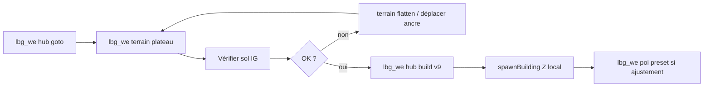

# ADR 0010 — Lost Heaven v9 : terrain-first, Z local par bâtiment

**Statut** : accepté (2026-06-06)  
**Remplace** : approche « grille + plateauZ unique » (ADR 0009 § bâtiments auto)

## Problème

La pose auto v4–v8 échoue encore (bâtiments en lévitation / enterrés) car :

1. **`spawnBuildingOnPlateau` force un Z unique** sur toute la ville (~600 m d’emprise) alors que le relief serveur varie de plusieurs mètres.
2. **Theaters client** et **terrain_mod serveur** ne garantissent pas le même Z que la structure.
3. **Grille JSON → spawn auto** masque le problème au lieu de valider le sol bâtiment par bâtiment.

## Décision

| Sujet | Choix v9 |
|-------|----------|
| Ordre | **Terrain d’abord**, bâtiments ensuite (délai 8 s après flatten) |
| Z structures | **`spawnBuilding` local** (empreinte hi/lo StructureManager) — **plus** de plateauZ global |
| Theaters | Z de référence = **max hauteur du site** (remplissage des creux, pas d’enfouissement) |
| Édition terrain | **`lbg_we terrain`** in-game (sample / flatten / plateau / clear) |
| Placement bâtiments | **Hybride** : auto après terrain OK **ou** manuel `lbg_we poi preset` (coords dump = vérité) |
| Client | SWG retail + mods `MOD_LBG` — pas Godot |

## Workflow cible

## Hors scope v9

- Heightmap custom importée (`.trn` / binaire terrain) — v10+
- Éditeur SOE World Editor client
- Godot preview 3D

## Fichiers

- `lbg_lost_heaven_screenplay.lua` — v9 terrain-first
- `lbg_world_editor_screenplay.lua` — commandes `terrain`
- Éditeur 2D — onglet terrain (v3 backlog)
