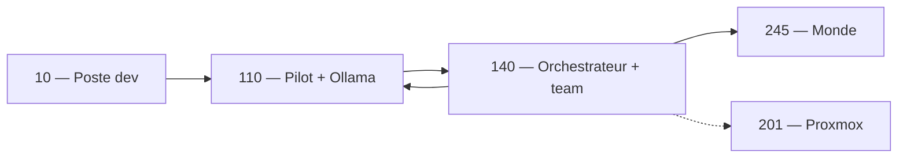

# Architecture — Équipe virtuelle studio LBG (méta-orchestrateur)

**Statut** : validé — implémentation phase A en cours  
**Date** : 2026-07-10  
**ADR** : `docs/adr/0014-equipe-virtuelle-orchestrateur.md`  
**Handoff session** : `docs/handoff_equipe_virtuelle_2026-07-10.md`

---

## 1. Vision

Évolution de l’orchestrateur (VM **140**) : **routeur d’intentions** → **chef d’orchestre**
d’une équipe virtuelle qui :

1. **Maintient l’infra** (sondes, playbooks, jobs Pilot) — write avec approbation.
2. **Développe et corrige** le MMO (PM, dev, QA, brief créatif).
3. **À terme** — persos / compagnons IA dans le monde (**245**), séparés des agents studio.

Modèle : **rôles + file de tâches + garde-fous** (complète le moteur jobs Jalon 7, ne le remplace pas).

---

## 2. Topologie

| Hôte | IP | Rôle |
|------|-----|------|
| Proxmox | `192.168.0.201` | Hyperviseur, backups — cible Ops (SSH RO) |
| LBG-IA | `192.168.0.110` | Pilot `:8080`, Ollama `:11434`, nginx |
| LBG-IA-MMORPG | `192.168.0.140` | Orchestrateur `:8010`, backend `:8000`, agents, **méta-orchestrateur** |
| ServeurSWG | `192.168.0.245` | MMO HTTP `:8050`, WS `:7733` |
| Prime | `192.168.0.246` | Core3 Prime / tests |
| Poste dev | `192.168.0.10` | Cursor, Claude Code, agent desktop `:5005` |
| NAS | `192.168.0.51` | Sauvegardes iSCSI → `/mnt/sauvegardes` sur 201 |



---

## 3. Socle existant (réutiliser)

| Composant | Fichiers / service | Rôle équipe |
|-----------|-------------------|-------------|
| Jobs Cowork | `orchestrator/services/jobs.py`, `#/jobs` | Objectifs NL multi-étapes |
| Action policy | `services/action_policy.py` | Garde-fous write |
| Agents HTTP | `lbg_agents/dispatch.py` | Workers dialogue, devops, pm… |
| Proactive | `services/proactive.py` | Analyses planifiées |
| Multi-LLM | `agents/dialogue_llm.py`, `lbg.env` | Groq → gemma4:26b failover |
| Storage watchdog | jobs Pilot `system:storage_watchdog` | Proto rôle `ops` |
| Smokes LAN | `infra/scripts/smoke_*_lan.sh` | Proto rôle `qa` |

---

## 4. Trois couches

### Studio (140, 10)

Méta-orchestrateur, workers par rôle, SQLite tâches, UI `#/team`.

### Ops (201 via 140)

Sondes L1 ; playbooks L2 avec approbation.

### Monde (245)

Dialogue, companion, joueurs IA — pas d’accès SSH Proxmox.

---

## 5. Rôles (phase A : ops, qa, pm)

| ID | Capability / agent | LLM | Niveau phase A |
|----|-------------------|-----|----------------|
| `ops` | `devops_probe` | Groq fast | L1 |
| `qa` | `team.qa` (nouveau) → smokes | Groq fast | L1 |
| `pm` | `project_pm` | Groq / GLM | L0–L1 |
| `dev_infra` | phase C | — | — |
| `dev_game` | phase C | — | — |
| `creative` | phase C | — | — |
| `dialogue` | existant | auto | — |
| `companion` | phase D | — | — |
| `human` | 10 | — | approve |

---

## 6. Modèle de tâche

```yaml
task_id: uuid
role: ops | qa | pm
status: queued | running | review | done | failed | cancelled
priority: low | normal | high | critical
approval_required: boolean
context: { trace_id, related_vms, branch, pilot_job_id? }
result: { summary, artifacts, trace }
```

Store : **SQLite** `/var/lib/lbg-ia-mmo/team_tasks.db` sur 140.

---

## 7. Boucle agentique

Plan → Act (allowlist) → Verify (smoke / healthz) → Report → Learn (optionnel).

Limites : `LBG_TEAM_MAX_STEPS`, `LBG_TEAM_MAX_DURATION_S` (à ajouter `lbg.env.example` phase A).

---

## 8. API phase A

| Route | Action |
|-------|--------|
| `POST /v1/team/plan` | Objectif → tâches proposées |
| `POST /v1/team/tasks` | Créer |
| `GET /v1/team/tasks` | Lister |
| `GET /v1/team/tasks/{id}` | Détail |
| `POST /v1/team/tasks/{id}/approve` | Approuver |
| `POST /v1/team/tasks/{id}/run` | Exécuter |
| `POST /v1/team/tasks/{id}/cancel` | Annuler |

Trace : `agents.team.trace`.

---

## 9. Sécurité

| Niveau | Description |
|--------|-------------|
| L0 | Suggest only |
| L1 | Read-only auto |
| L2 | Write → `review` + token |
| L3 | Write allowlist (hors phase A) |

Token : `LBG_TEAM_APPROVAL_TOKEN` (aligné tokens Pilot / opengame).

---

## 10. Phasage

| Phase | Contenu |
|-------|---------|
| **A** | Rôles ops/qa/pm, SQLite, API, `#/team` |
| **B** | Playbooks ops (smoke quotidien, disque, Ollama) |
| **C** | Workflow bug QA→dev, creative |
| **D** | Joueurs IA WS 245 |

---

## 11. Décisions validées

- **D1** : 140 = méta-orchestrateur ; 110 = LLM + UI ; 201 sans LLM  
- **D2** : SQLite team tasks ; jobs Pilot pour timers  
- **D3** : Phase A max L1  
- **D4** : Rôles A = ops, qa, pm  
- **D5** : Poste 10 via agent desktop  
- **D6** : Joueurs IA comptes dédiés (phase D)  
- **D7** : UI **Équipe** `#/team`

---

## 12. Checklist implémentation phase A

- [x] `orchestrator/team/` (store, models, routes)
- [x] Enregistrement dans `router/v1.py`
- [x] Tests `orchestrator/tests/test_team.py`
- [x] Proxy backend `/v1/pilot/team/*` (miroir jobs)
- [x] Pilot `#/team` (liste, approve, run)
- [x] `lbg.env.example` : `LBG_TEAM_*`
- [ ] Playbook L1 : smoke LAN → tâche `qa` auto (nécessite déploiement LAN)

---

## 13. Références

- `docs/handoff_equipe_virtuelle_2026-07-10.md`
- `docs/fusion_env_lan.md`
- `docs/plan_de_route.md`
- `docs/plan_bot_compagnon_autonome.md`
- `docs/assistant_core_plan.md`
- `agents/README.md`
