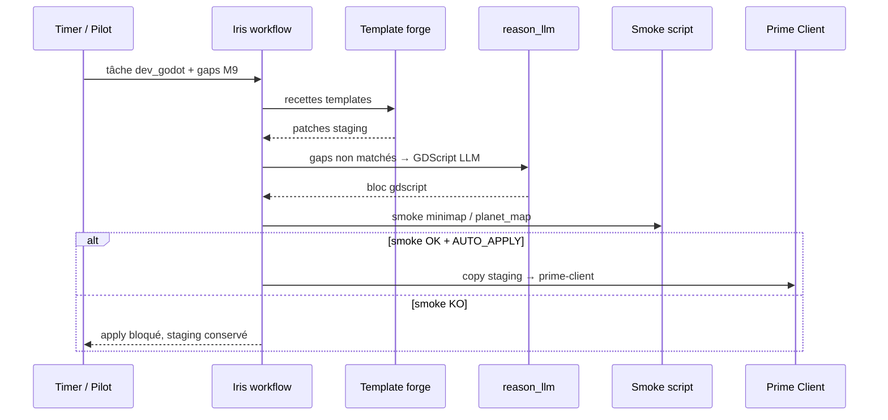

# Architecture tri-backend hybride

**Date** : 2026-07-12  
**ADR** : [0015-tri-backend-hybride.md](adr/0015-tri-backend-hybride.md)  
**Statut** : en déploiement

---

## Vue d'ensemble

```
                    ┌─────────────────────────────────────┐
                    │   ORCHESTRATEUR LBG — VM 140 :8010   │
                    │   team/ · Pilot proxy · autoconsult  │
                    └──────────────────┬──────────────────┘
                                       │
           ┌───────────────────────────┼───────────────────────────┐
           ▼                           ▼                           ▼
   ┌───────────────┐           ┌───────────────┐           ┌───────────────┐
   │ REASON        │           │ EXEC          │           │ MEDIA         │
   │ reason_llm    │           │ openclaw_     │           │ Pygmalion +   │
   │               │           │ adapter       │           │ ComfyUI (cible)│
   └───────┬───────┘           └───────┬───────┘           └───────┬───────┘
           │                           │                           │
   Ollama 110 / Groq /          OpenClaw local OR              GPU / 110
   Anthropic API                bash playbooks LBG
```

---

## Personas → backends

| Persona | Backend principal | Module |
|---------|-------------------|--------|
| Thémis (pm) | REASON | autoconsult + brief PM |
| Iris (dev_godot) | REASON + templates | `iris_gdscript_forge`, `iris_llm_forge` |
| Hermès (dev_godot) | REASON + EXEC | forge réseau + smoke sidecar |
| Héphaïstos (ops) | EXEC | `openclaw_adapter` |
| Argus (qa) | EXEC | skills smoke LAN |
| Pygmalion | MEDIA | infographiste (cible ComfyUI) |
| Dédale / Vulcan | REASON + L2 humain | Core3 build |

---

## Flux Iris forge (REASON + EXEC)



---

## OpenClaw ↔ playbooks LBG

Skills déclarés dans `infra/openclaw/skills/*.json`.

Runtime :

1. Si `LBG_OPENCLAW_BASE_URL` → HTTP `POST /v1/skills/{id}/run`
2. Sinon → **fallback bash** local (même script)

Intégration ops : `LBG_TEAM_OPS_USE_OPENCLAW=1` dans `_execute_ops`.

---

## Autonomie 24/7 sans poste 10

| Besoin | Sans poste 10 |
|--------|----------------|
| Round autoconsult | Timer 12 h sur 140 |
| Forge GDScript | Iris + Ollama 110 / API REASON |
| Apply patches | Smoke OK + `LBG_IRIS_FORGE_AUTO_APPLY=1` |
| Code complexe Core3 | L2 Pilot token ou session dev différée |
| Actions bureau Windows | Agent desktop 10 (optionnel) |

---

## Variables clés

```bash
# REASON — 110 H24 primary, cloud fallback
LBG_REASON_LOCAL_BASE_URL=http://192.168.0.110:11434
LBG_REASON_LOCAL_MODEL=gemma3:4b
LBG_REASON_FAILOVER=1
LBG_REASON_CLOUD_BASE_URL=https://api.groq.com/openai/v1
LBG_REASON_CLOUD_API_KEY=<secret>

# EXEC — bridge 140 (OpenClaw natif optionnel :18789)
LBG_OPENCLAW_BASE_URL=http://127.0.0.1:18790
bash infra/scripts/install_openclaw_lbg_vm140.sh

# MEDIA — ComfyUI
LBG_COMFYUI_BASE_URL=http://192.168.0.10:8188

# Iris forge LLM
LBG_IRIS_FORGE_LLM=1
LBG_IRIS_FORGE_SMOKE_REQUIRED=1
LBG_IRIS_FORGE_AUTO_APPLY=0

# Autoconsult (12 h)
LBG_TEAM_AUTOCONSULT_JOB_COOLDOWN_S=43200
```

> **Note** : la VM **110** (Ollama) est le socle H24 — distincte du poste dev **10** (Cursor optionnel).

---

## Liens

- [vision_equipe_fable_autoconsultation.md](vision_equipe_fable_autoconsultation.md)
- [jalon_iris_forge_gdscript.md](jalon_iris_forge_gdscript.md)
- [architecture_equipe_virtuelle_studio.md](architecture_equipe_virtuelle_studio.md)
