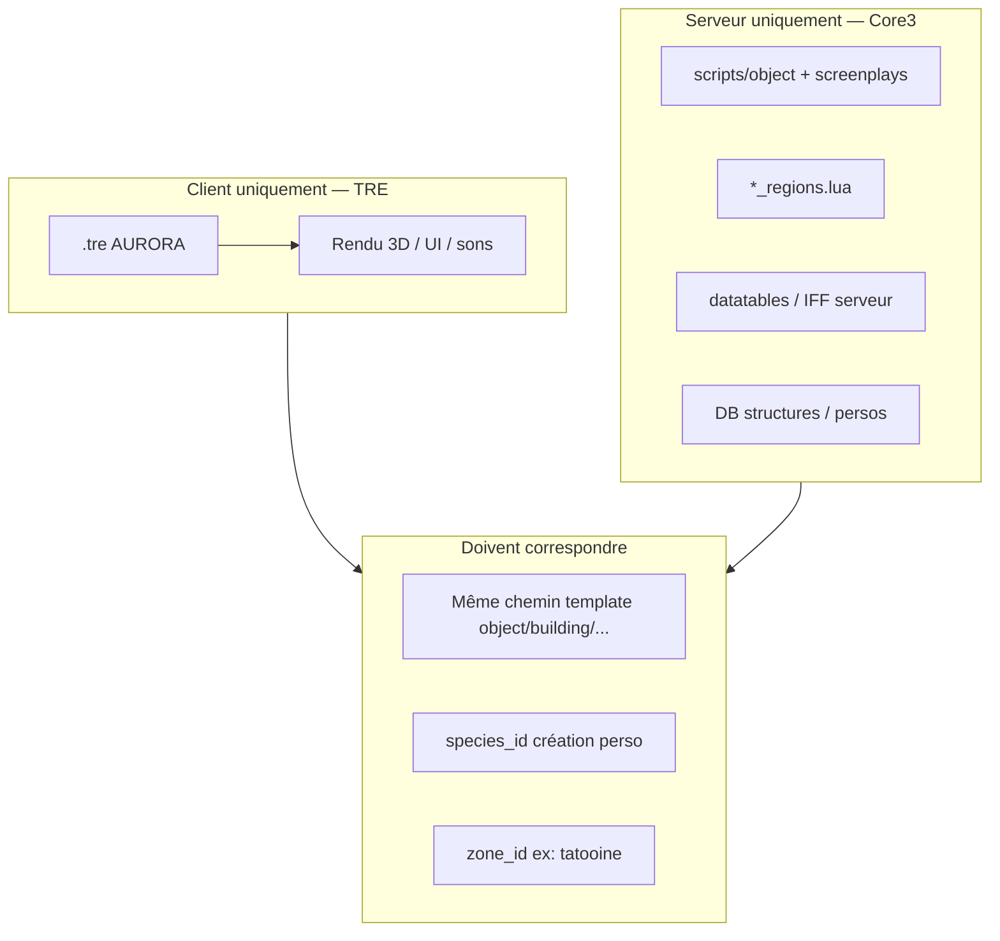

# Audit — pack TRE « StarWarsGalaxies - AURORA »

**Emplacement actuel** : `/mnt/j/swgemu/StarWarsGalaxies - AURORA/` (~12 Go de `.tre`)  
**Client LBG Prime (référence)** : `/mnt/j/swgemu/clients/prime-lbg/`  
**Serveur** : Core3 `lbg-new-mmo-clean` — **ne lit pas les `.tre`** ; synchronisation = templates Lua/IFF + datatables + zones.

---

## 1. Ce que contient AURORA (inventaire)

Configuration client : `swgemu_live.cfg` — pile de patches **priorité 0–98** au-dessus du retail.

| Fichier / groupe | Taille (ordre de grandeur) | Rôle probable |
|------------------|----------------------------|---------------|
| `Aur_French.tre` | ~32 Mo | Chaînes UI / traduction partielle (client) |
| `aur_patch_001` … `004` | appearance | Corps, tenues, meshes joueur / NPC |
| `aur_patch_005` … `008` | textures | DDS additionnels |
| `aur_patch_009` | shaders | Effets rendu |
| `aur_patch_010` | object | IFF objets / bâtiments partagés |
| `aur_patch_011` … `013` | files / configurable | Divers (datatables client, UI, etc.) |
| `aur_patch_014` … `034` | patches incrémentaux | Contenu modulaire |
| `aur_planets.tre` | ~130 Mo | **Planètes** : terrain, sélection UI (`ui_planet_sel_*`), Mustafar/Kash/Hoth/Taanab/Dathomir… |
| `ILM_aurora_1/2/3.tre` | ~2,5 Go | Gros pack monde / assets ILM |
| `ILM_texture.tre`, `ILM_music.tre` | ~1,2 Go | Textures + musiques |
| `future_add.tre`, `client.tre` | divers | Extensions / override haute priorité |
| Retail `data_*`, `patch_*`, `bottom.tre` | copie locale | Base Pre-CU/NGE selon install |

**Repères extraits de `aur_planets.tre`** (non exhaustif) :

- `texture/ui_planet_sel_kash.dds`, `hoth`, `taanab`, `dath`
- `appearance/mesh/ui_planet_sel_*`
- `object/building/mustafar/terrain/...`
- shaders / colorramp terrain (`dot3_terrain`, `stars_tato`, etc.)

→ Le pack n’est **pas** que de la traduction : planètes, apparences, textures, objets.

**Attention cfg** : dans `swgemu_live.cfg`, `searchTree_00_85` est déclaré **deux fois** (`ILM_aurora_1` et `ILM_aurora_2`) — une seule entrée gagne ; à corriger si les deux doivent coexister (priorités distinctes).

---

## 2. Règle d’or : client vs serveur



| Symptôme | Cause |
|----------|--------|
| Mesh rose / manquant | Client sans TRE ou mauvais CRC |
| Déco client au login | Serveur envoie un template absent du client |
| Sol invisible / chute | Planète cliente sans **terrain serveur** (.trn / heightmap) |
| Texte EN au lieu de FR | `Aur_French.tre` non chargé ou priorité < autre patch |
| Nouvelle race bloquée création | Serveur : pas d’entrée `species` / `starting_professions` |

**ADR LBG** ([0009](adr/0009-scrapaltai-lost-heaven.md)) : le relief Lost Heaven vient du **TRE Tatooine retail** ; AURORA ne remplace pas le serveur pour l’aplatissement hub.

---

## 3. Matrice d’intégration (par type de contenu)

| Contenu AURORA | Intégration client Prime | Travail serveur | Priorité LBG suggérée |
|----------------|------------------------|-----------------|------------------------|
| **Traduction FR** (`Aur_French.tre`) | Copier TRE + ligne `searchTree` dans `swgemu_live.cfg` (priorité > patch_fr si remplacement) | Faible : messages système custom déjà en Lua FR | **P1** — test isolé |
| **Textures / apparences** (murrik-like, tenues) | TRE priorité 24–26 comme `patch_murrik_00` | `object/mobile`, `appearance` si nouveaux NPC ; pas obligatoire si override vanilla path | **P2** — cherry-pick |
| **Objets / bâtiments** | TRE `aur_patch_010` + object | Dupliquer `.lua` sous `custom_scripts/object` si spawn serveur | **P2** — au cas par cas |
| **Musique / shaders ILM** | Client seulement | Aucun | **P3** — cosmétique |
| **Nouvelles races** | Meshes + écran création (IFF client) | `species/*.lua`, datatables création, `core3_species_slot_map.json`, slots LBG | **P4** — projet dédié |
| **Nouvelles planètes** | `aur_planets.tre` + ILM (Go) | Module planète complet Core3 (regions, travel, spawns, **fichiers terrain serveur**) — **absent** sur Prime aujourd’hui | **P5** — hors scope Prime court terme |

---

## 4. Synchronisation serveur (checklist)

Pour chaque asset AURORA que tu veux **voir en jeu sur Prime** :

1. **Chemin template** — le serveur référence `object/.../*.iff` ; le client doit avoir le **même chemin** dans un TRE chargé (CRC identique).
2. **Enregistrement Lua serveur** — `ObjectManager` charge les templates depuis `bin/scripts/object/` ; un IFF seul dans le TRE ne suffit pas pour spawn / craft / loot.
3. **Création de personnage** — `species_id` aligné entre client IFF et serveur (`CharacterCreationManager`, `core3_species_slot_map.json` LBG).
4. **Planète** — `zone_id` dans `planet_manager.lua` + `*_regions.lua` + données terrain côté **serveur** (souvent dossier `terrain/` ou binaire dédié selon fork) ; le TRE ne suffit pas.
5. **Voyage / shuttle** — `planetTravelPoints` + éventuellement écrans UI planète (client).
6. **Tests** — un client **avec** et **sans** le patch : éviter de forcer tout le pack 12 Go (risque crash, conflit `patch_murrik`, temps de chargement).

Outils LBG existants :

- `tools/client_patch/tre_writer.py` — petits patches incrémentaux (modèle Murrik).
- `infra/scripts/patch_prime_lbg_cfg_murrik.sh` — priorité `searchTree` dans cfg.
- `docs/pipeline_assets_swg_godot.md` — extraction vers Godot (hors runtime Prime).

---

## 5. Plan recommandé (sans tout intégrer)

### Phase A — Client bac à sable (0 impact serveur)

1. Garder AURORA comme **client séparé** (profil « Aurora_precu » déjà présent).
2. Corriger les doublons de priorité dans `swgemu_live.cfg`.
3. Noter crashes / temps de chargement / conflits avec `client.tre` (priorité 98).

### Phase B — Prime LBG : traduction fusionnée (fait)

Outil : `tools/client_patch/merge_fr_tre.py` — combine `patch_fr_00.tre` + `Aur_French.tre` en **`patch_fr_merged_00.tre`** (~32 Mo, ~13,5k STF) en gardant la meilleure traduction FR par entrée (heuristique accents / mots FR vs EN ; défaut = préférer LBG `patch_fr`).

```bash
cd LBG_IA_MMO
python3 tools/client_patch/merge_fr_tre.py \\
  --patch /mnt/j/swgemu/clients/prime-lbg/patch_fr_00.tre \\
  --aurora "/mnt/j/swgemu/StarWarsGalaxies - AURORA/Aur_French.tre" \\
  --out /mnt/j/swgemu/clients/prime-lbg/patch_fr_merged_00.tre
bash infra/scripts/patch_prime_lbg_cfg_fr_merged.sh
```

Rapport type : ~125k entrées « pick patch », ~15 « pick aurora », ~18k clés uniquement Aurora. **Serveur inchangé** (client only).

### Phase C — Patches ciblés (alignement serveur)

1. Lister les chemins utiles (Sytner / script d’audit) — ex. textures `bth_*`, buildings Lost Heaven.
2. Construire un **`patch_lbg_aur_00.tre`** minimal (comme `patch_murrik_00`) plutôt que toute la pile AURORA.
3. Pour chaque template spawné par `ia_bridge` / `world_poi` : vérifier présence dans TRE Prime **ou** garder template vanilla Tatooine côté serveur.

### Phase D — Races / planètes (projet long)

- **Races** : audit parallèle `content/core3/core3_species_slot_map.json` ↔ espèces AURORA.
- **Planètes** : exiger fork ou port du module planète côté Core3 **avant** d’activer `aur_planets.tre` sur le client officiel Prime — sinon écran de sélection planète sans zone jouable.

---

## 6. Risques

| Risque | Mitigation |
|--------|------------|
| Client 12 Go + conflits CRC | Patches incrémentaux, pas la pile complète sur Prime |
| SEGV / crash (cf. Murrik, Lost Heaven) | Un TRE à la fois, profil client dédié |
| Désync multijoueur | Même liste TRE pour tous les joueurs Prime |
| Licence / redistribution | Ne pas committer les `.tre` dans Git ; chemins locaux uniquement |
| Charge VM | Aucun TRE sur le serveur ; pas d’impact disque serveur |

---

## 7. Prochaines actions concrètes

| # | Action | Responsable |
|---|--------|-------------|
| 1 | Décider P1 : `Aur_French` sur clone Prime ou seulement AURORA | Produit |
| 2 | Script d’audit TRE (liste chemins `object/`, `appearance/`, `string/`) | Outil `tools/client_patch/audit_tre_paths.py` (à créer) |
| 3 | Tableau « asset voulu → template serveur → TRE requis » pour Lost Heaven / Murrik | Contenu LBG |
| 4 | Documenter version client minimale Prime dans MOTD / wiki | Ops |

---

## 8. Références repo

- Client Prime : `clients/prime-lbg/swgemu_live.cfg`
- Patch Murrik : `tools/client_patch/build_murrik_client_patch.py`, `patch_murrik_00.tre`
- Couches monde LBG : `docs/adr/0009-scrapaltai-lost-heaven.md`
- Espèces LBG : `content/core3/core3_species_slot_map.json`
- Planètes Core3 : `Core3-unstable/MMOCoreORB/bin/scripts/managers/planet/`
