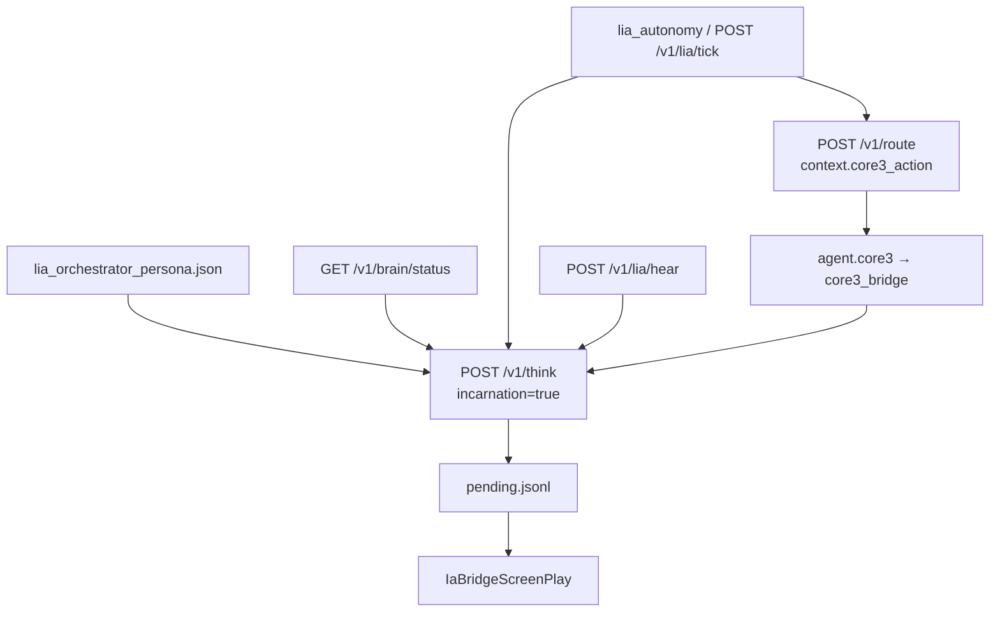

# Lia — incarnation de l'orchestrateur en jeu

**Lia** (perso IG `Lia`, compte `Bot_IA`) est l'avatar joueur de la stack LBG sur Serveur Prime. Elle n'est pas un simple bot décoratif : chaque tour LLM utilise le **persona orchestrateur**, l'état **`/v1/brain/status`** (narrative, intent, jauges) et le pont **`core3_bot_action`** vers le sidecar Core3.

## Chaîne



## Fichiers

| Fichier | Rôle |
|---------|------|
| `content/core3/lia_orchestrator_persona.json` | Identité, relay players, hints d'actions |
| `agents/src/lbg_agents/lia_orchestrator.py` | Prompts, brain, `incarnate_player_think`, `hear_player_message` |
| `agents/src/lbg_agents/lia_autonomy.py` | Boucle périodique (délègue à `lia_orchestrator`) |
| `orchestrator/router/routes/lia_incarnation.py` | API `POST /v1/lia/hear`, `POST /v1/lia/tick` |
| `tools/core3_ia_sidecar/core3_ia_sidecar.py` | `incarnation` sur `/v1/think`, `POST /v1/lia/hear` local |

Acteur par défaut : **`orchestrator:lia`** (`LBG_CORE3_LIA_ACTOR_ID`).

## Variables d'environnement

| Variable | Exemple | Rôle |
|----------|---------|------|
| `LBG_ORCHESTRATOR_URL` | `http://192.168.0.110:8010` | Brain status + mode `orchestrator` |
| `LBG_CORE3_IA_SIDECAR_URL` | `http://192.168.0.245:8791` | Think / snapshot |
| `LBG_CORE3_LIA_ACTOR_ID` | `orchestrator:lia` | `actor_id` sur `/v1/route` |
| `LBG_CORE3_LIA_AUTONOMY_MODE` | `invoke` | `invoke` \| `orchestrator` \| `sidecar` |
| `LBG_CORE3_LIA_HEAR_VIA` | *(hérite du mode)* | Forcer le canal pour « entendre » un joueur |
| `LBG_LIA_PERSONA_JSON` | chemin absolu | Override persona |
| `CORE3_IA_BOT_CHARACTER` | `Lia` | Prénom IG |
| `LBG_CORE3_LIA_AUTO_CONNECT` | `0` | Avant tick/hear : `POST /v1/lia/connect` si hors ligne |
| `LBG_CORE3_LIA_CONNECT_WAIT_S` | `120` | Attente max connexion |
| `LBG_CORE3_LIA_CONNECT_MODE` | `systemd` | Sur VM 245 : `systemd` ou `script` |

Voir aussi [Phase E — autonomie](core3_ia_phase_e_lia_autonomy.md) et [Phase D — headless](core3_ia_phase_d_headless_bot.md).

## API

### Orchestrateur (VM 140)

```bash
# Connecter Lia en jeu (headless core3client via sidecar VM 245)
curl -s -X POST http://127.0.0.1:8010/v1/lia/connect \
  -H 'Content-Type: application/json' \
  -d '{"wait":true,"wait_s":120}'

# Un joueur « parle » à Lia (hors chat SWG natif — Pilot, script, test)
curl -s -X POST http://127.0.0.1:8010/v1/lia/hear \
  -H 'Content-Type: application/json' \
  -d '{"from_player":"Teome","text":"Lia, tu es l’orchestrateur ?"}'

# Tick incarnation (proactif si Lia en ligne)
curl -s -X POST http://127.0.0.1:8010/v1/lia/tick \
  -H 'Content-Type: application/json' \
  -d '{}'
```

### Sidecar (VM 245)

```bash
curl -s -X POST http://127.0.0.1:8791/v1/lia/hear \
  -H 'Content-Type: application/json' \
  -d '{"from":"Teome","text":"Salut"}'

curl -s -X POST http://127.0.0.1:8791/v1/think \
  -H 'Content-Type: application/json' \
  -d '{"player":"Lia","prompt":"…","incarnation":true,"enqueue":true}'
```

### Route complète (invoke)

```bash
curl -s -X POST http://127.0.0.1:8010/v1/route \
  -H 'Content-Type: application/json' \
  -d '{
    "actor_id": "orchestrator:lia",
    "text": "Incarnation proactive.",
    "context": {
      "lia_incarnation": true,
      "core3_action": {
        "kind": "player_think",
        "player": "Lia",
        "prompt": "Approche Teome et salue.",
        "enqueue": true,
        "incarnation": true
      }
    }
  }'
```

Intent résultant : **`core3_bot_action`** → **`agent.core3`**.

## Comportement en jeu

- **`say`** : bulle spatial + relais system `[Lia]` vers joueurs relay proches (ex. Teome).
- **`approach_player`** : indispensable si distance &gt; ~16 m (bulle SWG).
- Le screenplay suit aussi les relay players toutes les ~30 s.

## Déploiement rapide

```bash
bash infra/scripts/deploy_lia_orchestrator_incarnation.sh --connect-smoke
```

Détail des étapes LAN : [Mise en service](core3_ia_lia_deploiement_mise_en_service.md).

## Actions métier (`perform`)

Catalogue : `content/core3/lia_perform_catalog.json` — ids : `dance`, `dance_floor`, `greet`, `bow`, `cheer`, `think`, `search`, `forage`, `meditate`, `conduct`.

```bash
curl -s -X POST http://127.0.0.1:8791/v1/enqueue \
  -H 'Content-Type: application/json' \
  -d '{"action":"perform","player":"Lia","message":"dance"}'
```

Visuel + chaîne d’animations ; pas les skills SWG complets (tips entertainer, loot réel, etc.).

## Interactions ciblées (`interact`)

Format : `message = kind:target[:extra]`.

| Kind | Effet v1 |
|------|----------|
| `greet` | approche, salut, spatial chat |
| `assist` | approche et demande l’objectif du joueur |
| `examine` | scan/observation roleplay + message system |
| `offer_trade` | demande d’échange IA visible (stub sûr) |
| `invite_group` | demande de groupe visible (stub sûr) |
| `request_duel` | demande duel roleplay visible (aucun combat lancé) |

```bash
curl -s -X POST http://127.0.0.1:8791/v1/enqueue \
  -H 'Content-Type: application/json' \
  -d '{"action":"interact","player":"Lia","message":"assist:Teome"}'
```

Les interactions radiales natives SWG (trade réel, groupe réel, duel réel) ne sont pas encore appelées : cette v1 est volontairement visible et non destructive.

## Limites actuelles

- Pas d'écoute du chat SWG natif : utiliser **`/v1/lia/hear`**, Pilot, ou un relais custom.
- Déplacement = téléport / approche serveur (pas de marche client headless).
- `perform` = roleplay animé ; skills métier vanilla non déclenchés.
