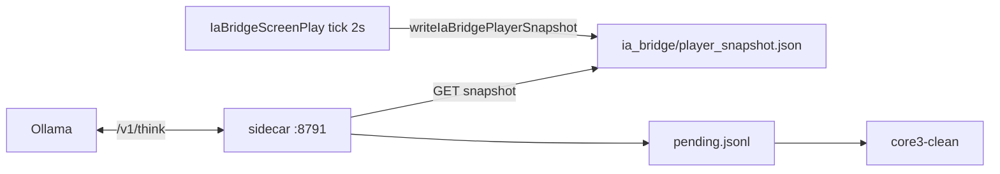

# Pont IA Core3 — Phase B : snapshot joueur → contexte LLM

**Statut** : **validée** (2026-05-22) — smoke `smoke_core3_ia_phase_b_lan.sh` HTTP 200, snapshot Lia / tatooine OK.

**Prérequis** : Phase A validée (ADR 0007).  
**Hors scope Phase B** : auto-login client, pool multi-bots, PNJ pilotes (Phase C).

## Objectif

Le sidecar lit l’état **serveur** de **Lia** (zone, coords, HAM) et l’injecte dans `/v1/think` — sans client graphique pour l’observation.

## Architecture Phase B



## Critères d’acceptation

| # | Critère | Statut |
|---|---------|--------|
| 1 | `GET /v1/player-snapshot?player=Lia` | OK |
| 2 | Snapshot écrit côté serveur (C++ + Lua tick) | OK |
| 3 | `/v1/think` inclut `observation` + `snapshot` | OK |
| 4 | Whitelist `say`, `switch_zone`, `noop` | OK |
| 5 | Joueur hors ligne → HTTP **409** `player_offline` | OK |
| 6 | Smoke + doc | `smoke_core3_ia_phase_b_lan.sh` |

## Déploiement VM 245

```bash
cd LBG_IA_MMO

# 1) Lua + sidecar (sans rebuild)
bash infra/scripts/deploy_core3_ia_bridge_vm.sh

# 2) C++ writeIaBridgePlayerSnapshot (obligatoire Phase B)
bash infra/scripts/build_core3_antigravity_vm.sh --sync
bash infra/scripts/install_core3_clean_after_vm_build.sh   # si script présent
# ou redémarrer core3-clean après binaire installé

# 3) Sidecar
sudo systemctl restart lbg-core3-ia-sidecar
```

Variables (`/etc/lbg-core3-ia.env`) :

| Variable | Défaut | Rôle |
|----------|--------|------|
| `CORE3_IA_BOT_CHARACTER` | `Lia` | Prénom perso (nameMap) |
| `CORE3_IA_SNAPSHOT_PATH` | `ia_bridge/player_snapshot.json` | Fichier snapshot |
| `CORE3_IA_SNAPSHOT_MAX_AGE_S` | `8` | Âge max avant flag `stale` |
| `LBG_DIALOGUE_LLM_BASE_URL` | Ollama `:110` | API OpenAI-compatible |
| `LBG_DIALOGUE_LLM_MODEL` | `phi4-mini:latest` | Modèle |
| `LBG_DIALOGUE_LLM_API_KEY` / `GROQ_API_KEY` | — | Bearer (Groq, OpenAI, etc.) |
| `LBG_DIALOGUE_LLM_TIMEOUT` | `45` | Timeout HTTP `/v1/think` (s) |

**Routage LLM** — aligné stack LBG (pas de Groq codé en dur) : voir **`docs/core3_ia_llm_routing.md`**.

```bash
bash infra/scripts/configure_core3_ia_llm_vm.sh auto   # fast → local → remote (failover)
bash infra/scripts/smoke_core3_ia_phase_b_lan.sh --with-think
```

Clés : `/etc/lbg-ia-mmo.env` sur la VM (`GROQ_API_KEY`, `LBG_DIALOGUE_FAST_*`, …).

## API sidecar

### `GET /v1/player-snapshot?player=Lia`

- **200** : joueur en ligne + JSON `snapshot` (zone, x, y, z, hp, action, mind, ts).
- **409** : hors ligne ou fichier absent / périmé.

### `POST /v1/think`

Corps : `{ "player": "Lia", "prompt": "…", "enqueue": true }`

- Charge le snapshot ; si hors ligne → **409**.
- Appelle le LLM avec l’observation serveur.
- Enqueue l’action (`say` / `switch_zone`) sauf `noop`.

Exemple :

```bash
ssh lbg@192.168.0.245 "curl -s 'http://127.0.0.1:8791/v1/player-snapshot?player=Lia'"
ssh lbg@192.168.0.245 "curl -s -X POST http://127.0.0.1:8791/v1/think \
  -H 'Content-Type: application/json' \
  -d '{\"prompt\":\"Dis où tu es en une phrase.\"}'"
```

## Smoke

```bash
# Lia connectée sur Prime / Tatooine
bash infra/scripts/smoke_core3_ia_phase_b_lan.sh
bash infra/scripts/smoke_core3_ia_phase_b_lan.sh --with-think   # + LLM Ollama
```

## Fichiers modifiés

| Fichier | Rôle |
|---------|------|
| `server-core3/.../DirectorManager.cpp` | `writeIaBridgePlayerSnapshot` |
| `ia_bridge_screenplay.lua` | `publishSnapshot` chaque tick |
| `tools/core3_ia_sidecar/core3_ia_sidecar.py` | GET snapshot, think enrichi |

## Rôle humain (inchangé)

Client SWG + **Bot_IA / Lia** en ligne pour les tests. Pas d’auto-login (Phase D).

## Suite — Phase C

PNJ pilotes (`npc_id` ↔ mobile Core3). Voir ADR 0007.
