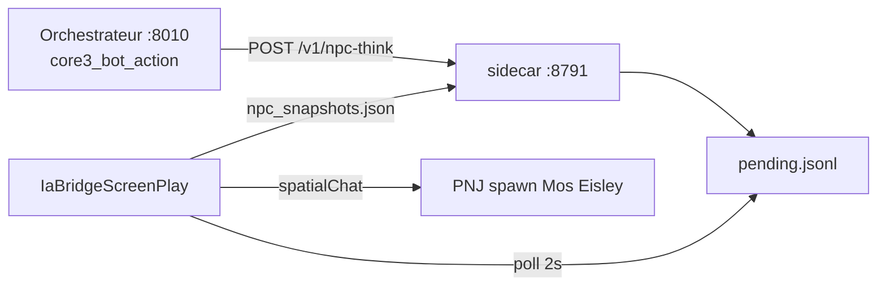

# Phase C — PNJ pilotes Core3 (Serveur Prime / Tatooine)

**Statut** : implémentée (2026-05-23) — registre `npc_id` LBG ↔ mobile Core3, `npc_say` en jeu, intent `core3_bot_action`.

## Objectif

Étendre le pont IA (Phase A/B) avec des **PNJ pilotes** sur Tatooine, pilotables par le sidecar et par l’orchestrateur LBG (`world_npc_id` / `npc:scribe` → `npc:core3_scribe`).

## Architecture



## Registre

Fichier : `content/core3/core3_npc_pilots.json`

| Champ | Rôle |
|-------|------|
| `pilot_id` | Clé pont (`npc:core3_scribe`) |
| `lbg_npc_id` | Id LBG / orchestrateur (`npc:scribe`) |
| `mobile_template` | Template `spawnMobile` Core3 |
| `spawn` | Position initiale Mos Eisley (près du cobaye Lia) |

Lua miroir : `content/core3/lua/ia_bridge_screenplay.lua` (table `IA_BRIDGE_PILOTS`).

## Actions file

| action | Effet |
|--------|--------|
| `npc_say` | `spatialChat` sur le mobile pilote (`player` = `pilot_id`) |
| `say` / `switch_zone` / `noop` | Inchangé (joueur Lia) |

Exemple :

```
npc_say|npc:core3_scribe|tatooine|3510|-4795|5|Bienvenue sur Tatooine, voyageur.
```

## Sidecar HTTP (Phase C)

| Endpoint | Description |
|----------|-------------|
| `GET /v1/npc-pilots` | Liste registre + snapshot live |
| `GET /v1/npc-snapshot?npc_id=` | Snapshot d’un pilote (`npc_id` ou `lbg_npc_id`) |
| `POST /v1/npc-think` | LLM + enqueue `npc_say` |

Variables :

| Variable | Défaut |
|----------|--------|
| `CORE3_IA_NPC_PILOTS_JSON` | `/opt/LBG_IA_MMO/content/core3/core3_npc_pilots.json` |
| `CORE3_IA_NPC_SNAPSHOTS_PATH` | `ia_bridge/npc_snapshots.json` |

## Orchestrateur

Intent **`core3_bot_action`** → `agent.core3` → `LBG_CORE3_IA_SIDECAR_URL` (ex. `http://192.168.0.245:8791` si sidecar en écoute LAN).

Exemple `POST /v1/pilot/route` (backend 140) :

```json
{
  "actor_id": "ops:1",
  "text": "Salue brièvement les voyageurs.",
  "context": {
    "core3_action": {
      "kind": "npc_think",
      "npc_id": "npc:scribe"
    }
  }
}
```

`npc_id` accepte `pilot_id`, `lbg_npc_id` ou `context.world_npc_id`.

Kinds : `npc_think`, `player_think`.

## Déploiement VM 245

```bash
cd LBG_IA_MMO
bash infra/scripts/deploy_core3_ia_bridge_vm.sh --restart
bash infra/scripts/configure_core3_ia_llm_vm.sh auto
bash infra/scripts/smoke_core3_ia_phase_c_lan.sh
```

**Redémarrage `core3-clean` requis** après mise à jour du screenplay Lua (spawn des pilotes).

Pas de rebuild C++ pour la Phase C seule.

## Vérification en jeu

1. Lia (`Bot_IA`) en ligne sur Tatooine.
2. Près de Mos Eisley : PNJ **Archiviste IA** et **Garde IA**.
3. Smoke ou `POST /v1/npc-think` → réplique visible en **spatial chat** autour du PNJ.

## Suite — rollout PNJ (C.1 → C.7)

Profils réutilisables, remplacement vanilla, rosters « doublon de service », routines quête/instructeur : **`docs/core3_ia_npc_rollout.md`** + catalogue v2 **`content/core3/core3_npc_catalog.json`**.

## Suite — Phase D

Joueur bot réservé **Bot_IA** / **Lia Bot** en headless (`docs/core3_ia_phase_d_headless_bot.md`).
