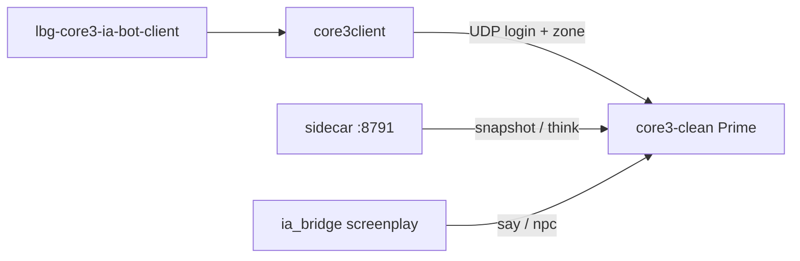

# Phase D — Compte joueur bot réservé (headless)

**Statut** : v1 (2026-05-24).  
**Périmètre** : **un seul** compte et **un seul** perso pour l’instant.

| Rôle | Valeur |
|------|--------|
| Compte (login) | `Bot_IA` |
| Perso IG | **Lia Bot** (prénom `Lia`, nom `Bot`) |
| Galaxie | Serveur Prime (id 3) |
| Connexion | `core3client` (sans client SWG / sans interface) |

D’autres comptes « joueur bot » pourront être ajoutés plus tard ; ce n’est **pas** l’objet de la v1.

## Principe



| Composant | Rôle |
|-----------|------|
| **`core3client`** | Maintient **Lia Bot** en ligne (headless) |
| **`lia_bot_session.json`** | Galaxie 3 + OID du perso |
| **`.env-core3client`** | Login `Bot_IA` |
| **Garde** | Si Lia est déjà connecté (client SWG ou autre), ne pas lancer un 2ᵉ client |

Le pont IA (file `pending.jsonl`, sidecar, PNJ) utilise le **prénom** `Lia` côté serveur (`CORE3_IA_BOT_CHARACTER`) — c’est le même perso que **Lia Bot** en liste de personnages.

## Installation (VM 245)

```bash
cd LBG_IA_MMO
bash infra/scripts/install_core3_ia_bot_client_vm.sh --build --enable
```

Activer seulement les fichiers (sans systemd) :

```bash
bash infra/scripts/install_core3_ia_bot_client_vm.sh --build
```

Puis sur la VM :

```bash
sudo systemctl enable --now lbg-core3-ia-bot-client
```

## Utilisation

1. **Fermer** le client SWG si tu étais connecté en `Bot_IA` (une session à la fois).
2. Le service headless connecte **Lia Bot** sur Tatooine.
3. Les smokes / `POST /v1/think` avec `player: Lia` fonctionnent sans Launchpad.

Tests :

```bash
bash infra/scripts/smoke_core3_ia_phase_d_headless_bot_lan.sh

ssh lbg@192.168.0.245 'bash /opt/LBG_IA_MMO/infra/scripts/run_core3_ia_bot_client_vm.sh --login-only'
ssh lbg@192.168.0.245 'bash /opt/LBG_IA_MMO/infra/scripts/run_core3_ia_bot_client_vm.sh'
```

## Mettre à jour l’OID perso

Si tu recrées **Lia Bot**, relancer un login-only et noter l’OID dans les logs, puis éditer `ia_bridge/lia_bot_session.json` :

```bash
ssh lbg@192.168.0.245 'cd /opt/lbg-new-mmo-clean/MMOCoreORB/bin && ./core3client --login-only -u Bot_IA -p … --login-port 44553 2>&1 | grep CharacterListEntry'
```

## Pilotage autonome (orchestrateur)

Une fois Lia headless en ligne, activer la boucle LLM :

- **Orchestrateur (VM 140)** : `LBG_CORE3_LIA_AUTONOMY_ENABLED=1`, `LBG_CORE3_IA_SIDECAR_URL=http://192.168.0.245:8791`, redémarrer `lbg-orchestrator`.
- **VM 245 (sidecar direct)** : `sudo systemctl enable --now lbg-core3-ia-lia-autonomy` (mode `sidecar`, intervalle ~45 s).

Chaque tick : snapshot → `POST /v1/think` → ligne `pending.jsonl` → screenplay (spatial chat pour `say`). Détail : `docs/core3_ia_phase_e_lia_autonomy.md`.

## Limites v1

- Un compte / un perso : **Bot_IA** + **Lia Bot** uniquement.
- Pas de second client graphique en parallèle.
- Pas de déplacement automatisé via `core3client` (login + zone-in seulement).

## Fichiers

| Fichier | VM |
|---------|-----|
| `content/core3/ia_bridge/lia_bot_session.json` | `MMOCoreORB/bin/ia_bridge/` |
| `infra/snippets/.env-core3client.example` | → `bin/.env-core3client` |
| `infra/scripts/run_core3_ia_bot_client_vm.sh` | `/opt/LBG_IA_MMO/infra/scripts/` |
| `infra/systemd/lbg-core3-ia-bot-client.service` | `/etc/systemd/system/` |
