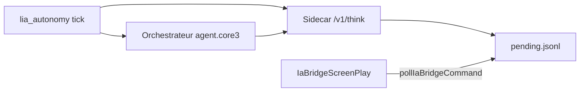

# Phase E — Lia autonome (orchestrateur + sidecar)

**Objectif** : faire « jouer » **Lia** sans intervention manuelle : le LLM choisit `say`, `switch_zone` ou `noop`, enqueue dans `ia_bridge/pending.jsonl`, exécution par `IaBridgeScreenPlay` (tick 2 s).

> **Incarnation orchestrateur** : prompts persona + brain + API `/v1/lia/hear` — voir [Lia = orchestrateur en jeu](core3_ia_lia_orchestrator_incarnation.md).

## Chaîne



## Activation

| Hôte | Méthode |
|------|---------|
| VM **140** (orchestrateur) | `/etc/lbg-core3-ia.env` : `LBG_CORE3_LIA_AUTONOMY_ENABLED=1`, `LBG_CORE3_IA_SIDECAR_URL=http://192.168.0.245:8791`, `systemctl restart lbg-orchestrator` |
| VM **245** (sidecar local) | `systemctl enable --now lbg-core3-ia-lia-autonomy` |

Variables utiles :

| Variable | Défaut | Rôle |
|----------|--------|------|
| `LBG_CORE3_LIA_AUTONOMY_ENABLED` | `0` | Active la boucle |
| `LBG_CORE3_LIA_AUTONOMY_INTERVAL_S` | `30` | Secondes entre ticks (15–600) ; plus bas = plus active |
| `LBG_CORE3_LIA_AUTONOMY_MODE` | `invoke` | `invoke` (dans le process orchestrateur), `orchestrator` (HTTP `/v1/route`), `sidecar` (HTTP `/v1/think`) |
| `LBG_CORE3_LIA_AUTONOMY_PROMPT` | — | Consigne fixe ; sinon prompts rotatifs FR |
| `CORE3_IA_BOT_CHARACTER` | `Lia` | Prénom IG |
| `LBG_CORE3_LIA_AUTO_CONNECT` | `0` | Orchestrateur connecte Lia via `/v1/lia/connect` si hors ligne |

## Test manuel

```bash
curl -s http://127.0.0.1:8791/v1/player-snapshot?player=Lia
curl -s -X POST http://127.0.0.1:8791/v1/think \
  -H 'Content-Type: application/json' \
  -d '{"player":"Lia","prompt":"Salue les voyageurs proches en une phrase."}'
```

## Actions joueur (pending.jsonl)

| Action | Effet |
|--------|--------|
| `say` | `spatialChat` + relais `[Lia] …` en system message si Teome à &lt; 64 m ; approche auto avant parler |
| `move_to` | Téléport serveur vers x,y,z (Tatooine) |
| `animate` | `doAnimation` (message = nom anim, ex. `wave`, `sit`) |
| `perform` | Gestes métier (message = id catalogue : `dance`, `greet`, `search`, `forage`, …) — chaîne d’anims + message system |
| `interact` | Interaction ciblée (message = `kind:target`, ex. `greet:Teome`, `assist:Teome`, `examine:Teome`) |
| `approach_player` | Rapproche Lia du prénom IG (message, ex. `Teome`) |
| `switch_zone` | Changement de zone |
| `noop` | Rien |

Portée bulle spatial SWG ~16 m : utiliser `approach_player` ou `move_to` avant `say` si les joueurs sont loin.

## Limites

- Pas de marche client réaliste (headless sans paquets mouvement) : déplacement = **téléport serveur**.
- Tick ignoré si Lia hors ligne (headless client arrêté).
