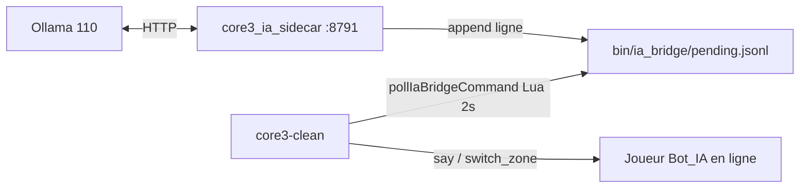

# Pont Core3 ↔ joueur IA (v0)

Pont minimal pour qu’un **LLM** pilote un **personnage joueur en ligne** sur **Core3**.

**Périmètre (ADR 0007)** : **Serveur Prime** (`core3-clean`) + planète **`tatooine`** uniquement. Guide ops : **`docs/core3_ia_prime_tatooine.md`**.

## Architecture



## Prérequis

1. **Build Antigravity** avec `pollIaBridgeCommand` (`server-core3` / `DirectorManager`).
2. Scripts Lua : `custom_scripts/screenplays/ia_bridge_screenplay.lua` (+ include dans `screenplays.lua`).
3. Joueur **connecté en jeu** (ex. compte `Bot_IA`) — le pont ne remplace pas le login. **Phase D** : session via `core3client` (sans UI) ou client SWG classique.
4. Sidecar lancé depuis le **cwd** = répertoire `MMOCoreORB/bin` du serveur (là où tourne `core3-clean`).

## Format de file (une ligne = une commande)

```
action|player|zone|x|y|z|message
```

| action | Effet |
|--------|--------|
| `say` | Message système `[IA] …` |
| `switch_zone` | `switchZone(zone, x, y, z, 0)` |
| `move_to` / `approach_player` | Déplacement Lia/Nix (voir **Mouvement** ci-dessous) |
| `housing_enter` | Entrée cantina test (téléport bar, cell `1082877` ; scène théâtre `1105851`) |

## Mouvement joueurs IA (Lia / Nix)

Fichier côté serveur (cwd `MMOCoreORB/bin`) : `ia_bridge/movement_mode`

| Valeur | Comportement |
|--------|----------------|
| `teleport` | **Défaut phase test** — déplacement instantané côté serveur (comme avant). |
| `walk` | Pas serveur ~5 m / ~1,4 s, même cellule ; secours si pas de `core3client`. |
| `client` | **Mouvement joueur réel** : le screenplay écrit `ia_bridge/bot_move.jsonl`, le `core3client` headless envoie des `DataTransform`. |

- `approach_player` vers une cible dans **une autre cellule** (ex. Teome en cantina, bot dehors) : refus en mode `walk` — utiliser `housing_enter` ou rester dehors.
- Les PNJ pilotes utilisent déjà `walk_patrol` (navmesh `setNextPosition`) ; les joueurs IA n’ont pas d’`AiAgent`, d’où la marche par jalons.
- Snapshots multi-joueurs : champs `parent_id`, `in_interior` pour guider l’autonomie (éviter `move_to` extérieur quand le groupe est en cantina).

Passer en vie « réelle » sur la VM :

```bash
# Marche serveur (secours)
echo walk | sudo tee /opt/lbg-new-mmo-clean/MMOCoreORB/bin/ia_bridge/movement_mode

# Mouvement client (recommandé avec lbg-core3-ia-bot-client actif)
echo client | sudo tee /opt/lbg-new-mmo-clean/MMOCoreORB/bin/ia_bridge/movement_mode
# Rebuild core3client après mise à jour C++ :
#   cd .../MMOCoreORB/build && cmake --build . --target core3client -j$(nproc)
# cache Lua ~30 s ; redémarrer le service bot-client si binaire changé
```

Format `ia_bridge/bot_move.jsonl` (une ligne) : `move_to|Lia|x|y|z|stopM` ou `stop|Lia`.

Exemples :

```
say|Bot_IA||||Salut, je suis le cobaye IA.
switch_zone|Bot_IA|tutorial|0|5|0|
```

## Sidecar HTTP

Depuis `LBG_IA_MMO/tools/core3_ia_sidecar/` :

```bash
cd /opt/lbg-new-mmo-clean/MMOCoreORB/bin
export CORE3_IA_BRIDGE_CWD=$PWD
export LBG_DIALOGUE_LLM_BASE_URL=http://192.168.0.110:11434/v1
export LBG_DIALOGUE_LLM_MODEL=phi4-mini:latest
python3 /opt/LBG_IA_MMO/tools/core3_ia_sidecar/core3_ia_sidecar.py
```

| Endpoint | Description |
|----------|-------------|
| `GET /healthz` | Santé + chemins file / snapshot (phase B) |
| `GET /v1/player-snapshot?player=Lia` | État serveur du perso (409 si hors ligne) |
| `POST /v1/enqueue` | Corps JSON `{ "line": "..." }` ou `{ "action", "player", "zone", "x", "y", "z", "message" }` |
| `POST /v1/think` | Snapshot + LLM + enqueue (`prompt`, `player`, `enqueue`) — 409 si offline |

Test manuel :

```bash
curl -s http://127.0.0.1:8791/v1/enqueue -H 'Content-Type: application/json' \
  -d '{"action":"say","player":"Lia","message":"Pont IA OK"}'
```

## Déploiement VM 245 (Phase A)

```bash
cd LBG_IA_MMO
bash infra/scripts/setup_core3_ia_prime_phase_a_vm.sh
```

Installe Lua, Tatooine seule, compte **Bot_IA**, systemd **`lbg-core3-ia-sidecar`**. Puis connecter **Bot_IA** sur Prime/Tatooine pour les tests en jeu.

## Limites v0

- Pas de lecture position / inventaire vers le LLM (phase suivante).
- Un seul consommateur (screenplay global).
- Pas d’auth HTTP sur le sidecar (LAN uniquement, `127.0.0.1` recommandé).
- Rebuild **obligatoire** après modification C++.

## Phases (ADR 0007)

| Phase | Statut | Doc |
|-------|--------|-----|
| A — file + sidecar + `say` / `switch_zone` | Terminée | ce fichier, `core3_ia_prime_tatooine.md` |
| B — snapshot joueur → LLM | Terminée | `core3_ia_phase_b_snapshot.md` |
| C — PNJ pilotes | Terminée | `docs/core3_ia_phase_c_npc_pilots.md` |
| D — **Bot_IA** / **Lia Bot** headless (`core3client`) | **v1** | `docs/core3_ia_phase_d_headless_bot.md` |
| E — monde vivant | À faire | `plan MMMORPG.md` |

**Phase D (v1)** : compte réservé **Bot_IA**, perso **Lia Bot**, session headless via `core3client` — `docs/core3_ia_phase_d_headless_bot.md`. Fermer le client SWG avant d’activer le service (une session à la fois).

## Suite (après Phase B)

- Token `X-LBG-Service-Token` sur le sidecar.
- Actions : `move`, dialogue PNJ, radial (whitelist progressive).

Voir aussi : `docs/fusion_pont_jeu_ia.md`, `docs/migration_new_mmo_core3.md`.
