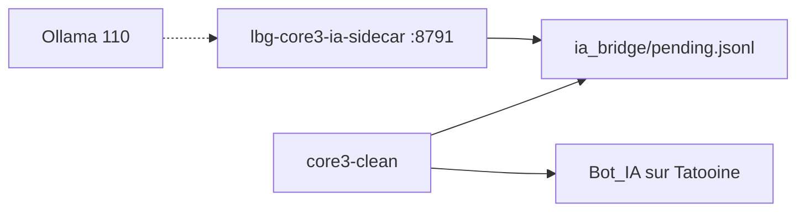

# Pont IA — Serveur Prime, planète Tatooine

Périmètre actuel du pont Core3 ↔ LBG_IA :

| Élément | Valeur |
|---------|--------|
| Instance | **Galaxy 3** — `core3-clean` — **LBG MMO Serveur Prime** |
| Planète | **`tatooine`** (id zone Core3 ; affichage cible **Scrapaltai** — voir [ADR 0009](adr/0009-scrapaltai-lost-heaven.md)) |
| Hors scope | PreCu (`core3-swgemu`), autres planètes, espace |

## Architecture (Phase A)



## Ops — Prime seul (PreCu coupé, provisoire)

Pour stabiliser la VM pendant le pont IA / build Antigravity :

```bash
bash infra/scripts/stop_core3_precu_vm.sh
bash infra/scripts/start_core3_prime_only_vm.sh
```

**systemd (recommandé)** — redémarrage auto si crash, plus de `pkill` orphelin après deploy :

```bash
bash infra/scripts/install_core3_prime_systemd_vm.sh
bash infra/scripts/restart_core3_prime_vm.sh   # deploy Lua / pont IA
```

| Commande | Rôle |
|----------|------|
| `systemctl status lbg-core3-prime` | État Prime sur la VM |
| `install_core3_prime_systemd_vm.sh` | Installe + enable l’unité |
| `restart_core3_prime_vm.sh` | Redémarrage (utilisé par `deploy_core3_ia_bridge_vm.sh --restart`) |

Log : `/tmp/core3-clean.log` (append). Boot ~2–3 min avant pastille verte launchpad (`:8792`).

`start_core3_dual_vm.sh` démarre **Prime seul** par défaut. Dual complet : `CORE3_START_PRECU=1 bash infra/scripts/start_core3_dual_vm.sh`.

## Déploiement VM 245

```bash
cd LBG_IA_MMO
bash infra/scripts/setup_core3_ia_prime_phase_a_vm.sh
```

Crée / met à jour :

- Scripts Lua (`ia_bridge_screenplay.lua`, zone **Tatooine** seule)
- `Core3.ZonesEnabled` sur **clean** (défaut setup : `tatooine` + `tutorial` — pas de blocage login)
- Compte **`Bot_IA`** (admin 0), mot de passe par défaut `lbgiabot` (surcharge `CORE3_IA_BOT_PASSWORD`)
- Unités **`lbg-core3-ia-sidecar.service`**, **`lbg-core3-prime.service`** (optionnel : `install_core3_prime_systemd_vm.sh`)

## Renommer la planète (affichage)

L’**id technique** reste `tatooine` dans :

- `config-local.lua` → `Core3.ZonesEnabled`
- `ia_bridge_screenplay.lua` → `IA_BRIDGE_ZONE`
- `/etc/lbg-core3-ia.env` → `CORE3_IA_ZONE`

Pour un autre **id** (ex. `lbg_prime_desert`), aligner les trois fichiers puis redémarrer `core3-clean` et le sidecar.

## Test

1. Client → **LBG MMO Serveur Prime** (ports 4455x), login **Bot_IA**.
2. Créer / charger un perso sur **Tatooine**.
3. :

```bash
ssh lbg@192.168.0.245 "curl -s -X POST http://127.0.0.1:8791/v1/enqueue \
  -H 'Content-Type: application/json' \
  -d '{\"action\":\"say\",\"player\":\"Lia\",\"message\":\"Salut depuis le pont IA\"}'"
```

`player` = **prénom du perso** en jeu (`Lia` pour Lia Bot), pas le login `Bot_IA`. Par défaut le sidecar utilise `CORE3_IA_BOT_CHARACTER` (`Lia`).

Message attendu en jeu : `[IA] Salut depuis le pont IA`.

## Phase A — validée

- [x] Sidecar `lbg-core3-ia-sidecar` (:8791, `CORE3_IA_BOT_CHARACTER=Lia`)
- [x] Screenplay `IaBridgeScreenPlay` + `pollIaBridgeCommand`
- [x] Smoke en jeu : `[IA] Pont IA OK` avec Lia connectée sur Prime / Tatooine

**Règle ops** : le pont ne fait pas le login. Session joueur : client SWG **ou** Phase D `core3client` (`docs/core3_ia_phase_d_headless_bot.md`) — pas les deux en même temps.

## Phase B — validée (impl.)

Snapshot serveur → sidecar → LLM. Doc : **`docs/core3_ia_phase_b_snapshot.md`**.

```bash
bash infra/scripts/smoke_core3_ia_phase_b_lan.sh
```

Rebuild + install : `install_core3_clean_after_vm_build.sh` (Phase B C++ actif).

## Phase C — suite

PNJ pilotes — ADR 0007, `plan MMMORPG.md`.
