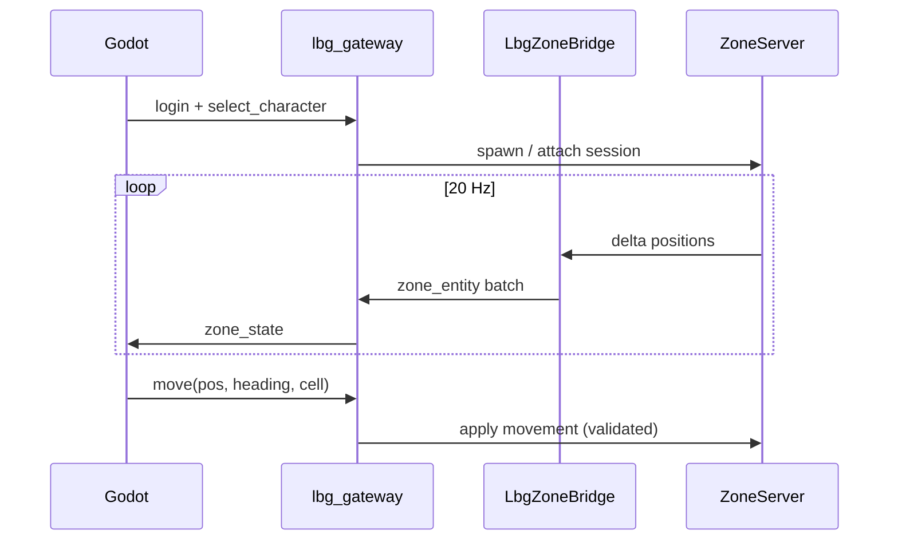

# Spec — Zone bridge Core3 ↔ client Godot (`lbg-ws/2`)

**Statut** : brouillon technique — juin 2026  
**Objectif** : un joueur contrôlé depuis Godot apparaît **sur la même zone** que sous `lbgemu`, avec deltas temps réel.

Schémas JSON : [`schemas/lbg-ws/server.zone_state_v2.schema.json`](schemas/lbg-ws/server.zone_state_v2.schema.json), [`schemas/lbg-ws/client.zone_command_v2.schema.json`](schemas/lbg-ws/client.zone_command_v2.schema.json).

Plan produit : [`plan_client_godot_prime_rendu.md`](plan_client_godot_prime_rendu.md).

---

## 1. Composants

| Composant | Rôle |
|-----------|------|
| **Godot** | Rendu monde + input ; consomme `zone_state`, envoie `move` |
| **lbg_gateway** (étendu) | WS `lbg-ws/2`, auth SQL, traduction vers le bridge C++ |
| **LbgZoneBridge** (C++ / ZoneServer) | Abonnement joueurs/PNJ en zone ; push 10–20 Hz |
| **Core3 Prime** | Autorité simulation, collision, persistance |

---

## 2. Session unique par personnage

Politique recommandée : **`kick_other`**

- Si Teome est en ligne via `lbgemu` et Godot fait `select_character(Teome)` → déconnecter la session SWG **ou** refuser Godot avec `error: character_in_use`.
- Config serveur : `LBG_ZONE_SESSION_POLICY=kick_other|reject`.

---

## 3. Messages (résumé)

### Serveur → client : `zone_state`

Voir schéma v2. Champs clés :

- `your_character_id` — entité que ce client contrôle
- `entities[]` — joueurs + PNJ avec `pos`, `cell`, `local_pos`, `appearance`, `anim`
- `removed_entity_ids[]` — despawn

### Client → serveur : `move`

Coords **monde** `[x, hauteur, z]` + `cell` + `heading` + `seq`.

Le serveur valide collision / navmesh ; le client prédit localement puis corrige sur delta.

---

## 4. Phases d’implémentation C++

| Phase | Livrable |
|-------|----------|
| **ZB-0** | Interface header `LbgZoneBridge.h` + hook dans `ZoneServer::update` (lecture seule) |
| **ZB-1** | Export JSON fichier ou SHM pour gateway (comme snapshots, mais 20 Hz) |
| **ZB-2** | Injection `move` validé depuis gateway |
| **ZB-3** | `appearance` minimal (species, height) depuis `CreatureObject` |

Fichiers cibles (à confirmer dans le tree `server-core3`) :

- `src/server/zone/ZoneServer.h`
- `src/server/zone/managers/player/PlayerManager.h`
- Nouveau : `src/server/lbg/LbgZoneBridge.cpp`

---

## 5. Parallèle client (M0)

Sans attendre ZB-2 :

- Scène [`lbg_client_godot/scenes/world/CantinaInterior.tscn`](../lbg_client_godot/scenes/world/CantinaInterior.tscn) — repère SWG local
- Quand `cell == 1082877`, afficher l’intérieur ; entités déjà en delta cantina (gateway v1)

Quand ZB-1 actif : remplacer `world_state` v1 par `zone_state` v2 dans `Network.gd`.

---

## 6. Critères d’acceptation (M2)

1. Teome connecté Godot + cantina habillée visible.
2. Teome connecté lbgemu : **même position** ±1 m (même cellule).
3. Un seul client actif par personnage (policy documentée).
4. PNJ bar présents des deux côtés (roster `exactly_one`).
