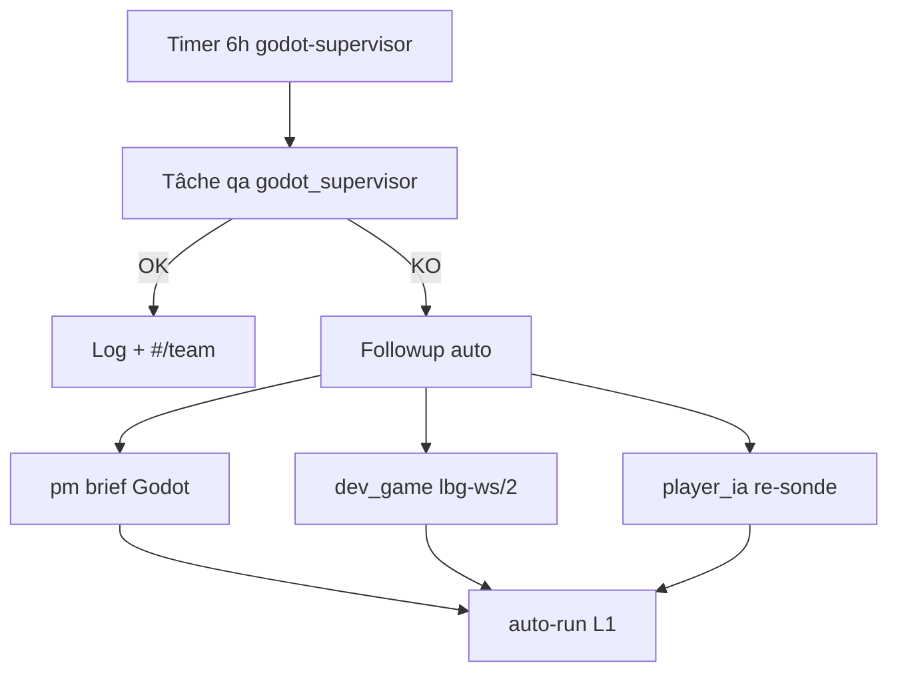

# Équipe virtuelle autonome — Godot + sidecar 246 + lbg-ws/2

**Objectif** : demain matin, la Team pilote les deux pistes client **sans intervention manuelle** (timers + followups auto).

---

## Boucle autonome (VM 140)



| Timer | Actor | Rôle | Période |
|-------|-------|------|---------|
| `lbg-team-godot-supervisor-job` | `system:team_godot_supervisor` | qa (godot_supervisor) | **6 h** |
| `lbg-team-infographiste-job` | `system:team_infographiste` | dev_game (infographiste_ia) | **12 h** |
| `lbg-team-godot-client-tracks-job` | `system:team_godot_client_tracks` | dev_game M3/M5/ZB-0 | **8 h** |
| `lbg-team-player-ia-job` | `system:team_player_ia` | player_ia probe | 12 h |
| `lbg-team-pm-reunification-job` | `system:team_pm_reunification` | pm brief | 24 h |
| `lbg-team-qa-smoke-job` | `system:team_qa_smoke` | qa smoke LAN | 24 h |

Installation :
```bash
bash infra/scripts/install_team_godot_supervisor_job_vm.sh
bash infra/scripts/install_team_infographiste_job_vm.sh
bash infra/scripts/install_team_godot_client_tracks_job_vm.sh
```

---

## Variables clés (`/etc/lbg-ia-mmo.env`)

```bash
LBG_TEAM_GODOT_SUPERVISOR_JOB_ENABLED=1
LBG_TEAM_GODOT_FOLLOWUP_ENABLED=1
LBG_TEAM_GODOT_FOLLOWUP_AUTO_RUN=1          # pm + dev_game + player_ia auto
LBG_CORE3_SIDECAR_URL=http://192.168.0.246:8791
LBG_TEAM_GODOT_GATEWAY_SMOKE=0              # 1 quand gateway :50000 actif sur 246
LBG_TEAM_GODOT_GATEWAY_HOST=192.168.0.246
LBG_GATEWAY_WS2_PREVIEW=1                   # négociation lbg-ws/2 sur gateway
LBG_TEAM_GODOT_SOE_M3=1                     # sonde SOE login+zone dans superviseur
LBG_TEAM_GODOT_SOE_M5=0                     # 1 quand M3 stable
LBG_CLIENT_PRIME_LBG_DIR=/home/sdesh/projects/new_mmo/client-prime-lbg
LBG_NEW_MMO_ROOT=/home/sdesh/projects/new_mmo
```

---

## Pilot `#/team` — raccourcis

| Bouton | Effet |
|--------|--------|
| **Supervise Godot** | qa godot_supervisor full → Lancer |
| **Audit lbg-ws/2** | dev_game piste gateway → Lancer |
| **Infographiste IA** | dev_game Pygmalion — manifest GLB → Lancer |
| **SOE M3** / **SOE M5** / **Audit ZB-0** / **Client live** | dev_game pistes M3/M5/ZB-0 |
| **Brief réunification** | pm sous-projets |
| **Sonde joueurs IA** | player_ia probe |

Plan NL exemple : *« supervise godot et lbg-ws/2 sur Prime »* → propose qa + dev_game.

---

## Pistes parallèles

### M1 — Prime 2D (`new_mmo/prime-client`)
- Miroir : `client-prime-lbg/run_sidecar_mirror.sh`
- Smoke : `infra/scripts/smoke_godot_sidecar_mirror_lan.sh`

### lbg-ws/2 — Gateway preview (`services/lbg_gateway/`)
- Client WS `proto: "lbg-ws/2"` → messages `zone_state` v2 (lecture snapshots)
- Audit équipe : tâche dev_game `godot_track: lbg_ws2`
- Spec C++ : `docs/core3_zone_bridge_spec.md` (ZB-0 à venir)

---

## Demain matin (checklist ops)

1. `systemctl list-timers 'lbg-team-*'` sur **140** — tous **active**
2. `#/team` filtrer `system:team_godot_supervisor` — dernière tâche **done**
3. Si **failed** : followups pm/dev_game/player_ia déjà **done** (auto-run)
4. Godot visuel (poste dev) : `run_sidecar_mirror.sh` + `godot4 --path prime-client`

---

## Références

- [`jalon_client_godot_sidecar_246.md`](jalon_client_godot_sidecar_246.md)
- [`runbook_promotion_prototype_core3.md`](runbook_promotion_prototype_core3.md)
- [`core3_zone_bridge_spec.md`](core3_zone_bridge_spec.md)
- [`jalon_infographiste_ia.md`](jalon_infographiste_ia.md)
- [`jalon_godot_client_live_team.md`](jalon_godot_client_live_team.md)
