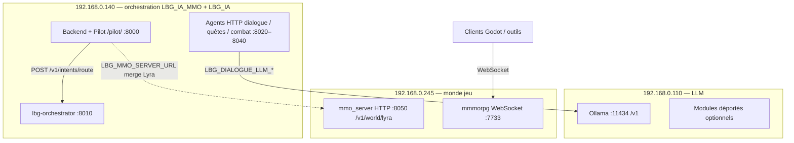

# Topologie LAN — répartition cible (point 1 / phase A)

Document **vivant** : à mettre à jour si les IPs ou les rôles changent. Lié à **`plan_fusion_lbg_ia.md`**.

## Décision actuelle (réseau privé)

| IP | Rôle principal | Notes |
|----|------------------|--------|
| **`192.168.0.140`** | **Orchestrateur LBG** (monorepo : `lbg-orchestrator`, etc.) + **stack LBG_IA** (orchestrateur « produit » : Vue / Docker / `RouterIA`, Postgres selon déploiement) | Point d’entrée **logique** pour l’IA et l’UI produit ; **`deploy_vm.sh`** déploie **ce monorepo** vers cette machine par défaut (`LBG_VM_HOST`). |
| **`192.168.0.245`** | **Serveur MMO** : **`mmmorpg`** (WebSocket, jeu) + idéalement **`mmo_server`** HTTP (Lyra PNJ, `/v1/world/lyra`, persistance `WorldState`) | Séparer le **monde jeu** et la **slice Lyra** réseau du reste ; les services **140** appellent **245** via URLs (voir ci‑dessous). |
| **`192.168.0.110`** | **LLM local** (Ollama) + **Frontend Unifié** (Nginx :8080) | Héberge l'interface **Lyra** (racine) et le **Client MMO** (`/mmo/`). |

---

## Schéma « qui appelle qui » (flux principaux)



**Lecture** : les **agents sur 140** utilisent **`LBG_DIALOGUE_LLM_*`** pour joindre **Ollama sur 110**. Le **backend / pilot** appelle **245** via **`LBG_MMO_SERVER_URL`** (`GET /v1/world/lyra`) pour fusionner `context.lyra` si `world_npc_id` est présent. Les **clients jeu** parlent en **WebSocket** à **`mmmorpg` sur 245**, pas au port 8000. Les **healthz** agrégés peuvent couvrir 140 et 245 selon la config.

---

## Compte de déploiement : même utilisateur **sudoer** sur 110, 140 et 245

Pour pouvoir lancer **`deploy_vm.sh`** depuis le poste de dev vers **chaque** VM concernée (sans changer de procédure à chaque fois) :

1. **Même identité Unix** recommandée sur les trois machines : ex. utilisateur **`lbg`**, membre de **`sudo`**, propriétaire de `/opt/LBG_IA_MMO` sur les hôtes où le monorepo est installé.
2. **SSH par clé** : la même clé publique peut être autorisée sur **140**, **245** (et **110** si tu y déploies aussi du code du monorepo, ex. agents).
3. **Première fois sur une VM** : reprendre la logique de **`docs/ops_vm_user.md`** (création user, `authorized_keys`, `chown` `/opt`).
4. **`deploy_vm.sh`** : **`LBG_VM_HOST`** + **`LBG_DEPLOY_ROLE`** (voir § **Déploiement par machine**). En résumé : **`core`** sur **140**, **`mmo`** sur **245**, **`front`** sur **110**, ou **`all`** pour les trois à la suite.

```bash
LBG_DEPLOY_ROLE=all LBG_VM_USER=lbg bash infra/scripts/deploy_vm.sh
```

Sur **110**, le rôle **`front`** ne dépose que **`pilot_web/`** (pas de venv complet) ; **Ollama** et **Nginx** restent des ops séparées. Le compte **`lbg` sudoer** sert aussi aux **mises à jour Ollama** et à la conf **nginx**.

---

## Table des variables (monorepo LBG_IA_MMO — fichiers sur **140**)

Sur la VM **140**, `/etc/lbg-ia-mmo.env` (ou équivalent) doit refléter les **hôtes réels**.

**Même fichier copié sur les trois VM (140 / 245 / 110)** : pour **`LBG_ORCHESTRATOR_URL`** et **`LBG_AGENT_*_URL`**, utiliser **`http://192.168.0.140:…`** (IP LAN du core), **pas** `127.0.0.1` — sinon, sur **245** ou **110**, le loopback désigne la machine locale, pas l’orchestrateur. En **dev local seul** (poste WSL sans réplication), tu peux temporairement mettre `127.0.0.1` pour ces URLs.

Si tu ne dupliques l’env **que** sur **140** (un fichier par machine), les services qui écoutent en **127.0.0.1** sur **140** peuvent rester en loopback pour ces URLs ; tout ce qui tourne sur **une autre machine** utilise l’**IP LAN**.

| Variable | Exemple cible (LAN) | Rôle |
|----------|---------------------|------|
| `LBG_ORCHESTRATOR_URL` | `http://192.168.0.140:8010` | **Recommandé** si le **même** `lbg.env` est poussé sur **140 / 245 / 110**. Sur **140 seule** avec env dédié : `http://127.0.0.1:8010` possible. |
| `LBG_AGENT_DIALOGUE_URL` | `http://192.168.0.140:8020` | Idem : LAN si env partagé ; loopback seulement si fichier **uniquement** sur **140**. |
| `LBG_AGENT_QUESTS_URL` | `http://192.168.0.140:8030` | Idem. |
| `LBG_AGENT_COMBAT_URL` | `http://192.168.0.140:8040` | Idem. |
| **`LBG_DIALOGUE_LLM_BASE_URL`** | **`http://192.168.0.110:11434/v1`** | **Ollama sur 110** — obligatoire si le LLM n’est plus local à **140**. |
| `LBG_DIALOGUE_LLM_MODEL` | `phi4-mini:latest` (ou modèle présent sur **110**) | Cohérent avec ce qu’Ollama expose sur **110**. |
| **`LBG_MMO_SERVER_URL`** | **`http://192.168.0.245:8050`** | **`mmo_server`** HTTP sur **245** ; le **backend 140** fusionne `context.lyra` via `GET /v1/world/lyra`. |
| **`LBG_MMO_INTERNAL_TOKEN`** | **`change-moi`** (optionnel) | Si défini sur **245** (`lbg-mmo-server`), protège l’écriture interne `POST /internal/v1/npc/{npc_id}/reputation` via `X-LBG-Service-Token`. Le **backend 140** doit avoir la **même** valeur pour relayer le double-write depuis `POST /v1/pilot/reputation`. |
| `LBG_MMO_STATE_PATH` | Chemin **sur la VM 245** (pas sur 140) | À configurer **uniquement** sur l’hôte où tourne **`mmo_server`** (fichier d’état monde). |
| `LBG_MMO_SEED_PATH` | *(optionnel)* Chemin vers un JSON **seed** PNJ | Défaut : fichier versionné sous **`mmo_server/world/seed_data/`** dans le dépôt ; surcharge pour tests ou variante de scène. |
| `LBG_DEVOPS_HTTP_ALLOWLIST` | Inclure les healthz **réels** (ex. `http://192.168.0.140:8010/healthz`, `http://192.168.0.140:8000/healthz`, et si besoin `http://192.168.0.245:8050/healthz`) | Ajuster si DevOps sonde des services sur plusieurs hôtes. |

**Firewall / routage** : entre **140** et **245** / **110**, autoriser les ports utilisés (ex. **8050** 245←140, **11434** 110←140, **7733** clients→245 pour `mmmorpg`).

---

## Déploiement par machine

Script : **`infra/scripts/deploy_vm.sh`** (racine **`LBG_IA_MMO/`**). Variable **`LBG_DEPLOY_ROLE`** :

**Poste de dev (WSL)** : si `ssh lbg@<vm>` n’utilise pas automatiquement la bonne clé, exporter **`LBG_SSH_IDENTITY`** (clé privée) — voir `docs/ops_vm_user.md`. Optionnel : **`LBG_SSH_KNOWN_HOSTS_FILE=/tmp/lbg_known_hosts`** pour un `known_hosts` écrivable.

**CRLF** : `deploy_vm.sh` exécute **`infra/scripts/fix_crlf.sh`** avant `rsync` (opt-out : **`LBG_SKIP_FIX_CRLF=1`**).

| Rôle | Hôte par défaut | Contenu poussé / installé |
|------|-----------------|---------------------------|
| **`core`** | `LBG_LAN_HOST_CORE` → **192.168.0.140** | Monorepo **sans** `mmo_server/` ; `install_local.sh` avec **`LBG_SKIP_MMO_SERVER=1`**. Si **`LBG_PILOT_WEB_ON_FRONT=1`** (défaut en mode `all`), **`pilot_web/`** est exclu du sync. |
| **`mmo`** | `LBG_LAN_HOST_MMO` → **192.168.0.245** | Sync **sans** `backend/`, `orchestrator/`, `agents/`, `pilot_web/` ; **`install_local_mmo.sh`** + unité **`lbg-mmo-server`**. |
| **`front`** | `LBG_LAN_HOST_FRONT` → **192.168.0.110** | **Uniquement** `pilot_web/` → `/opt/LBG_IA_MMO/pilot_web` (pas de venv monorepo sur 110). |
| **`all`** | — | Enchaîne **`core` → `mmo` → `front`** sur les trois IP ci‑dessus. |

### “Ça déploie aussi X ?” (rappel rapide)

- **`pilot_web/index.html` (page statique)** : **oui** — en rôle **`front`** (donc aussi via `LBG_DEPLOY_ROLE=all`), le répertoire `pilot_web/` est synchronisé vers **`/opt/LBG_IA_MMO/pilot_web/`** sur la VM **110**.
- **Conf Nginx front** `infra/nginx/pilot_web_110.conf.example` (proxy `/v1/*`) : **non** — `deploy_vm.sh` ne configure pas Nginx. Pour (ré)installer la conf sur **110**, lancer depuis le poste de dev :

```bash
LBG_NGINX_PILOT_PORT=8080 bash infra/scripts/install_nginx_pilot_110.sh
```

- **Secrets** `infra/secrets/lbg.env` → `/etc/lbg-ia-mmo.env` : **non** — utiliser :

```bash
bash infra/scripts/push_secrets_vm.sh
```

- **Remise en cohérence “tout le LAN”** : en pratique **`deploy_vm.sh all` → `push_secrets_vm.sh` → `install_nginx_pilot_110.sh`** (si tu sers le pilot en statique via Nginx sur 110).

Exemples :

```bash
# Stack orchestrateur + backend + agents sur 140 (sans MMO sur disque)
LBG_DEPLOY_ROLE=core LBG_VM_HOST=192.168.0.140 LBG_PILOT_WEB_ON_FRONT=1 bash infra/scripts/deploy_vm.sh

# MMO seul sur 245
LBG_DEPLOY_ROLE=mmo LBG_VM_HOST=192.168.0.245 bash infra/scripts/deploy_vm.sh

# Pilot statique sur 110
LBG_DEPLOY_ROLE=front LBG_VM_HOST=192.168.0.110 bash infra/scripts/deploy_vm.sh

# Tout le LAN en une commande
LBG_DEPLOY_ROLE=all bash infra/scripts/deploy_vm.sh
```

**LBG_IA** (autre dépôt, Vue / Docker / Postgres) sur **140** : procédure **séparée** sur la même machine — documenter les **ports** (ex. **8000** vs **3000**). **`mmmorpg`** (WebSocket) sur **245** : paquet **`mmmorpg_server/`** dans ce monorepo, unité **`lbg-mmmorpg-ws.service`** (rôle **`deploy_vm.sh` mmo**) ; variables **`LBG_MMO_*`** / **`MMMORPG_*`** dans `/etc/lbg-ia-mmo.env`. Le dépôt source **`~/projects/mmmorpg`** reste la référence hors monorepo.

### Point d’arrêt — reprise (2026-04-11)

- Compte **`lbg`** (sudoer) **OK** sur **140 / 245 / 110**.
- **`LBG_DEPLOY_ROLE=all`** exécuté avec succès : core sans **`mmo_server`** sur 140, **`lbg-mmo-server`** sur 245, **`pilot_web`** sous `/opt/LBG_IA_MMO/pilot_web` sur 110.
- **À faire ensuite** : clés SSH (moins de prompts) ; **Nginx** sur 110 : `infra/nginx/pilot_web_110.conf.example` ; **CORS** backend : `LBG_CORS_ORIGINS` dans `/etc/lbg-ia-mmo.env` sur **140** ; pilot : URL backend **`http://192.168.0.140:8000`** ; smoke LAN : **`bash infra/scripts/smoke_vm_lan.sh`** ; **`mmmorpg`** sur 245 si pas encore déployé.

---

## Option — frontend sur **110**

**Oui, c’est possible** : servir le build statique (Vue LBG_IA ou autre) sur **110**, avec **`VITE_API_BASE_URL`** (ou équivalent) pointant vers l’API sur **140** (ex. `http://192.168.0.140:8000` ou le port du backend LBG_IA).

**À prévoir** :

- **CORS** : sur la VM **140**, définir **`LBG_CORS_ORIGINS`** (fichier env systemd, ex. `http://192.168.0.110` si Nginx écoute le port 80). Le backend expose **`create_app()`** / middleware CORS si cette variable est non vide — voir `backend/main.py`.
- **Nginx (110)** : L'interface est servie sur le port **8080** (standard projet). 
    - Racine `/` : Lyra / Pilotage.
    - Sous-dossier `/mmo/` : Client MMO (Vite).
    - Proxy `/v1/` : Vers l'API sur 140:8000.
- **Déploiement** : Utiliser `deploy_web_client.sh` pour le MMO et `deploy_vm.sh front` pour Lyra.

#### Recette express — client MMO (`/mmo/`) + pont IA (`mmmorpg_server`)

1. **Build** : depuis la racine du dépôt (`…/LBG_IA_MMORPG`), le script regénère le bundle avec la base **`/mmo/`** ; en manuel : `cd web_client && npm ci && npm run build` (le déploiement officiel repasse par le script ci‑dessous).
2. **Copie `pilot_web/mmo` (+ option VM front)** : depuis **`LBG_IA_MMO/`** :
   ```bash
   bash infra/scripts/deploy_web_client.sh
   ```
   Par défaut le script met à jour **`pilot_web/mmo/`** localement puis **rsync** vers **`/opt/LBG_IA_MMO/pilot_web/mmo/`** sur **`LBG_VM_HOST`** (souvent **192.168.0.110**). Pour **ne pas** toucher la VM : `LBG_MMO_WEB_DEPLOY_LOCAL_ONLY=1 bash infra/scripts/deploy_web_client.sh`.
3. **Static Pilot + page Desktop** : **`pilot_web/index.html`** (dictée Web Speech, `#/desktop`) part avec le rôle **`front`** : `LBG_DEPLOY_ROLE=front LBG_VM_HOST=192.168.0.110 bash infra/scripts/deploy_vm.sh`.
4. **Serveur WebSocket MMO (VM 245)** : après mise à jour de `mmmorpg_server` (ex. `session_summary` / `memory_hint` sur le pont IA), redémarrer l’unité **`lbg-mmmorpg-ws`** sur la VM MMO ou repasser **`LBG_DEPLOY_ROLE=mmo`** pour resynchroniser et recharger les services.
5. **Dictée navigateur** : l’API **SpeechRecognition** exige en pratique **HTTPS** ou **localhost** ; un Pilot servi en HTTP nu sur une IP LAN peut bloquer le micro. Prévoir TLS (Nginx), tunnel, ou test local.

**Alternative** : garder le **frontend sur 140** avec le reste LBG_IA pour limiter la latence et la config réseau.

---

## Résumé une ligne

- **140** = cerveau orchestration + LBG_IA (déploiement MMO monorepo via **`deploy_vm.sh`**).
- **245** = monde MMO (`mmmorpg` + `mmo_server`).
- **110** = LLM (+ modules déportés ; **option** front).

---

## Historique

| Date | Changement |
|------|------------|
| 2026-05-02 | **Recette LAN** : sous‑section *Recette express* (build `web_client`, `deploy_web_client.sh`, `deploy_vm.sh front`, redémarrage `lbg-mmmorpg-ws`, contrainte HTTPS pour dictée `#/desktop`). |
| 2026-04-12 | Conflit **:80** : **Traefik** LBG_IA (`orchestrateur-traefik`) vs nginx pilot — **port 8080** ou route Traefik ; précisions § option front. |
| 2026-04-12 | **`LBG_CORS_ORIGINS`** (backend), exemple **Nginx** `infra/nginx/pilot_web_110.conf.example`, smoke **`smoke_vm_lan.sh`**. |
| 2026-04-12 | Env partagé sur 3 VM : `LBG_ORCHESTRATOR_URL` / `LBG_AGENT_*` en **192.168.0.140** (pas loopback) ; précisions dans la table. |
| 2026-04-11 | Création : répartition 140 / 245 / 110 ; table variables ; option front sur 110. |
| 2026-04-11 | Schéma Mermaid « qui appelle qui » ; compte **lbg** sudoer sur 3 VM ; **`deploy_vm.sh`** multi-cible via **`LBG_VM_HOST`**. |
| 2026-04-11 | **`LBG_DEPLOY_ROLE`** (`core` / `mmo` / `front` / `all`) ; table et exemples ; **point d’arrêt** après déploiement LAN validé. |
| 2026-04-27 | **Unification Port 8080** : Frontend Lyra + MMO sur Nginx 110. Dépréciation du port 8081. |
| 2026-04-16 | Ajouts env : **`LBG_MMO_INTERNAL_TOKEN`** (écriture interne `mmo_server`) ; déploiement : **`LBG_SSH_*`** + **`LBG_SKIP_FIX_CRLF`** / `fix_crlf` avant `rsync`. |
