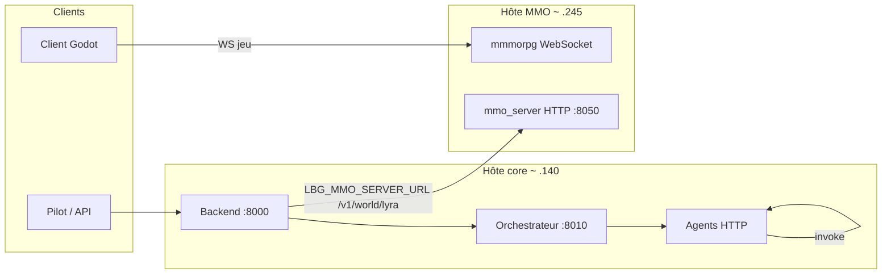

# Spécification monde — sources de vérité (fusion — phase B)

Trois simulations « monde » coexistent dans l’historique du projet. Ce document fixe les **rôles** et une **figure** pour la transmission, sans fusionner le code (ADR **`0002`**, **`plan_fusion_lbg_ia.md`** §3.3–3.4).

---

## 1. Les trois blocs

| Bloc | Dépôt / emplacement | Rôle | Transport / persistance |
|------|---------------------|------|-------------------------|
| **A — Monde jeu multijoueur** | **`mmmorpg`** (à porter dans le monorepo) | **Autorité** joueurs, PNJ réseau, `world_tick`, positions | **WebSocket**, `PROTOCOL.md` |
| **B — Slice IA (`mmo_server`)** | **`LBG_IA_MMO/mmo_server/`** | Jauges PNJ pour **Lyra** / dialogue / orchestrateur ; **`WorldState`** fichier | **HTTP** `/v1/world/lyra`, `LBG_MMO_STATE_PATH` |
| **C — Simulation async LBG_IA** | **`LBG_IA`** — `WorldSimulationCore` | Monde **in‑process** orchestrateur (entités, besoins, `/world/*`, `/godot/*`) | HTTP sur l’API LBG_IA, pas le client Godot MMO |

**Règle** : pour le **jeu client** final, la **vérité spatiale / réseau** est **A** une fois intégré. **B** sert la **chaîne IA** et reste cohérent avec les **`npc_id`** versionnés (`world/seed_data/`). **C** est un **laboratoire / produit LBG_IA** jusqu’à décision de convergence ou abandon au profit de A+B.

---

## 2. Diagramme (cible d’exploitation LAN)

*(Les IPs sont des exemples ; voir **`fusion_env_lan.md`**.)*

**Lecture** : le **joueur** ne parle pas au **`mmo_server`** pour jouer — il parle au **serveur WS**. Le **pilot / backend** utilise **`mmo_server`** pour **enrichir l’IA** (Lyra PNJ).

---

## 3. Correspondance d’identifiants

- **`npc_id`** stable (ex. `npc:smith`) : commun entre **seed** `mmo_server`, **`context.world_npc_id`**, et à terme entités **`kind: npc`** côté **mmmorpg** (à aligner au portage).
- **`player_id`** / **`entity_id`** : propres au **jeu** (WS) ; ne pas les confondre avec **`actor_id`** orchestrateur sans mapping documenté.

### 3.1 PNJ v1 (liste seed monorepo)

Source de vérité : `mmo_server/world/seed_data/README.md` (IDs versionnés).

---

## 4. Évolution

- **Court terme** : documenter les **écarts** volontaires entre B et A (deux vérités possibles — ADR 0002).
- **Moyen terme** : **pont** lecture seule depuis A vers la chaîne IA, puis événements validés (voir **`fusion_pont_jeu_ia.md`**).
- **Long terme** : module Lyra / état PNJ **dans** le processus serveur jeu **ou** service latéral unique — **nouvel ADR** si changement d’architecture.

---

## Voir aussi

- `fusion_pont_jeu_ia.md` — mécanisme de pont
- `fusion_etat_des_lieux_v0.md` — ports et variables
- `plan_mmorpg.md` — roadmap MMO monorepo
