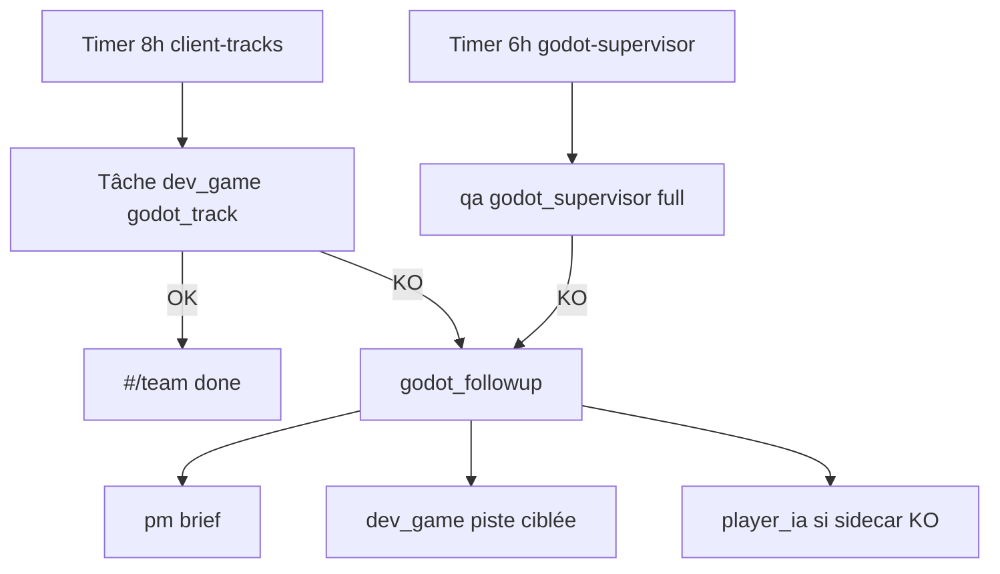

# Jalon équipe — client Godot live M3 / M5 / ZB-0

**Date** : 2026-07-11  
**Statut** : **en cours** — automation équipe virtuelle active  
**Owner** : `dev_game` (Dédale) — sous-projet `client_godot`

---

## Objectif

Faire avancer **autonomement** (timers + followups) les trois pistes client Prime :

| Piste | Jalon | Sonde équipe | Artefact |
|-------|-------|--------------|----------|
| **M3** | SOE login + zone UDP | `soe_m3_login`, `soe_m3_zone` | `new_mmo/client-prime-lbg/soe_handshake.py` |
| **M5** | Play ZQSD | `soe_m5_play` | `prime_controller.py` + Godot `:12346` |
| **ZB-0** | ZoneBridge C++ | `zb0_readiness` | `LbgZoneBridge.h` + hook `ZoneServer` |

---

## Boucle autonome



| Timer | Actor | Rôle | Période |
|-------|-------|------|---------|
| `lbg-team-godot-client-tracks-job` | `system:team_godot_client_tracks` | dev_game (rotation M3→M5→ZB-0→live) | **8 h** |
| `lbg-team-godot-supervisor-job` | `system:team_godot_supervisor` | qa (+ SOE M3, ZB-0 en full) | **6 h** |

Install :
```bash
bash infra/scripts/install_team_godot_client_tracks_job_vm.sh
```

---

## Pilot `#/team`

| Raccourci | Effet |
|-----------|--------|
| **SOE M3** | dev_game `godot_track: soe_m3` |
| **SOE M5** | dev_game `godot_track: soe_m5` |
| **Audit ZB-0** | dev_game `godot_track: zb0` |
| **Client live** | dev_game `godot_track: client_live` (tout) |

Plan NL : *« audit soe m3 zone udp prime »*, *« zb-0 zone bridge »*, *« client live godot m3 m5 »*

---

## Variables (VM 140)

```bash
LBG_TEAM_GODOT_CLIENT_TRACKS_JOB_ENABLED=1
LBG_TEAM_GODOT_SOE_M3=1
LBG_TEAM_GODOT_SOE_M5=0          # 1 quand M3 stable
LBG_CLIENT_PRIME_LBG_DIR=/chemin/vers/client-prime-lbg
LBG_NEW_MMO_ROOT=/chemin/vers/new_mmo
LBG_SOE_HOST=192.168.0.246
LBG_SOE_USER=Bot_IA
LBG_SOE_PASSWORD=lbgiabot
```

Smokes manuels :
```bash
bash infra/scripts/smoke_soe_m3_login_lan.sh
bash infra/scripts/smoke_soe_m5_play_lan.sh
```

---

## Forge (action_proposal)

Chaque workflow `godot_client_tracks_workflow` produit une proposition OpenGame (`team_godot_soe_m3`, `team_godot_zb0`, …) si échec ou gap — **revue humaine** avant build Core3.

## Validation humaine simplifiée

| Preset `#/team` | Rôle | Effet |
|-----------------|------|--------|
| **Valider client** | qa | Smokes + `human_summary` + commandes `godot4 --path …` |
| **Plan build ZB-0** | dev_game (Vulcan) | Plan dry-run rsync→cmake→install |
| **Compiler Core3** | dev_game (Vulcan) | **L2** — lance `build_core3_antigravity_vm.sh --sync` |

Le champ **`human_summary`** s’affiche au-dessus du JSON dans le détail tâche Pilot.

---

## Prochaines étapes techniques

1. [ ] Hook `LbgZoneBridge` dans `ZoneServerImplementation.cpp` (ZB-0 complet)
2. [ ] Activer `LBG_TEAM_GODOT_SOE_M5=1` après M3 vert sur 140
3. [ ] ZB-1 export JSON 20 Hz → `lbg_gateway` lbg-ws/2 live
4. [ ] Déployer `client-prime-lbg` sur 140 ou monter NFS depuis poste dev

---

## Références

- [`jalon_client_godot_sidecar_246.md`](jalon_client_godot_sidecar_246.md)
- [`core3_zone_bridge_spec.md`](core3_zone_bridge_spec.md)
- [`equipe_autonome_godot.md`](equipe_autonome_godot.md)
