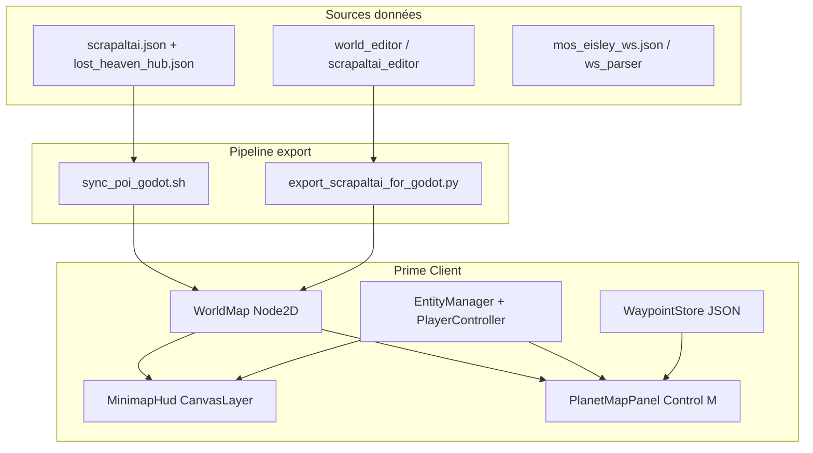

# Jalon M9 — Scrapaltai 2D planète + carte / minimap style SWG

**Date** : 2026-07-12  
**Statut** : **proposé** — soumission équipe virtuelle  
**Owner PM** : Thémis (`pm`)  
**Owners techniques** : Dédale (`dev_game` / Prime Client 2D), Pygmalion (`infographiste_ia` / art 2D)

**Client cible** : `new_mmo/prime-client` (Godot 4.6 top-down) — **pas** `lbg_client_godot` (3D en pause).

**Références** : [ADR 0009 Scrapaltai](adr/0009-scrapaltai-lost-heaven.md), [clients_2d_3d.md](clients_2d_3d.md), jalon M4 (carte existante).

---

## Objectif produit

1. **M9a** — Rendu planète **Scrapaltai entière** lisible en 2D top-down (13 km × 13 km, hub Lost Heaven + contexte désert).
2. **M9b** — **Minimap HUD** coin écran (style SWG : nord haut, curseur joueur, zoom local).
3. **M9c** — **Carte planétaire** touche **M** (pan, POI, waypoints, double-clic « aller là »).

Parité SWG visée : expérience **carte M + minimap**, pas clone pixel-perfect des textures `.tre` retail.

---

## État des lieux (M4 → M8)

| Composant | Existe | Limite |
|-----------|--------|--------|
| `WorldMap` plein écran | ✓ | Pas de widget minimap |
| `tatooine_map_config.json` | ✓ | `display_name: Scrapaltai`, ±6500 m |
| Texture `tatooine.svg` | ✓ | Hub LH détaillé, reste planète simplifié |
| POI / hub / `.ws` | ✓ | POI surtout Lost Heaven ; ME deprecated |
| `scrapaltai.json` (serveur) | ✓ | Pas sync auto → Godot |
| World Editor HTML | ✓ | Export manuel vers Godot |
| Minimap HUD | ✗ | — |
| Panneau carte M SWG | ✗ | Ctrl+M = toggle debug seulement |
| Waypoints perso | ✗ | — |
| Pipeline `export_tatooine_for_godot.py` | ✗ | Référencé dans code, absent |

---

## Architecture cible



---

## Découpage M9a / M9b / M9c

### M9a — Planète Scrapaltai (rendu monde)

**But** : le joueur / observateur voit une **planète cohérente**, pas seulement le hub.

| ID | Livrable | Fichiers / scripts | Owner | Critère d'acceptation |
|----|----------|-------------------|-------|------------------------|
| M9a-1 | Texture planète enrichie | `prime-client/assets/maps/tatooine.svg` (+ PNG fallback) | Pygmalion + humain | Désert + repères LH + routes ; calibrée ±6500 m |
| M9a-2 | Pipeline export WE → Godot | `LBG_IA_MMO/tools/map_export/export_scrapaltai_for_godot.py` | Dédale | 1 commande : SVG + JSON POI + config |
| M9a-3 | Sync POI serveur → client | `infra/scripts/sync_scrapaltai_poi_godot.sh` | Dédale | `scrapaltai.json` → `tatooine_pois.json` + `lost_heaven_buildings.json` |
| M9a-4 | `WorldMap.set_planet()` branché | `main.gd`, `world_map.gd` | Dédale | Connexion joueur → nom planète affiché Scrapaltai |
| M9a-5 | Couches POI planétaires | `poi_layer.gd`, `tatooine_pois.json` | Dédale | ≥ hub LH + starport + 3 POI secondaires visibles |
| M9a-6 | Sprites top-down hub | `assets/sprites/units/` via Infographiste | Pygmalion | Bots/NPC différenciés sur fond carte |

**Commandes** :
```bash
# Export carte depuis World Editor
python3 tools/map_export/export_scrapaltai_for_godot.py \
  --editor-root tools/world_editor \
  --out /home/sdesh/projects/new_mmo/prime-client/assets/maps

# Sync POI serveur
bash infra/scripts/sync_scrapaltai_poi_godot.sh
```

**Smoke M9a** :
```bash
godot4 --path /home/sdesh/projects/new_mmo/prime-client
# Ctrl+P POI visibles ; focus LH ; texture Scrapaltai (pas grille seule)
```

---

### M9b — Minimap HUD (style SWG)

**But** : overlay permanent coin **bas-droite** (configurable), indépendant du zoom caméra monde.

| ID | Livrable | Fichiers | Owner | Critère d'acceptation |
|----|----------|----------|-------|------------------------|
| M9b-1 | Scène minimap | `scenes/ui/minimap_hud.tscn` | Dédale | SubViewport + carte + cadre |
| M9b-2 | Script minimap | `scripts/minimap_hud.gd` | Dédale | Suit joueur local ; nord ↑ ; toggle **M** (minimap seule) |
| M9b-3 | Intégration main | `scenes/main.tscn`, `main.gd` | Dédale | Minimap visible en mode observateur + PLAY |
| M9b-4 | Repères POI minimap | `minimap_hud.gd` | Dédale | Hub + starport en points ; bots en pastilles |
| M9b-5 | Config UI | `config/minimap_config.json` | Dédale | Taille, position, zoom ratio (ex. 1:8) |

**Spec UX (SWG)** :
- Carré ~180×180 px, bord semi-transparent
- Point joueur = triangle ou flèche direction heading (M5)
- Autres entités = pastilles couleur (`sprite_manifest.json`)
- Clic minimap → pan caméra monde vers ce point (option M9b-4)

**Smoke M9b** :
```bash
bash infra/scripts/smoke_prime_client_minimap.sh
```

---

### M9c — Carte planétaire M + waypoints

**But** : panneau **plein écran** type SWG (touche **M**), avec arbre locations et waypoints.

| ID | Livrable | Fichiers | Owner | Critère d'acceptation |
|----|----------|----------|-------|------------------------|
| M9c-1 | Panneau carte | `scenes/ui/planet_map_panel.tscn` | Dédale | Plein écran ; pan molette ; même texture WorldMap |
| M9c-2 | Script carte | `scripts/planet_map_panel.gd` | Dédale | Toggle **M** ; POI cliquables ; tooltip nom |
| M9c-3 | Waypoints | `scripts/waypoint_store.gd`, `config/waypoints.json` | Dédale | CRUD local ; max 5 waypoints |
| M9c-4 | Clic « aller là » | `planet_map_panel.gd` → `player_controller` / UDP | Dédale | Double-clic → move intent (M5 ou inject pending) |
| M9c-5 | Arbre locations | `assets/maps/locations_tree.json` | Dédale + PM | Hub LH, starport, trainers (deprecated ME marqués) |
| M9c-6 | Export locations SWG | `tools/map_export/export_locations_from_stf.py` | Dédale | Optionnel — labels depuis STF / world_editor |

**Smoke M9c** :
```bash
bash infra/scripts/smoke_prime_client_planet_map.sh
```

---

## Rôles équipe virtuelle

| Rôle | Persona | M9 — responsabilités |
|------|---------|----------------------|
| **pm** | Thémis | Priorisation M9a→b→c ; brief réunification ; validation jalons |
| **dev_game** | Dédale | Godot scenes/scripts ; pipeline export ; smokes |
| **dev_game** | Pygmalion | Texture SVG planète ; sprites top-down ; revue visuelle |
| **qa** | Argus | Smokes M9a/b/c ; non-régression M3/M5 |
| **ops** | — | Sync 140/246 si timers ; pas de VM dédiée |

---

## Automation équipe (timers + Pilot)

| Timer | Actor | Période | Rotation |
|-------|-------|---------|----------|
| `lbg-team-m9-map-job` | `system:team_m9_map` | **12 h** | m9a → m9b → m9c → m9_full |

Install :
```bash
bash infra/scripts/install_team_m9_map_job_vm.sh
```

**Pilot `#/team`** :

| Preset | Effet |
|--------|--------|
| **M9 planète** | dev_game `m9_track: m9a` |
| **M9 minimap** | dev_game `m9_track: m9b` |
| **M9 carte M** | dev_game `m9_track: m9c` |
| **M9 complet** | dev_game `m9_track: m9_full` |

Plan NL : *« audit m9 scrapaltai minimap »*, *« jalon m9 carte swg »*

### Remédiation auto (2026-07-12)

| Mécanisme | Rôle | Action |
|-----------|------|--------|
| `m9_remediation.py` | auto | Lance `export_scrapaltai_for_godot.py` avant sonde M9a |
| `m9_map_followup.py` | followup | PM + dev_game piste suivante + Pygmalion (texture) + ops (sync VM) |
| `sync_prime_client_assets_vm.sh` | ops | Rsync maps/minimap vers `/opt/new_mmo/prime-client` sur 140 |
| `smoke_prime_client_minimap.sh` | qa | Vérifie fichiers M9b |

Variables :
```bash
LBG_TEAM_M9_AUTO_REMEDIATE=1
LBG_TEAM_M9_FOLLOWUP_ENABLED=1
LBG_TEAM_M9_FOLLOWUP_AUTO_RUN=1
LBG_PRIME_CLIENT_ROOT=/home/sdesh/projects/new_mmo/prime-client
```

---

## Variables env (140 / poste dev)

```bash
LBG_TEAM_M9_MAP_JOB_ENABLED=1
LBG_PRIME_CLIENT_ROOT=/home/sdesh/projects/new_mmo/prime-client
LBG_NEW_MMO_ROOT=/home/sdesh/projects/new_mmo
LBG_WORLD_EDITOR_ROOT=/opt/LBG_IA_MMO/tools/world_editor
LBG_SCRAPALTAI_POI=/opt/LBG_IA_MMO/content/core3/world_poi/scrapaltai.json
```

---

## Ordre d'exécution recommandé

| Phase | Durée estimée | Bloquant pour |
|-------|---------------|---------------|
| **M9a** | 1–2 semaines | M9b, M9c (texture + POI communs) |
| **M9b** | 3–5 jours | — (valeur UX immédiate) |
| **M9c** | 1 semaine | M9b souhaitable avant (réutilise texture) |

**Parallélisable** :
- Pygmalion texture (M9a-1) en // Dédale pipeline (M9a-2/3)
- M9b HUD en // fin M9a si texture stable

---

## Risques & mitigations

| Risque | Mitigation |
|--------|------------|
| Divergence POI serveur / Godot | Script sync CI + sonde équipe `m9a_poi_sync` |
| Perf 13 km × entités | Culling spatial `EntityManager` ; POI statiques en layers |
| Textures SWG `.tre` non exportables | Rester SVG/PNG calibré World Editor |
| Waypoints sans pathfinding | Phase 1 : teleport / move intent ; phase 2 : navmesh |
| ADR 0009 « Godot pause » | **Levée** pour Prime Client 2D uniquement (ADR amendement PM) |

---

## Critères de clôture M9 (global)

- [ ] Planète Scrapaltai visible entière (texture + POI LH + contexte)
- [ ] Minimap HUD active en jeu (observateur + PLAY)
- [ ] Touche **M** ouvre carte planétaire interactive
- [ ] ≥ 1 waypoint créé, visible, cliquable
- [ ] Smokes M9a/b/c verts sur LAN
- [ ] Timer équipe `lbg-team-m9-map-job` actif sur 140
- [ ] Doc `prime-client/README.md` jalons M9 à jour

---

## Prochaine action équipe (immédiate)

1. **Thémis** — valider ce jalon en brief réunification (`#/team` → Brief réunification).
2. **Dédale** — tâche `m9a` : créer `export_scrapaltai_for_godot.py` + `sync_scrapaltai_poi_godot.sh`.
3. **Pygmalion** — tâche Infographiste : enrichir `tatooine.svg` depuis `tools/world_editor/assets/tatooine_map.svg`.
4. **Argus** — préparer smokes `smoke_prime_client_minimap.sh` / `smoke_prime_client_planet_map.sh` (stub OK).

---

## Liens

- Prime Client : `new_mmo/prime-client/README.md`
- World Editor : `tools/world_editor/README_scrapaltai_editor.md`
- Équipe autonome : `docs/equipe_autonome_godot.md`
- Jalon client live : `docs/jalon_godot_client_live_team.md`
