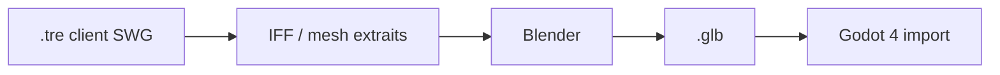

# Pipeline assets SWG → Godot 4 (client Prime)

**Statut** : guide opérationnel — juin 2026  
**Cible** : `lbg_client_godot` + Prime (`lbg_gateway`, Core3)  
**Lié** : [`plan_client_godot_prime_rendu.md`](plan_client_godot_prime_rendu.md) (piliers B/C), [`plan_client_lbg_godot.md`](plan_client_lbg_godot.md) §7, [`lbg_client_godot/assets/world/README.md`](../lbg_client_godot/assets/world/README.md)

---

## 1. Principe

| Règle | Pourquoi |
|-------|----------|
| **Pas de `.tre` / IFF en runtime Godot** | Formats propriétaires, lourd à maintenir, perf et tooling faibles |
| **Export batch → GLB (glTF 2.0)** | Import natif Godot 4, versionnable dans Git (LFS si gros fichiers) |
| **Le client SWG reste la référence visuelle** | Capture in-game, ReShade, comparaison côte à côte avec `lbgemu` |
| **Le repo LBG reste la référence spatiale** | `content/core3/locations/*.json`, `world_coords.py`, cantina cell `1082877` |

On **convertit** des assets extraits du client retail / install SWGEmu — on ne **branche** pas l’exécutable SWG dans Godot.

---

## 2. Install locale (votre machine)

Chemins typiques sur ce poste (WSL, lecteur `J:` monté) :

| Rôle | Chemin |
|------|--------|
| Racine SWGEmu / outils | `/mnt/j/swgemu/` |
| Client jouable (`SWGEmu.exe`) | `/mnt/j/swgemu/StarWarsGalaxies/` |
| Patch / client Prime LBG | `/mnt/j/swgemu/clients/prime-lbg/` |
| Mods LBG (IFF custom) | `/mnt/j/swgemu/MOD_LBG/` (`appearance/`, `object/`, `texture/`) |
| Éditeur IFF (Sytner) | `/mnt/j/swgemu/sytners_iff_editor_3_11_6_8_release/` |
| Core3 / VM | `/mnt/j/swgemu/Core3-unstable/MMOCoreORB/` (serveur, pas les meshes client) |

Les archives du jeu sont des **`.tre`** (et patches) sous `StarWarsGalaxies/` — **ne pas les copier entièrement dans le repo Git** ; n’extraire que les fichiers nécessaires vers un dossier de travail local, puis exporter en GLB.

---

## 3. Ce qu’on peut réutiliser du client d’origine

| Asset | Dans SWG | Faisabilité → Godot | Effort |
|-------|----------|---------------------|--------|
| **Mesh statique** (mur, comptoir, bâtiment) | IFF / `.msh` dans `.tre` | Bon — 1 export GLB par pièce ou bloc cantina | Moyen |
| **Personnage (corps)** | Squelette + mesh modulaire | Bon — 1 GLB **par espèce de base** (C1) | Moyen–élevé |
| **Textures** | DDS dans `.tre` | Bon — convertir en PNG puis import Godot | Faible |
| **Animations** | Formats SWG propriétaires | **Goulot** — ré-export ou clips recréés dans Blender | Élevé |
| **Apparence complète joueur** (wearables, morphs) | Système `appearance` | **Long terme** (C3/C4) — centaines de pièces | Très élevé |

Pour **aller plus vite** : viser **C1** (un humanoïde + idle/marche) et **B** (cantina en bloc GLB), pas la parité Teome au pixel près dès la v1.

---

## 4. Chaîne d’outils recommandée



### 4.1 Extraction (Windows conseillé)

1. **Sytner IFF Editor** (déjà sur `J:`) — ouvrir / parcourir les `.tre` du client, repérer les chemins type `appearance/...`, `object/building/...`, `texture/...`.
2. Exporter ou extraire vers un **dossier de staging** hors Git, par ex. `J:\swgemu\export_godot_staging\`.
3. Noter pour chaque asset : **chemin logique SWG**, **cellule** si intérieur, **échelle** observée in-game.

Alternatives communauté (selon confort) : viewers/converters SWGEmu, scripts sur les forums du projet — l’important est d’arriver à un **mesh + UV + textures** lisibles par Blender.

### 4.2 Blender

1. Importer le mesh (selon format intermédiaire disponible : OBJ, etc.).
2. **Échelle** : vérifier la taille (~1,8 m pour un humain) ; SWG n’est pas toujours en mètres Godot.
3. **Axes** : le client Godot cantina utilise `CantinaInterior.swg_local_to_godot(x, y, z) → Vector3(x, z, y)` — en intérieur, aligner le personnage sur ce repère (Y = hauteur Godot).
4. **Squelette** : si export riggé, vérifier les weights ; sinon rig simple pour idle/marche.
5. **Textures** : DDS → PNG (GIMP, `texconv`, ou import Blender avec addon) ; chemins relatifs propres pour glTF.
6. **Animations** (C1 minimal) :
   - idéal : récupérer 2 clips SWG convertis ;
   - acceptable : **idle + walk** recréés à la main sur le rig exporté.
7. Exporter **glTF 2.0 binaire `.glb`** :
   - inclure mesh + skin + animations ;
   - pas d’extensions exotiques ;
   - nommer clairement : `human_male_base.glb`, `mos_eisley_cantina_block.glb`.

### 4.3 Godot 4

1. Copier les GLB dans le repo (voir §5).
2. Godot importe automatiquement ; pour les persos :
   - scène dérivée `CharacterBody3D` + `Skeleton3D` + `AnimationPlayer` ;
   - remplacer ou compléter `EntityView.tscn` (pilier C1).
3. **Collisions** : mesh simplifié ou `CollisionShape3D` box pour v1 (pas le high-poly SWG).
4. **Commit** : fichiers &lt; 10 Mo en Git ; au-delà → **Git LFS** ou binaire hors repo + script de sync.

---

## 5. Arborescence cible dans le repo

```
lbg_client_godot/assets/
  world/                    # Pilier B — déjà documenté
    terrain/
    exteriors/
    interiors/mos_eisley_cantina/
    collisions/
  avatars/                  # Pilier C — à créer
    base/
      human_male_base.glb
      human_male_base.import
    npc/                    # optionnel : variantes trainers
    textures/               # PNG dérivées DDS (si pas embarquées dans GLB)
  manifest.json             # optionnel : mapping species → glb path
```

Fichier manifeste (exemple) pour `EntityView` / gateway v2 :

```json
{
  "default_player": "avatars/base/human_male_base.glb",
  "species": {
    "human": "avatars/base/human_male_base.glb",
    "wookiee": "avatars/base/wookiee_base.glb"
  },
  "mobile_template": {
    "trainer_brawler": "avatars/npc/trainer_brawler.glb"
  }
}
```

---

## 6. Parcours par priorité produit

### 6.1 C1 — Premier humanoïde (remplacer les capsules)

| Étape | Action | Critère de done |
|-------|--------|-----------------|
| 1 | Choisir un template SWG (ex. humain masculin neutre, ou `MOD_LBG/appearance/player`) | Mesh visible dans Blender |
| 2 | Export `human_male_base.glb` + idle + walk | Joue dans l’inspecteur Godot |
| 3 | Scène `avatars/base_humanoid.tscn` branchée sur `EntityView` | Teome/Lia en capsule → mesh |
| 4 | Orientation : le mesh regarde **+Z** ou **−Z** Godot selon votre caméra | Marche cohérente avec clic sol |
| 5 | Gateway (plus tard) : champs `species`, `anim` dans `world_state` | Changement de variante sans recompiler |

**Ne pas bloquer** sur l’équipement SWG : une seule tenue « civile » suffit pour C1.

### 6.2 B — Cantina Mos Eisley (cell `1082877`)

| Étape | Action | Critère de done |
|-------|--------|-----------------|
| 1 | Repère : posts catalogue `mos_eisley_cantina_bar.json` (bar `7.26, 1.15, -0.89`) | Comptoir aligné avec Jax |
| 2 | Export bloc intérieur (sol + murs + comptoir) ou pièces assemblées dans Blender | Remplace `CantinaInterior` CSG |
| 3 | Placer la racine scène à l’origine locale cantina ; collisions `StaticBody3D` | Raycast sol + murs OK |
| 4 | Comparer avec capture `lbgemu` + ReShade si besoin ambiance | « Reconnaissable » suffit v1 |

World Editor / POI : [`world_editor_plan.md`](world_editor_plan.md) — les **cellules** structure restent la vérité serveur ; le GLB est **visuel client** seulement.

### 6.3 C2+ — Espèces et PNJ catalogue

- Lire `mobile_template` / profils dans [`content/core3/core3_npc_catalog.json`](../content/core3/core3_npc_catalog.json).
- 1 GLB par **espèce** ou par **template** (ex. `trainer_brawler`), pas par `pilot_id`.
- Couleur / label `Label3D` reste acceptable pour les PNJ secondaires jusqu’à C2.

---

## 7. Repères et coords (éviter les PNJ « dans le vide »)

| Contexte | Source | Godot |
|----------|--------|-------|
| Monde Tatooine | `locations/*.json` → `world_anchor` | Position absolue après gateway |
| Intérieur cantina | coords **locales** SWG + cell `1082877` | `CantinaInterior.swg_local_to_godot` ou `local_pos` gateway |
| Conversion serveur | [`services/lbg_gateway/world_coords.py`](../services/lbg_gateway/world_coords.py) | Ne pas reconvertir à la main côté client |

Les assets GLB **intérieurs** doivent être modélisés dans le **repère local** de la cellule (origine = coin cohérent avec les posts JSON), pas en coords planétaires 3400 / −4800.

---

## 8. Légal et bonnes pratiques

- Les assets du client **Star Wars Galaxies** sont **propriétaires** (Lucasfilm / Disney). Usage typique : **installation retail + émulation personnelle / serveur privé** ; ne pas redistribuer les `.tre` ou packs DDS complets dans un dépôt public.
- Dans **LBG_IA_MMO** : ne versionner que les **GLB/PNG dérivés** strictement nécessaires, ou des placeholders maison ; documenter la provenance dans `assets/manifest.json` (champ `source: "swg_export_personal"`).
- **ReShade** sur `SWGEmu.exe` : cosmétique sur le client legacy uniquement — voir discussion produit ; n’affecte pas ce pipeline Godot.

---

## 9. Checklist avant commit GLB

- [ ] Taille raisonnable (&lt; 5–15 Mo par fichier v1)
- [ ] Pas de chemins absolus `J:\` dans les matériaux
- [ ] Échelle humaine ~1,7–2,0 m en Godot
- [ ] Animations nommées `idle`, `walk` (minuscules, stables)
- [ ] Collisions simplifiées pour le gameplay
- [ ] Test dans scène cantina : Jax / Lia au comptoir, pas de capsule flottante
- [ ] Entrée ajoutée dans ce doc ou `assets/world/README.md` si nouveau dossier

---

## 10. Dépannage fréquent

| Symptôme | Cause probable | Piste |
|----------|----------------|-------|
| Personnage géant / nain | Échelle Blender / unités SWG | Réimporter à 0,01 ou 100 selon export |
| Mesh couché / tourné | Axes SWG vs Godot | Rotation fixe sur nœud racine −90° X ou swap Y/Z |
| Textures roses | Chemins DDS manquants | Ré-embarquer PNG dans GLB |
| Animations absentes | Non incluses à l’export glTF | Cocher « Animation » à l’export Blender |
| Pieds dans le sol cantina | Repère local ≠ posts JSON | Aligner sur spawn Jax `7.26, 1.15, -0.89` |
| Double conversion coords | `pos` déjà monde + offset client | Suivre `GameState.display_position` / gateway |

---

## 11. Suite code (hors pipeline art)

**Fait (C1 squelette)** :

- `AvatarLibrary` (autoload) + `assets/avatars/manifest.json`
- `BaseHumanoid` / `PlaceholderHumanoid` branchés sur `EntityView`
- Dès que `assets/avatars/base/human_male_base.glb` existe, il remplace le placeholder automatiquement

**À venir** :

---

## 12. Références internes

| Document | Sujet |
|----------|--------|
| [`plan_client_godot_prime_rendu.md`](plan_client_godot_prime_rendu.md) | Piliers A/B/C, contrat entité v2 |
| [`plan_client_lbg_godot.md`](plan_client_lbg_godot.md) §7 | `.tre` vs GLB, décision proto |
| [`world_editor_plan.md`](world_editor_plan.md) | POI, cellules trainers ME |
| [`mos_eisley_cantina_ia.md`](mos_eisley_cantina_ia.md) | Cells cantina / théâtre |
| [`content/core3/locations/mos_eisley_cantina_bar.json`](../content/core3/locations/mos_eisley_cantina_bar.json) | Ancre + poste bar |

---

*Dernière mise à jour : 2026-05-29 — ajuster les chemins `J:` si l’install SWG change de lecteur.*
