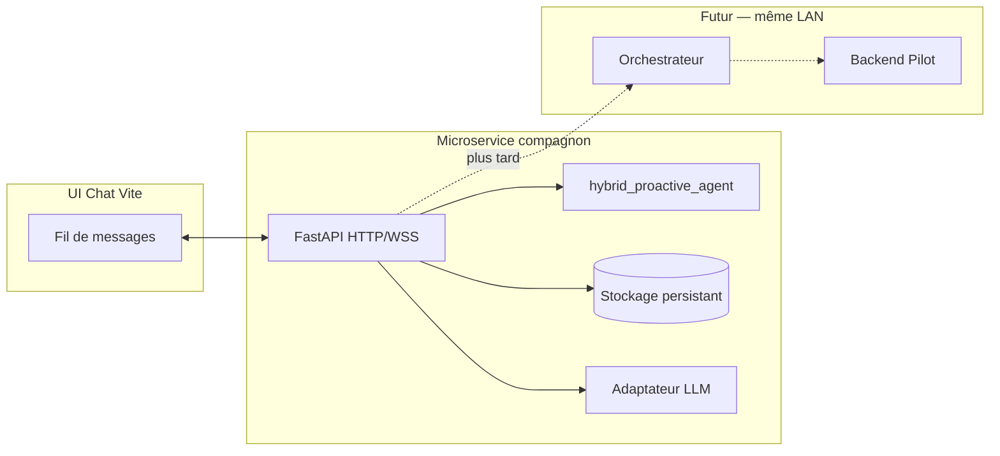

# Plan — bot compagnon autonome (microservice + chat naturel)

## Objectif produit

Un petit **agent conversationnel** qui :

- **vit à côté** du monorepo (process déployé sur une VM LAN, ex. **110** ou **140**) ;
- échange en **langage naturel** dans une UI type Vite (référence : client sur un port du type **`http://192.168.0.110:5174/`**) ;
- masque la **mécanique** : pas de JSON imposé à l’utilisateur ; traces structurées **opt-in** (debug / opérateur) ;
- conserve une **mémoire persistante** pour « évoluer » dans le temps (comportement + souvenirs exploitables) ;
- pourra **plus tard** réutiliser les **mêmes API** qu’un utilisateur Pilot / orchestrateur (compte technique ou session `actor_id` dédié).

Ce document est un **plan d’ingénierie** ; le moteur motivation / modes est déjà isolé dans `hybrid_proactive_agent/`.

---

## Faisabilité (expertise)

**Oui, c’est possible**, avec des limites honnêtes :

| Attente | Réalité technique |
|---------|-------------------|
| « Bot autonome qui vit à côté » | Un **microservice** (HTTP + éventuellement WebSocket) + boucle timer interne + persistance. Pas de magie : c’est du **code déployé** et des **garde-fous**. |
| Langage naturel visible, JSON invisible | Standard : **UI = bulles de texte** ; JSON **logs**, **header debug**, ou panneau « développeur » caché derrière un flag (`?debug=1` ou rôle opérateur). |
| Mémoire persistante / apprentissage | **Apprentissage continu** au sens *produit* : journal d’épisodes, extractions, résumés, préférences — stockés en **SQLite / JSONL / PG** selon charge. Ce n’est **pas** du fine-tuning du modèle sauf chantier séparé (données, GPU, gouvernance). |
| Devenir « utilisateur » du projet | Oui : **`actor_id`** stable (ex. `bot:compagnon-1`), même contrat `POST /v1/route` / Pilot que les humains, **policy** et approbations inchangées. |

**Risques à anticiper** : coût LLM, reprise après crash (état + file d’initiatives), spam proactif (quotas + opt-in), alignement avec **ADR assistant local vs MMO** (`docs/adr/0004-assistant-local-vs-persona-mmo.md`).

---

## Architecture cible (vue d’ensemble)

- **Microservice** : unique source de vérité pour **session bot**, **mémoire**, **tensions / modes** (via `HybridProactiveEngine`), **appels LLM**.
- **UI** : mince ; appelle uniquement des endpoints du type `POST /chat`, `GET /events` ou `WebSocket /stream`.
- **Orchestrateur** : branché **après** : le bot devient client HTTP avec jetons / `actor_id` — pas besoin de modifier le cœur au jour 1.

---

## Choix VM (110 vs 140)

| Critère | 110 (souvent front / pilot) | 140 (souvent autre rôle) |
|--------|-----------------------------|---------------------------|
| Proximité utilisateur / Nginx | Souvent **oui** | Selon ta topo |
| Latence vers `orchestrator` | À mesurer sur LAN | Idem |
| Charge LLM / CPU | Si le modèle est **API distant**, VM légère suffit | Si **LLM local**, plutôt VM avec **RAM/GPU** |

**Recommandation pragmatique** : microservice **sur la VM qui porte déjà le Pilot ou le chemin le plus court vers l’orchestrateur** ; exposer le chat derrière le **même reverse proxy** (8080) en prod plutôt que d’exposer un port dev (5174) ouvert au LAN sans TLS — le `5174` reste un **bon prototype** ; prod = `https://…/compagnon/` ou sous-chemin dédié.

---

## Phases de mise en place

### Phase 1 — Existence (MVP « il existe »)

1. **Nouveau paquet ou dossier** `LBG_IA_MMO/companion_bot/` (nom à figer) :
   - `pyproject.toml`, FastAPI, `uvicorn`, `pydantic` ;
   - dépendance **`hybrid-proactive-agent`** en editable ou chemin relatif.
2. **Persistance minimale** :
   - **SQLite** : tables `sessions`, `messages`, `engine_state_snapshot`, `memory_entries` (ou réutiliser `LongTermMemoryStore` en JSONL au début, puis migrer).
3. **Endpoint `POST /v1/chat`** :
   - Entrée : `{ "session_id", "text" }` (pas de JSON métier côté UI).
   - Traitement : `observe_user_turn` → prompt LLM (système + historique + extraits mémoire) → réponse texte ;
   - Sortie **publique** : `{ "reply": "..." }` ;
   - Sortie **debug** (header `X-Debug: 1` ou query) : `hints`, `mode`, `raw_action`, `usage`.
4. **Boucle autonome optionnelle** : tâche `asyncio` ou APScheduler : `tick_silence` + si tension haute, générer **une** initiative (quota strict).
5. **Santé** : `GET /healthz`, métriques opt-in (alignement `LBG_METRICS_*` si tu unifies).

### Phase 2 — Interface « comme le 5174 »

1. **Petit client Vite** (sous `companion_bot/web/` ou réutilisation d’un shell existant) :
   - Une colonne : fil de messages ;
   - Saisie texte ; pas d’arborescence JSON ;
   - Toggle « Mode opérateur » → panneau repliable avec dernier payload debug.
2. **CORS** : autoriser l’origine du dev (110:5174) et l’origine prod derrière Nginx.

### Phase 3 — Mémoire « évolutive »

1. **Épisodique** : chaque tour utilisateur + réponse → ligne dans `messages` + **résumé** périodique (batch ou fin de session) dans `memory_entries`.
2. **Rappel** : au prompt, injecter **Top-K** extraits (mot-clés comme aujourd’hui, ou **embeddings** + pgvector plus tard).
3. **Préférences explicites** : champ `user_prefs` validé (ex. « toujours en français », « pas d’exécution sans confirmation »).

### Phase 4 — Utilisateur du projet (greffon orchestrateur)

1. Créer **`actor_id`** et éventuellement **jeton** Pilot dédiés.
2. Depuis le microservice, pour certains tours : **appeler** `POST {ORCH}/v1/route` avec le **même** `context` qu’un humain, puis reformuler la réponse en **langage naturel** pour le canal chat.
3. Les **actions outillées** passent par **`action_proposal` + policy** ; le bot ne court-circuite pas l’exécution.

### Phase 5 — Durcissement prod

1. Auth (token simple ou SSO interne) ; rate limit ; audit JSONL ;
2. Déploiement **systemd** sur VM choisie ; logs structurés ;
3. Document runbook : variables `LBG_COMPANION_*`, backup SQLite, etc.

---

## Contrat « JSON invisible »

| Couche | Contrat |
|--------|---------|
| UI → API | `session_id`, `text` (formulaire ou JSON minimal **implémenté** dans le client, pas montré à l’utilisateur). |
| API → UI | **`reply` texte** obligatoire ; le reste **uniquement si** `debug=true` ou rôle opérateur. |
| Ops | Logs serveur avec `trace_id`, `mode`, `tension` — jamais affichés dans le fil utilisateur par défaut. |

---

## Dépendances et prérequis

- **LLM** : clé API ou endpoint **OpenAI-compatible** (aligné avec `LBG_ORCHESTRATOR_INTENT_LLM*` côté orchestrateur si tu veux un seul fournisseur).
- **Réseau** : accès LAN depuis ta machine vers la VM du service ; en prod, passer par le reverse proxy existant.
- **hybrid_proactive_agent** : déjà prêt pour tension / modes ; le **personnage** et la **voix** viennent du **prompt** + mémoire.

---

## Prochaine décision à trancher (1 choix)

- **A.** Microservice **totalement autonome** (son propre LLM + mémoire) puis **client** de l’orchestrateur plus tard — *le plus simple pour « il existe » vite*.  
- **B.** Dès le MVP, **toutes** les répliques passent par **`agent.dialogue`** / orchestrateur — *plus cohérent avec un seul cerveau, plus de travail d’intégration*.

Recommandation : **A** pour valider UX et persistance, puis **B** pour l’unification garde-fous.

---

## Liens utiles dans le repo

- Moteur hybride : `hybrid_proactive_agent/README.md`, `docs/GREFFON.md`, `docs/ARCHITECTURE.md`
- Routage existant : `orchestrator/router/routes/route_intent.py`
- Vision assistant / MMO : `docs/adr/0004-assistant-local-vs-persona-mmo.md`

---

## État

| Statut | Livrable |
|--------|----------|
| Plan | Ce document |
| Implémentation | À faire (Phase 1) |
