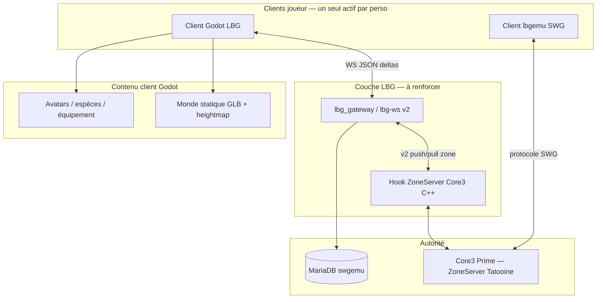
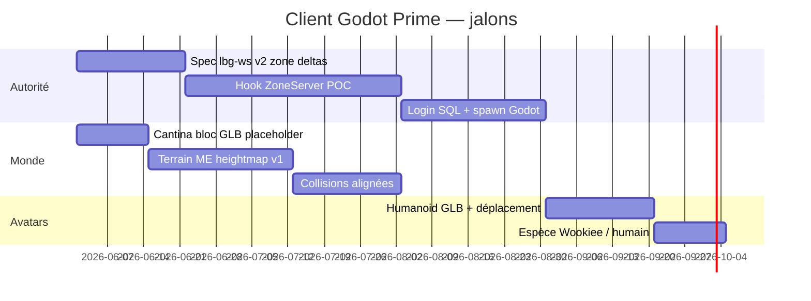

# Plan — Client Godot Prime : même serveur, même joueur, monde habillé

**Statut** : cible produit — juin 2026  
**Remplace comme objectif principal** le mode « observateur + capsules » décrit en Phase 2 du [`plan_client_lbg_godot.md`](plan_client_lbg_godot.md).

---

## 1. Objectif (une phrase)

Un **client Godot 4** se connecte au **même Core3 Prime** que `lbgemu`, contrôle **un personnage persistant** (ex. Teome) visible **identiquement** depuis l’autre client, dans un **monde 3D** avec sol, bâtiments, obstacles et **représentation joueur** au-delà des capsules de debug.

---

## 2. Ce qui n’est pas l’objectif

| Hors scope (outil intermédiaire seulement) | Pourquoi |
|------------------------------------------|----------|
| Gateway **lecture seule** + snapshots JSON | Utile pour QA IA, pas un client joueur |
| `pending.jsonl` pour simuler le mouvement | Pont bot, pas parité joueur humain |
| Bac à sable `mmmorpg_server` comme monde final | Proto réseau uniquement |
| Réimplémenter le protocole SWG binaire dans Godot | Coût prohibé ; passer par une **couche LBG** côté serveur |

Le POC actuel (`lbg_client_godot` + port 50000) reste une **brique de test réseau** ; la suite est **rendu + autorité zone**.

---

## 3. Architecture cible



**Règle d’or** : une seule session **autoritaire** par `character_id` en zone (politique à définir : refus double login, ou déconnexion du client SWG quand Godot prend la main).

---

## 4. Trois piliers (parallélisables)

### Pilier A — Même joueur, même serveur (réseau + autorité)

| Besoin | État actuel | Cible |
|--------|-------------|--------|
| Login / persos Prime | Gateway stub | Auth SQL `swgemu` + `select_character` |
| Entrée zone Tatooine | Proxy local Godot | Spawn réel via ZoneServer (hook C++) |
| Position / mouvement | Non injecté en zone | Deltas 10–20 Hz depuis le serveur |
| Visibilité inter-clients | Snapshots fichier 2 s | Événements joueurs en temps réel |
| Chat / actions | `interact` IA seulement | File zone ou `pending` **en complément**, pas en remplacement |

**Livrable minimal A** : Teome contrôlé depuis Godot, visible sur `lbgemu` au même endroit (ou l’inverse), sans deux fantômes.

**Dépendance serveur** : extension documentée dans [`migration_new_mmo_core3.md`](migration_new_mmo_core3.md) phase 2 — **hook zone → JSON/WebSocket** (nom de travail `LbgZoneBridge`).

---

### Pilier B — Habiller l’univers (monde Godot)

Repère spatial : **coords monde SWG** (comme le gateway `world_coords` : x, hauteur, z planétaire).

| Couche | Source de vérité | Rendu Godot v1 |
|--------|------------------|----------------|
| Terrain extérieur | Heightmap / mesh extrait Tatooine | `MeshInstance3D` + collision `StaticBody3D` |
| Bâtiments majeurs | POI + cantina Mos Eisley (World Editor / export) | GLB par bâtiment, instanciés depuis `world_poi` |
| Intérieurs (cantina) | Cell `1082877` + mesh bloc cantina | Scène dédiée `interiors/mos_eisley_cantina.tscn` |
| Obstacles / collision | Navmesh serveur (approximation) | Simplification box/mesh pour v1 |

**Données déjà dans le repo** :

- `content/core3/world_poi/tatooine.json` — slots PNJ / posts (pas encore les meshes)
- `content/core3/locations/*.json` — ancres monde + intérieurs
- World Editor : export POI vers le repo ([`world_editor_plan.md`](world_editor_plan.md))

**Pipeline assets (pas de `.tre` en runtime Godot)** — guide pas à pas : [`pipeline_assets_swg_godot.md`](pipeline_assets_swg_godot.md).

1. **Placeholder** — terrain plat + boîtes cantina + skybox (1 semaine, débloque la caméra).
2. **Export ciblé** — cantina + place Mos Eisley depuis SWGEmu / WE → GLB dans `lbg_client_godot/assets/world/`.
3. **Zone complète** — heightmap Tatooine autour de ME (itération).

**Livrable minimal B** : marcher dans une cantina reconnaissable (sol, murs, comptoir), collisions basiques, pas un plan vert vide.

---

### Pilier C — Joueurs « détaillés » (au-delà des pillules)

| Niveau | Description | Effort |
|--------|-------------|--------|
| **C0** (actuel) | Capsule + `Label3D` + couleur espèce | Fait |
| **C1** | Mesh humanoïde GLB + orientation + animation idle/marche | 2–3 sem. |
| **C2** | Espèce / taille depuis `core3_npc_catalog` + snapshot | 1–2 sem. |
| **C3** | Équipement simplifié (slots majeurs) | 1–2 mois |
| **C4** | Parité SWG (armure, mounts, etc.) | Long terme |

**Contrat entité côté gateway (v2)** — enrichir `world_state.entities[]` :

```json
{
  "id": "player:Teome",
  "kind": "player",
  "pos": [3446.0, 6.3, -4819.0],
  "cell": 1082877,
  "species": "wookiee",
  "appearance": { "height": 1.9, "wearables": [] },
  "anim": "idle"
}
```

Godot : `EntityView` → `CharacterBody3D` + scène `avatars/base_humanoid.tscn` + script d’apparence.

---

## 5. Phases proposées (ordre recommandé)



| Phase | Nom | Critère de fin |
|-------|-----|----------------|
| **M0** | Cantina habillée (offline) | Scène Godot cantina + spawn Teome **sans** réseau, coords locales |
| **M1** | Monde + réseau v2 lecture | Godot reçoit deltas joueurs/PNJ **et** affiche cantina statique alignée |
| **M2** | Joueur autoritaire Godot | Teome bouge depuis Godot, **visible** sur lbgemu (même cellule) |
| **M3** | Extérieur Mos Eisley | Terrain + bâtiments autour, entrée cantina |
| **M4** | Avatars C1–C2 | Mesh + espèce, plus de capsules |

---

## 6. En cours (les deux pistes en parallèle)

| Piste | Fichiers |
|-------|----------|
| **M0 — Monde cantina** | `lbg_client_godot/scenes/world/CantinaInterior.*` — affiché si `cell == 1082877` |
| **A — Spec zone v2** | `docs/schemas/lbg-ws/server.zone_state_v2.schema.json`, `client.zone_command_v2.schema.json`, `docs/core3_zone_bridge_spec.md` |

Prochaines implémentations : hook C++ **ZB-0** (lecture), `Network.gd` support `lbg-ws/2`, avatars GLB (pilier C).

---

## 7. Liens

| Document | Rôle |
|----------|------|
| [`plan_client_lbg_godot.md`](plan_client_lbg_godot.md) | Historique POC, options réseau |
| [`migration_new_mmo_core3.md`](migration_new_mmo_core3.md) | Coexistence Python / Core3, phase hook |
| [`world_editor_plan.md`](world_editor_plan.md) | Export POI / bâtiments vers repo |
| [`mos_eisley_cantina_ia.md`](mos_eisley_cantina_ia.md) | Coords cantina |
| `lbg_client_godot/README.md` | Lancement POC actuel |
