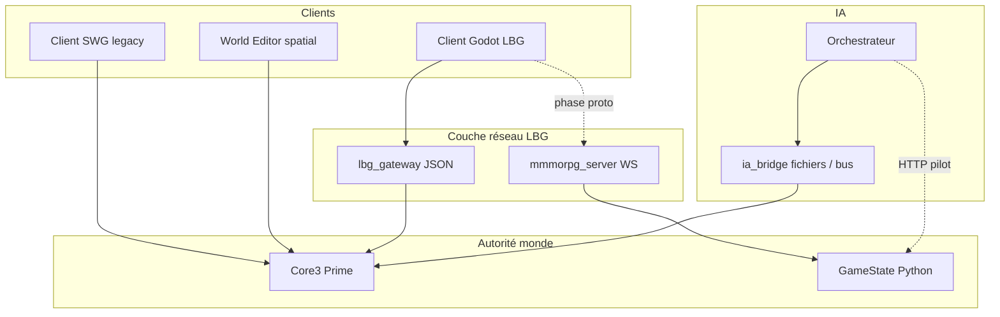
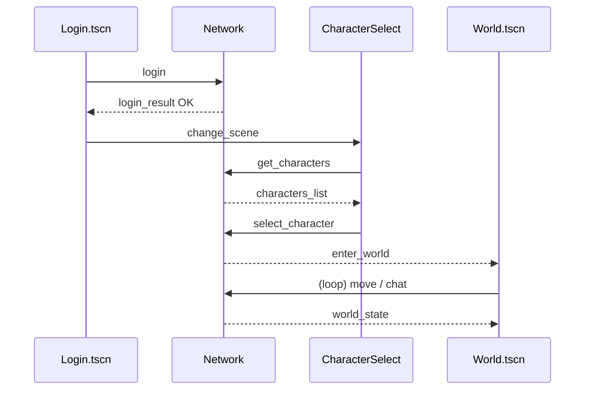

# Plan — Client LBG personnalisé (Godot) sans client SWG

**Statut** : **gelé** — juin 2026 (voir [`ARCHIVED_mmmorpg_sandbox.md`](ARCHIVED_mmmorpg_sandbox.md))

> **Objectif produit actuel (juin 2026)** : **client SWGEmu personnalisé** (launchpad + patches Prime) — pas Godot comme axe produit.

**Objectif initial (doc)** : savoir si et comment construire un **client joueur LBG** (Godot 4) indépendant du client SWG, connecté à **l’autorité monde** cible (Core3 Prime ou bac à sable Python).

**Documents liés** : [`migration_new_mmo_core3.md`](migration_new_mmo_core3.md), [`adr/0005-new-mmo-core3-coexistence.md`](adr/0005-new-mmo-core3-coexistence.md), [`ws_contract_mmmorpg_ws_v1.md`](ws_contract_mmmorpg_ws_v1.md), [`core3_ia_player_bridge.md`](core3_ia_player_bridge.md).

---

## 1. Verdict court

| Question | Réponse |
|----------|---------|
| Client Godot **sans binaire SWG** ? | **Oui**, c’est le bon cap produit long terme. |
| Godot **directement** sur le protocole UDP/TCP SWG de Core3 ? | **Non recommandé** (mois/années, reverse-engineering, crypto, snapshots binaires). |
| Protocole JSON minimal login / persos / monde ? | **Oui**, faisable en **semaines** si un **gateway** traduit vers Core3 ou si on cible d’abord **`mmmorpg_server`**. |
| Cohérence avec le projet actuel ? | **Oui** : tu as déjà un proto JSON WebSocket (`mmmorpg-ws/1`) + Core3 Prime + `ia_bridge` fichier. |

**Recommandation** : deux pistes **en parallèle**, une rapide (bac à sable) et une structurante (Prime) :

1. **Piste A (2–4 sem.)** — Client Godot → **`mmmorpg_server`** (WebSocket existant) : client minimal jouable, zéro C++ Core3.
2. **Piste B (2–4 mois, incrémental)** — **`lbg_gateway`** (Python ou C++) : JSON/TCP ou WS sur port dédié → pont vers Core3 (comptes DB, zone, snapshots dérivés de `ia_bridge` / zone server).

Le client SWG reste l’outil **éditeur / QA / World Editor** tant que Prime n’expose pas toutes les features (skills, combat, structures).

---

## 2. Carte des couches (cible)



| Couche | Rôle | État aujourd’hui |
|--------|------|------------------|
| **Core3** | Simulation, persistance MariaDB `swgemu`, zone Tatooine Prime | En prod LAN (VM 245) |
| **ia_bridge** | PNJ pilotes, quêtes, queue `pending.jsonl` | Lua + fichiers, pas le client joueur |
| **mmmorpg_server** | Monde bac à sable, WS JSON, collisions village | Documenté, tests `pilot_web` |
| **mmo_server** | Slice Lyra HTTP | Backend / agents, pas le client 3D |
| **Client SWG** | Protocole historique SWG | Obligatoire pour jouer sur Prime aujourd’hui |

---

## 3. Options d’intégration réseau (Core3 ↔ Godot)

### Option 1 — Réimplémenter le protocole SWG dans Godot

- **Effort** : très élevé (login, encryption, object controllers, deltas, templates…).
- **Verdict** : **à écarter** sauf fork client SWG open existant à maintenir.

### Option 2 — Gateway LBG (recommandé pour Prime)

Service **`lbg_gateway`** (nouveau module) :

- Écoute **TCP ligne JSON** ou **WebSocket** (port ex. `50000` ou réutiliser `7733` avec `proto: lbg-ws/1`).
- **Login** : vérifie compte/mot de passe contre MariaDB (même tables que Core3) ou délègue à un endpoint interne.
- **Personnages** : lecture `characters` / `player_objects`.
- **Entrée monde** : ne réinvente pas tout le stack zone — **v1** :
  - soit spawn d’un **proxy joueur** via API interne / script admin ;
  - soit synchronisation **lecture seule** : positions depuis `ia_bridge/npc_snapshots.json` + position joueur via requête admin / headless `core3client` ;
  - **v2** : branchement C++ sur `ZoneServer` pour pousser `world_state` (développement Core3).
- **Mouvement / chat** : gateway traduit en commandes fichier `ia_bridge/pending.jsonl` ou packets zone une fois le hook C++ existe.

| Avantage | Inconvénient |
|----------|----------------|
| Godot reste simple | Double maintenance gateway ↔ Core3 |
| Proto stable pour le client | Latence / fidélité monde limitée en v1 |
| Aligné ADR 0005 phase 2 | Nécessite spec sécurité (auth, rate limit) |

### Option 3 — Réutiliser `mmmorpg_server` (recommandé pour proto Godot)

- Proto déjà défini : [`ws_contract_mmmorpg_ws_v1.md`](ws_contract_mmmorpg_ws_v1.md), [`mmmorpg_PROTOCOL.md`](mmmorpg_PROTOCOL.md).
- Messages proches de ta spec (`hello`, `move`, `world_tick`, entités).
- **Godot** : `WebSocketPeer` plutôt que `StreamPeerTCP` (même JSON).

| Avantage | Inconvénient |
|----------|----------------|
| Implémentable **immédiatement** | Monde = bac à sable Python, **pas** Tatooine Prime |
| Pont IA déjà câblé | Migration ultérieure vers gateway Prime |

### Option 4 — `core3client` headless comme adaptateur (complément Phase D)

- Déjà documenté : [`core3_ia_phase_d_headless_bot.md`](core3_ia_phase_d_headless_bot.md).
- Le gateway pourrait **piloter** une session headless pour obtenir des positions réelles zone.
- **Verdict** : bon pour **bot / observation**, pas comme seul client joueur humain (une session, pas d’UI).

---

## 4. Protocole réseau LBG minimal (spec cible)

Transport proposé pour **Godot + gateway** (aligné sur ta spec, avec versioning LBG).

### 4.1 Transport

| Paramètre | Valeur recommandée |
|-----------|-------------------|
| Transport | **WebSocket** (Godot natif) *ou* TCP + `\n` |
| Port | `50000` (gateway Prime) / `7733` (mmmorpg existant) |
| Encodage | JSON UTF-8, **une frame = un objet** |
| Version | Champ `proto: "lbg-ws/1"` sur messages serveur |

### 4.2 Client → serveur

| `type` | But | Champs clés |
|--------|-----|-------------|
| `login` | Auth | `username`, `password` |
| `get_characters` | Liste persos | (session après login) |
| `select_character` | Choisir perso | `character_id` |
| `enter_world` | Demande chargement zone | `zone` (ex. `tatooine`) |
| `move` | Intent mouvement | `direction` [x,z], `dt` *ou* `pos` [x,y,z] |
| `chat` | Chat | `channel`, `message` |
| `interact` | PNJ / objet | `target_id`, `action` (v2) |

Exemple :

```json
{ "type": "login", "username": "steve", "password": "***" }
```

### 4.3 Serveur → client

| `type` | But |
|--------|-----|
| `login_result` | `{ "success": true, "session_token": "..." }` |
| `characters_list` | `{ "characters": [{ "id", "name", "race", "profession" }] }` |
| `enter_world` | `{ "map", "zone", "position": [x,y,z], "cell": 0 }` |
| `world_state` | Snapshot / delta entités |
| `chat` | Message entrant |
| `error` | Code + raison |

Exemple `world_state` (v1 simplifié) :

```json
{
  "proto": "lbg-ws/1",
  "type": "world_state",
  "tick": 12004,
  "entities": [
    { "id": 1, "kind": "player", "name": "Teome", "pos": [3526.0, -4799.0, 5.0], "cell": 0, "heading": 90.0 },
    { "id": 2, "kind": "npc", "pilot_id": "npc:core3_barman_jax", "name": "Jax Moro", "pos": [7.26, -0.89, 1.15], "cell": 1082877 }
  ]
}
```

### 4.4 Mapping vers Core3 (gateway)

| Message LBG | Source / action Core3 v1 | v2 |
|-------------|---------------------------|-----|
| `login` | SQL `swgemu` accounts | Idem + ticket session |
| `characters_list` | SQL `characters` | Idem |
| `select_character` | Réserver slot session gateway | Liaison OID joueur en zone |
| `world_state` | Lecture `ia_bridge/npc_snapshots.json` + poll joueur (headless/admin) | Hook C++ broadcast zone |
| `move` | `pending.jsonl` ou packet zone | `PlayerManager` direct |
| `chat` | Spatial / `pending.jsonl` | Pipeline chat Core3 |

Schémas JSON : à créer sous `docs/schemas/lbg-ws/` (miroir de `docs/schemas/ws/` existant).

---

## 5. Structure client Godot (premier jet jouable)

### 5.1 Arborescence projet

```
lbg_client_godot/
  project.godot
  autoload/
    Network.gd          # WS ou TCP, parse JSON, signaux
    GameState.gd        # cache entités, joueur local
    Config.gd           # host, port, proto
  scenes/
    Login.tscn
    CharacterSelect.tscn
    World.tscn
    ui/
      ChatPanel.tscn
      HUD.tscn
  scripts/
    entity/
      EntityView.gd     # Node3D + label
      EntityFactory.gd
    world/
      WorldLoader.gd    # map lbg_prime / tatooine stub
  assets/
    maps/               # mesh / heightmap LBG (pas .tre SWG en v1)
    characters/         # placeholders
```

### 5.2 Autoload `Network.gd` (WebSocket — aligné monorepo)

Préférer **`WebSocketPeer`** pour coller à `mmmorpg_server` ; variante TCP possible pour gateway `50000`.

```gdscript
# Résume — voir implémentation complète en phase 0
extends Node
signal message_received(dict: Dictionary)

var _ws := WebSocketPeer.new()

func connect_to_server(host: String, port: int) -> int:
    return _ws.connect_to_url("ws://%s:%d" % [host, port])

func send_message(msg: Dictionary) -> void:
    _ws.send_text(JSON.stringify(msg))

func _process(_delta: float) -> void:
    _ws.poll()
    while _ws.get_available_packet_count() > 0:
        var raw = _ws.get_packet().get_string_from_utf8()
        var data = JSON.parse_string(raw)
        if data is Dictionary:
            message_received.emit(data)
```

### 5.3 Flux scènes



### 5.4 Monde 3D v1

- **Caméra** : TPS ou top-down (Godot `CharacterBody3D` + `SpringArm3D`).
- **Map** : mesh simple `lbg_prime` ou réimport zone Tatooine **sans** parser `.tre` SWG en v1 (pipeline assets LBG séparé — voir §7).
- **Entités** : capsules + nom au-dessus ; sync depuis `world_state`.

---

## 6. Phases d’implémentation (effort indicatif)

### Phase 0 — Faisabilité technique (1 semaine)

| Tâche | Livrable |
|-------|----------|
| POC Godot → `mmmorpg_server:7733` | Login `hello` + `welcome` + `move` + affichage 2–3 entités |
| Documenter mapping champs | Table `mmmorpg-ws/1` ↔ spec `lbg-ws/1` |
| Décision transport Prime | WS vs TCP port `50000` |

**Critère** : client Godot se connecte au bac à sable Python sans client SWG.

### Phase 1 — Client minimal bac à sable (2–3 semaines)

- Scènes Login / CharacterSelect / World (spec §5).
- Chat + mouvement.
- Tests LAN : `192.168.0.245:7733` (ou VM locale).
- Option : page `pilot_web` comme référence comportement.

### Phase 2 — Gateway Prime v0 (3–6 semaines)

| Composant | Description |
|-----------|-------------|
| `services/lbg_gateway/` | Python asyncio ou C++ léger |
| Auth SQL | Comptes existants Prime |
| `world_state` | Agrège `npc_snapshots.json` + position joueur (méthode v1) |
| Deploy | systemd à côté de `core3`, port `50000` |

**Critère** : Godot affiche Teome + PNJ IA cantina sur coords réelles (lecture). **Atteint juin 2026** (observateur lbgemu + `local_pos` / delta cantina).

### Phase 3 — Gateway Prime v1 — actions (1–2 mois)

- `move` / `chat` traduits vers zone (C++ ou `pending.jsonl` + règles).
- Deltas `world_state` (10–20 Hz) au lieu de snapshot complet.
- Sécurité : TLS LAN, rate limit, session token.

### Phase 4 — Assets & rendu (parallèle, long)

- Pipeline mesh/textures LBG (GLB / Godot import), **pas** dépendance `.tre` SWG.
- Maps : extrait heightmap / POI depuis éditeur + `world_poi/tatooine.json`.

### Phase 5 — Dépréciation client SWG (optionnel, très long)

- Parité skills, combat, inventaire, structures.
- Amendement **ADR 0002** : autorité = Core3 + `lbg-ws/1`.

---

## 7. Assets (`.tre` SWG vs packs LBG)

| Approche | Faisabilité | Note |
|----------|-------------|------|
| Lire `.tre` SWG dans Godot | Faible | Format propriétaire, outils SWGEmu, risque légal / maintenance |
| Exporter IFF → GLB (pipeline batch) | Moyenne | One-shot par zone, stocker dans `assets/lbg/` |
| Art placeholder Godot | **Haute** | Suffisant pour proto réseau |
| Réutiliser OpenGame / forge | Moyenne | [`docs/adr/0003-opengame-forge-prototypes.md`](adr/0003-opengame-forge-prototypes.md) |

**Pour le proto réseau** : ne pas bloquer sur les assets ; cubes + terrain simple.

---

## 8. Orchestrateur IA (inchangé dans l’architecture)

Le client Godot **ne parle pas** directement à l’orchestrateur.

```
Godot → lbg_gateway / mmmorpg → (pont) → ia_bridge / backend → Orchestrateur
```

- Bac à sable : pont WS → `MMMORPG_IA_BACKEND_URL` (existant).
- Prime : dialogue PNJ via `pending.jsonl` + agents (comme aujourd’hui avec client SWG).

---

## 9. Risques et mitigations

| Risque | Impact | Mitigation |
|--------|--------|------------|
| Double vérité monde (Python vs Core3) | Confusion tests | Piste A = sandbox ; Piste B = Prime ; pas de merge implicite |
| Gateway v1 lecture seule | Frustration joueur | Afficher badge « observateur » ; prioriser move v2 |
| Parité gameplay SWG | Années | Garder client SWG pour QA ; roadmap par feature |
| Sécurité mot de passe en clair JSON | LAN only | TLS + hash côté gateway ; jamais logger les mdp |
| Charge ops VM 245 | Instabilité | Ports documentés : 44553/44563 (SWG), 50000 (LBG), 7733 (mmmorpg) |

---

## 10. Décision : par quoi commencer ?

| Priorité | Sujet | Pourquoi |
|----------|--------|----------|
| **1 (immédiat)** | Godot → **`mmmorpg_server`** | Valide UI, réseau, boucle jeu sans toucher Core3 C++ |
| **2 (ensuite)** | Spec formelle **`lbg-ws/1`** + schémas JSON | Contrat stable avant gateway Prime |
| **3** | **`lbg_gateway` v0** lecture `world_state` Prime | Premier écran « Tatooine + PNJ IA » sans SWG |
| **4** | Gateway v1 move/chat | Gameplay minimal Prime |
| **5** | C++ `LbgNetworkServer` dans Core3 | Seulement si gateway Python devient limite perf |

**Réponse à ta question du jour** :

1. **« Protocole réseau LBG minimal »** → §4 + réutiliser / étendre `mmmorpg-ws/1`, puis `lbg-ws/1` sur gateway port `50000`.
2. **« Premier client Godot »** → §5 + **Phase 0** contre port **7733** ; brancher Prime en **Phase 2**.

---

## 11. Prochaines actions concrètes (checklist)

- [x] Dossier `lbg_client_godot/` (Godot 4.2+) — Login + World + autoload Network.
- [x] POC WebSocket : `hello` → `welcome` (`mmmorpg_server`) — voir `lbg_client_godot/README.md`.
- [x] Schémas initiaux `docs/schemas/lbg-ws/` (login, world_state).
- [x] Smoke `infra/scripts/smoke_lbg_client_ws_phase0.sh`.
- [x] `services/lbg_gateway/` v0 (snapshots + catalogue, port 50000).
- [x] Gateway : dialogue IA (`dialogue_ia.py` + `interact`).
- [x] Déployer gateway en service systemd sur VM 245 (`install_lbg_gateway_systemd_vm.sh`).
- [x] Godot Prime : joueurs lbgemu (`source: core3`) + observateur cantina.
- [ ] Phase 3 : `move` cantina → `pending.jsonl` (coords locales) — opt-in `LBG_GATEWAY_INJECT_MOVE`.
- [ ] ADR fils **0009** (optionnel) : « Client LBG Godot + autorité Core3 via gateway ».
- [x] Jalons Phase 0 dans [`plan_de_route.md`](plan_de_route.md).

---

## 12. Références code & docs existants

| Élément | Chemin |
|---------|--------|
| Proto WS actuel | `docs/ws_contract_mmmorpg_ws_v1.md` |
| Serveur WS | `mmmorpg_server/` |
| Test client minimal | `pilot_web/` (panneau WS) |
| Core3 bridge | `content/core3/lua/ia_bridge_screenplay.lua` |
| Migration Core3 | `docs/migration_new_mmo_core3.md` phase 2 |
| Bot headless (proto SWG) | `docs/core3_ia_phase_d_headless_bot.md` |
| Handoff ME / cantina | `docs/world_editor_handoff_demain.md` |
