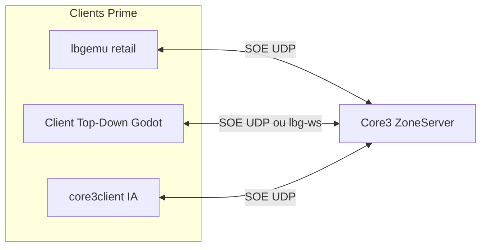

# Plan — Client Top-Down 2D + Headless IA pour Core3 Prime

**Statut** : cible produit — juin 2026  
**Serveur** : Core3 Prime (`192.168.0.246:44553`)  
**Client retail** : `lbgemu` / `prime-lbg` (conservé en parallèle)  
**Outils** : Cursor / Antigravity (jalons + prompts ci-dessous)

**Documents liés** :
- [`core3_ia_phase_d_headless_bot.md`](core3_ia_phase_d_headless_bot.md) — bot `core3client` (déjà en prod)
- [`plan_client_godot_prime_rendu.md`](plan_client_godot_prime_rendu.md) — vision 3D long terme + gateway
- [`pipeline_assets_swg_godot.md`](pipeline_assets_swg_godot.md) — extraction assets retail
- [`world_editor/README_scrapaltai_editor.md`](../tools/world_editor/README_scrapaltai_editor.md) — carte Tatooine 2D + POI
- [`client_patch/`](../../tools/client_patch/) — extraction TRE / branding Prime

---

## 1. Objectif (une phrase)

Construire un **écosystème client LBG** pour Prime : (A) **headless** pour les IA, (B) **Top-Down 2D** jouable (ZQSD, saut/nage/vol à terme), (C) **retail SWG** inchangé pour les humains — les trois sur le **même Core3**, avec extraction **transitoire** des cartes retail puis univers propre.

---

## 2. FAQ — coexistence des clients

| Question | Réponse |
|----------|---------|
| Le client original peut-il rester connecté ? | **Oui.** Core3 ne impose pas un seul type de client. |
| Le client 2D et le retail voient-ils les mêmes entités ? | **Oui**, dans la même zone : le ZoneServer diffuse positions, apparences, états à **toutes** les sessions UDP valides. |
| Un même personnage sur retail **et** 2D en même temps ? | **Non** (une session zone par perso). Politique LBG : refus double login ou kick de l’ancienne session. |
| Deux comptes différents (ex. Teome + Bot_IA) ? | **Oui** — mirroring classique pour valider le pont. |
| L’IA headless sans graphismes ? | **Oui** — `core3client` existe déjà ; pas besoin de Godot ni de SWG.exe. |
| Dé-starwarsiser impose-t-il de tout refaire ? | **Non immédiatement.** Extraction retail = **phase transition** ; contenu LBG (JSON, sprites, noms) remplace progressivement. |



---

## 3. Propriété & légalité (rappel)

| Composant | Statut | Action LBG |
|-----------|--------|------------|
| **Core3** (serveur) | AGPLv3 — SWGEmu | Fork `core3-clean` Prime ; publier les sources modifiées si hébergement public. |
| **Client retail** (binaire SOE 2003) | Propriétaire Sony/Disney | Usage privé / dev ; **ne pas redistribuer** ; remplacer à terme par client LBG. |
| **Assets extraits** (.tre, .iff) | IP Lucasfilm | **Transition uniquement** ; ne pas committer les `.tre` dans Git ; exporter vers JSON/PNG/GLB LBG. |
| **Code client LBG** (Godot, Python) | Vôtre | Licence au choix (MIT/AGPL) ; aucun code SOE fuité. |

**Dé-SOEiser** = formats ouverts + protocole documenté côté LBG, pas réutiliser le code source client fuité (SWG-Source).

---

## 4. Architecture cible — trois couches

Séparation stricte pour que l’IA, le 2D et le futur 3D partagent la même logique :

```
┌─────────────────────────────────────────────────────────┐
│  Couche C — Visuelle (optionnelle)                      │
│  Godot 2D : TileMap, sprites, caméra, animations        │
└───────────────────────────┬─────────────────────────────┘
                            │
┌───────────────────────────▼─────────────────────────────┐
│  Couche B — Simulation locale                           │
│  EntityManager : id → {x, y, z, state, kind, label}     │
│  Projection : screen.x = world.x, screen.y = world.z    │
│              sprite.offset_y = -world.y (hauteur)       │
└───────────────────────────┬─────────────────────────────┘
                            │
┌───────────────────────────▼─────────────────────────────┐
│  Couche A — Réseau (obligatoire pour tout client)      │
│  Option 1 (rapide) : lbg_gateway WebSocket JSON         │
│  Option 2 (autonome) : stack SOE UDP (sous-ensemble)    │
│  Option 3 (IA) : core3client (existant)                 │
└─────────────────────────────────────────────────────────┘
```

### Choix réseau recommandé (hybride)

| Phase | Transport | Pourquoi |
|-------|-----------|----------|
| **M0–M2** | `core3client` + sidecar `:8791` | IA déjà opérationnelle ; zéro risque sur le protocole |
| **M3–M4** | **lbg-ws v2** (gateway) pour le 2D | Évite 6–12 mois de rétro-ingénierie SOE dans Godot ; hook C++ zone documenté dans [`migration_new_mmo_core3.md`](migration_new_mmo_core3.md) |
| **M5+** (optionnel) | SOE natif Godot (GDExtension C++) | Si le gateway limite saut/vol/nage — étendre les paquets côté **serveur** d’abord |

> Le retail continue en SOE pur ; le 2D peut passer par le gateway **sans** casser le client original.

---

## 5. Extraction cartes & bâtiments (client retail)

**Oui, c’est possible** — comme étape de transition, pas comme dépendance finale.

| Donnée | Fichier SWG | Outil / action LBG | Sortie Godot 2D |
|--------|-------------|-------------------|-----------------|
| Terrain extérieur | `.trn` dans `.tre` | Script `tools/map_export/trn_to_heightmap.py` (à créer) | `TileMap` + couche altitude |
| Types de sol | splat / shader terrain | même pipeline | autotile herbe/sable/eau |
| Objets monde (bâtiments, arbres) | World Snapshot `.ws` | `tools/map_export/ws_to_json.py` (à créer) | JSON → `Sprite2D` / `Marker2D` |
| POI gameplay | `content/core3/world_poi/*.json` | **Déjà dans le repo** | icônes + labels |
| Carte 2D Tatooine | `tools/world_editor/` | **Déjà** — SVG + calibration | fond carte éditeur → import Godot |
| Intérieurs | `.pob` / cellules | Phase ultérieure | scènes 2D par bâtiment |
| Textures | `.dds` dans `.tre` | [`extract_tre_asset.py`](../tools/client_patch/extract_tre_asset.py) | PNG → atlas 2D |

**Règle Git** : exporter vers `lbg_client_td/assets/world/` (PNG, JSON, `.tres`) — **jamais** les `.tre` originaux.

### Prompt Cursor (extraction snapshot)

```
Crée tools/map_export/ws_to_json.py : parse un World Snapshot SWG (.ws),
extrait pour chaque entrée {template, x, y, z, quaternion}, normalise les
chemins template en id LBG neutre, écrit un JSON array. Tests unitaires sur
un échantillon de 10 lignes. Doc courte dans tools/map_export/README.md.
```

---

## 6. Jalons (milestones)

### M0 — Prérequis (fait / en cours)

- [x] Prime stable (`246:44553`)
- [x] Client retail brandé (étapes 1–4 + musique)
- [x] `core3client` headless Lia (`core3_ia_phase_d_headless_bot.md`)
- [x] Sidecar `:8791` + snapshots `ia_bridge/`
- [x] World Editor 2D Tatooine (`tools/world_editor/`)

### M1 — Client console « observateur » (1–2 sem.)

**But** : lire la zone sans graphismes (proto commun IA + debug 2D).

| Tâche | Livrable |
|-------|----------|
| M1.1 | Script `tools/zone_observer/zone_feed.py` : poll `npc_snapshots.json` + futur `player_snapshots.json` à 5–10 Hz |
| M1.2 | Affichage terminal : entités `{id, x, z, y, kind}` triées par distance |
| M1.3 | Test : retail bouge Teome → terminal affiche le delta < 2 s |

**Prompt Cursor**

```
Lis docs/core3_ia_phase_d_headless_bot.md et tools/core3_ia_sidecar/.
Écris tools/zone_observer/zone_feed.py : CLI qui affiche en temps réel les
positions des joueurs/PNJ depuis ia_bridge/npc_snapshots.json et
player_snapshots.json, avec coords x/z/y SWG. Option --watch 1s.
```

### M2 — Projet Godot 4 Top-Down (squelette) (1 sem.)

**Projet existant** : `new_mmo/prime-client/` (pas `lbg_client_td/`).

| Tâche | Livrable |
|-------|----------|
| M2.1 | `prime-client/` — Godot 4.6, EntityManager, projection | ✓ |
| M2.2 | `snapshot_bridge.gd` + `demo_entities.json` | ✓ |
| M2.3 | Lien M1 via `zone_feed.py --json-out` ou snapshots directs | ✓ |

**Prompt Cursor**

```
Crée lbg_client_td/ (Godot 4.2 2D). Autoload Network (stub), EntityManager,
WorldProjection (screen.x=world.x, screen.y=world.z, offset_y=-world.y).
Scène Main.tscn : Node2D + Camera2D + chargement entities depuis un JSON
de test. README avec godot --path lbg_client_td.
```

### M3 — Mirroring retail ↔ 2D (2–3 sem.)

| Tâche | Livrable |
|-------|----------|
| M3.1 | `zone_feed.py --mirror --godot-port 12345` | ✓ |
| M3.2 | `run_m3_mirror.sh` + bots Lia/Nix/Mira | ✓ |
| M3.3 | Validation mouvement Prime → sprite 2D | ✓ |

### M4 — Carte Tatooine 2D (extraction) (2–3 sem.)

| Tâche | Livrable |
|-------|----------|
| M4.1 | Export carte SVG → `prime-client/assets/maps/` | ✓ |
| M4.2 | POI villes + Lost Heaven (`tatooine_pois.json`) | ✓ |
| M4.3 | TileMap eau + collision polygones | ✓ (`zone_layers.gd`) |
| M4.4 | `ws_to_json.py` + `mos_eisley_ws.json` | ✓ |

### M5 — Contrôle clavier + gateway (3–4 sem.)

| Tâche | Livrable |
|-------|----------|
| M5.1 | ZQSD → `prime_controller` (SOE direct) | ✓ `--play` |
| M5.2 | Hook `movement_mode` Core3 | doc existante |
| M5.3 | Retail voit perso Godot | à valider IG |

**Serveur** : modifier validation mouvement dans `core3-clean` **avant** le client.

### M6 — Mécaniques modernes (itératif)

| Feature | Client 2D | Serveur Core3 |
|---------|-------------|---------------|
| Saut / chute | `y` + vélocité, ombre au sol | Gravité, dégâts chute, anti-cheat assoupli |
| Nage | tuile eau → état `swimming` | State bits + vitesse |
| Vol atmosphérique | `y` libre + sprite élevé | Zone flag `allow_flight` |
| Atmosphérique | report JTL existant ou simplifié | — |

Chaque mécanique = **paquet serveur d’abord**, puis input Godot.

### M7 — Dé-starwarsisation contenu (continu)

| Zone | Action |
|------|--------|
| Templates CRC | Remplacer noms `object/.../tatooine/...` par catalogue LBG JSON |
| Sprites 2D | Remplacer assets retail par pack Kenney / art LBG |
| UI | Pas de logo Rebelle / SWG (cf. branding `patch_11_03`) |
| Serveur | `string/en/*.stf` → fichiers LBG ; quêtes Lua neutres |

---

## 7. Structure repo cible

```
LBG_IA_MMO/
  tools/zone_observer/        # M1 zone_feed.py
  new_mmo/prime-client/       # M2 Godot 4 Top-Down (hors monorepo LBG, même workspace)
  tools/client_patch/         # retail branding (existant)
  tools/world_editor/         # carte 2D (existant)
  content/core3/world_poi/    # vérité gameplay (existant)
```

Le dossier gelé `lbg_client_godot/` (3D phase 0) reste en lecture ; **ne pas mélanger** avec `lbg_client_td/` avant fusion explicite.

---

## 8. Politique « un personnage, un client actif »

À implémenter côté Core3 ou login :

1. À la connexion zone Godot : si le perso est déjà en ligne (retail) → `DisconnectMessage` au retail ou refus Godot.
2. Documenter dans le launchpad : « Teome est sur Client LBG 2D » vs « Client classique ».
3. Les **bots IA** (`Bot_IA`, `Nix`, …) restent headless — comptes dédiés, pas de double session humaine.

---

## 9. Ordre d’exécution recommandé (Cursor)

```
Semaine 1–2 : M1 (zone_feed) + M2 (squelette Godot)
Semaine 3–4 : M3 (mirroring) — critère go/no-go
Semaine 5–6 : M4 (carte exportée)
Semaine 7+  : M5 (gateway mouvement) puis M6 une feature à la fois
```

**Premier prompt à lancer dans Cursor (Agent)**

```
Lis LBG_IA_MMO/docs/plan_client_topdown_prime.md.
Exécute le jalon M1 : tools/zone_observer/zone_feed.py avec tests.
Puis M2 : crée lbg_client_td/ minimal Godot 4.2 2D selon §6 M2.
Ne touche pas au client retail ni à core3client existant.
```

---

## 10. Risques & mitigations

| Risque | Mitigation |
|--------|------------|
| Réécrire SOE dans Godot trop tôt | Gateway d’abord (§4) |
| Double session / dup items | Politique §8 |
| Assets Star Wars dans Git | Export uniquement ; `.gitignore` `*.tre` |
| Serveur rejette saut/vol | Modifier Core3 avant le client |
| Perf snapshots fichier 2 s | Passer à lbg-ws push 10–20 Hz (plan Godot Prime) |

---

## 11. Critères « client LBG viable »

- [ ] IA (`core3client`) joue sans SWG.exe
- [ ] Client 2D affiche les autres joueurs en temps quasi réel
- [ ] ZQSD fonctionne sur au moins une zone test
- [ ] Retail et 2D coexistent sur Prime (comptes distincts)
- [ ] Carte 2D Mos Eisley navigable (terrain + POI)
- [ ] Aucune dépendance `.tre` au runtime Godot
- [ ] Branding LBG (pas de splash SWG obligatoire sur retail)

---

*Dernière mise à jour : 2026-06-19 — aligné branding Prime étapes 1–4 + musique.*
