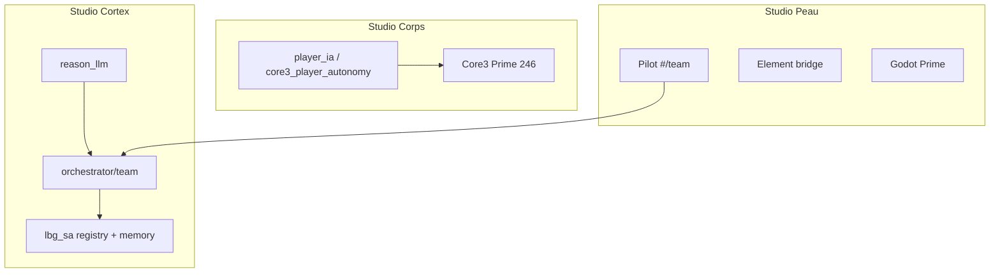

# Plan LBG Studios Agents (LBG_SA) — partitions, modules, mémoire et évolution

**Date** : 2026-07-29  
**Statut** : phase 0 — squelette + ancrage Atlas  
**Complète** : ADR 0014, ADR 0015, `vision_equipe_fable_autoconsultation.md`, `plan_team_local_llm.md`  
**Ancien nom de code** : Fable5 (renommé pour coller à l’approche studios modulaires)

---

## 1. Objectif

**LBG Studios Agents (LBG_SA)** nomme le **bâtiment** unifié qui relie plusieurs **studios** :

| Studio (partition) | Contenu | Rôle |
|--------------------|---------|------|
| **Studio Cortex** | Équipe studio (Thémis, Atlas, Iris…) + stack LLM / agents déclaratifs | Planifier, consulter, router, bench, autoconsult |
| **Studio Corps** | Joueurs IA (Lia, Nix…) + Core3 | Snapshots, ticks, actions monde (autorité serveur) |
| **Studio Peau** | Pilot, Element, Godot | Interfaces humaines et client |

Les **salles d’archives** (registre de modules + mémoire JSONL namespacée) sont transversales au bâtiment (`orchestrator/lbg_sa/`).

Ce n’est pas un monolithe : **contrats JSON**, **namespaces mémoire**, **registre de modules**.

---

## 2. Partitions (studios)

### Règles de frontière

- **Corps** = seule source de vérité pour l’état MMO ; le LLM ne persiste que des **interprétations** (mémoire `player/*`).
- **Cortex** peut lire le Corps (sondes L1) et proposer des actions L2.
- **Peau** ne décide pas : affiche, approuve, envoie des tokens.

---

## 3. Mémoire long terme — salles d’archives (phase 0)

### Ancres

| Variable (canonique) | Alias | Usage |
|----------------------|-------|--------|
| `LBG_TEAM_DB_PATH` | — | Répertoire parent par défaut (`/var/lib/lbg-ia-mmo/`) |
| `LBG_STUDIOS_AGENTS_MEMORY_ROOT` | `LBG_SA_MEMORY_ROOT` | Racine JSONL (défaut : `{parent team db}/lbg_sa/memory`) |
| `LBG_STUDIOS_AGENTS_MEMORY_ENABLED` | `LBG_SA_MEMORY_ENABLED` | `1` par défaut ; `0` = RAM volatile par namespace |
| `LBG_STUDIOS_AGENTS_MEMORY_MAX_ENTRIES` | `LBG_SA_MEMORY_MAX_ENTRIES` | Cap par namespace (défaut 500) |

### Namespaces

| Namespace | Producteur | Contenu typique |
|-----------|------------|-----------------|
| `team/atlas` | runs `admin_infra` | périmètre, gaps Ollama, leçons bench |
| `team/pm` | autoconsult (futur) | synthèses, conflits POI |
| `player/lia` | think/tick (futur) | objectifs, relations PNJ |
| `cortex/router` | bench / routage (futur) | profils modèles validés |

Implémentation : `LbgSaMemoryStore` délègue à `hybrid_proactive_agent.LongTermMemoryStore` (un fichier `{namespace}.jsonl`).

### Distinction

- `services/experience_memory.py` — **jobs** Cowork (`experiences.jsonl`).
- **LBG_SA** — équipe, joueurs, ops LLM **namespacés**.
- Roadmap phase F vision : fusion conceptuelle via tags communs, pas un seul blob.

---

## 4. Boucle Observe → Learn

Protocole cible (tous modules LBG_SA) :

1. **Observe** — sonde / audit / snapshot  
2. **Diagnose** — gaps, métriques (ex. bench 4/6)  
3. **Propose** — brief PM ou action L2  
4. **Act** — L1 scripté ou L2 token  
5. **Verify** — smoke / re-sonde  
6. **Learn** — `append_learning` dans le namespace du module  

**Phase 0** : Learn branché sur **Atlas** (`admin_infra_workflow`).

---

## 5. Registre de modules

Voir `orchestrator/lbg_sa/module_registry.py` — chaque entrée :

- `id`, `partition`, `owner_role`, `memory_namespace`
- `host_allowlist` (110, 140, 245, 246…)
- `mmo_safe` — le module peut-il toucher le monde sans L2 dédié ?
- `status` : `active` | `planned` | `frozen`

API : `GET /v1/lbg_sa/meta` (modules + chemins mémoire).

---

## 6. Intégration Team

### Kickoff phase 0

`POST /v1/lbg_sa/team/kickoff` enfile (si pas déjà fait) :

| Rôle | Objectif |
|------|----------|
| `pm` | Valider studios et prioriser vertical slice joueur + mémoire |
| `qa` | Smoke : tests `test_lbg_sa_*`, mémoire Atlas après run admin_infra |
| `admin_infra` | Poursuite local LLM lab (déjà timer Atlas) |

Contexte tâche : `lbg_sa_kickoff_batch: phase0`, `subproject: lbg_sa`.

### Plan NL

Mots-clés `lbg_sa`, `studios agents`, `mémoire équipe` (+ alias legacy `fable5`) → propositions `pm` + `qa` dans `POST /v1/team/plan`.

---

## 7. Roadmap par horizon

### Phase 0 (en cours)

- [x] Doc + `orchestrator/lbg_sa/` (registry, memory, atlas)
- [x] Learn sur run Atlas
- [x] Kickoff Team + sous-projet `lbg_sa`
- [ ] Déployer sur 140 + un run Atlas → ligne `team/atlas.jsonl`

### Phase 1 — Cortex consolidé

- Injecter `context_hints` Atlas dans brief PM autoconsult
- Bench watchdog → append automatique (script → API ou import Python)
- Routage auto bench → `LBG_REASON_MODEL_*` (feature flag)

### Phase 2 — Corps joueur

- Mémoire `player/lia` après think dry-run
- Autonomie graduée (`LBG_CORE3_PLAYER_AUTONOMY_ENABLED` par zone)
- Métriques : snapshot online, actions allowlistées / refusées

### Phase 3 — Peau et jeu

- Headless / bot gateway même chemin qu’humain
- Outils data-driven MMO exposés comme **capabilities** `mmo_safe`

### Phase matériel (quand budget suit)

| Besoin | Déclencheur |
|--------|-------------|
| GPU/NPU 110 | bench 26b stable &lt; 60 s sur code |
| 2ᵉ nœud inference | saturation router + dialogue |
| Embeddings locaux | recall mots-clés insuffisant (métrique rappel) |
| RAM 140 | nombre de namespaces + timers |

Les **interfaces** (namespaces, profils, modules) restent fixes ; on monte en **tier** modèle / matériel.

---

## 8. Critères de succès LBG_SA phase 0

- Tests `orchestrator/tests/test_lbg_sa_*.py` verts en CI
- `GET /v1/lbg_sa/meta` expose ≥ 6 modules et `memory_root`
- Run `admin_infra` retourne `lbg_sa_memory` avec `recorded: true` si enabled
- Kickoff crée 3 tâches Team visibles dans Pilot `#/team`

---

## Liens

- `orchestrator/lbg_sa/`
- `docs/vision_equipe_fable_autoconsultation.md` (phase F mémoire équipe)
- `hybrid_proactive_agent/docs/ARCHITECTURE.md`
- `infra/scripts/atlas_bench_watchdog.py`
- `infra/scripts/deploy_lbg_sa_vm140.sh`
