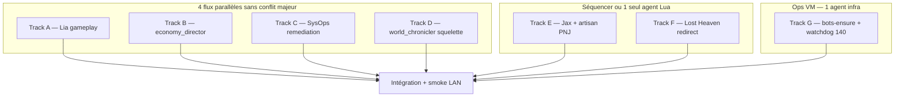

# Plans parallèles — prochaines étapes World Director / MMO Prime

**Date** : 2026-06-28  
**Objectif** : découper le travail en **flux indépendants** lançables sur **plusieurs agents** en parallèle, avec critères d’acceptation et zones de conflit Git explicites.

**Références** :
- [`plan_world_director_integration.md`](plan_world_director_integration.md) — phases 2–6
- [`plan MMMORPG.md`](../../plan%20MMMORPG.md) — suite prévue juin 2026
- [`ARCHIVED_mmmorpg_sandbox.md`](ARCHIVED_mmmorpg_sandbox.md) — bac à sable Python gelé

---

## 1. Vue d’ensemble — ce qui peut tourner en parallèle



| Track | Phase WD | Effort estimé | Conflits Git probables |
|-------|----------|---------------|------------------------|
| **A** Lia gameplay | 3 | 1–2 j | `core3_player_autonomy.py`, `core3_economy_loop.py` |
| **B** `economy_director.py` | 4.1–4.4 | 1–2 j | Nouveaux fichiers + registry orchestrateur |
| **C** SysOps remediation | 2.4 | 0,5–1 j | `infra_watchdog.py`, `remediation.py`, systemd |
| **D** `world_chronicler` squelette | 5.1–5.2 | 1–2 j | Nouveaux fichiers JSON + agent |
| **E** Jax + artisan trainer | 3.2 | 1 j | **`ia_bridge_screenplay.lua`**, catalogues JSON |
| **F** Lost Heaven | 3 / ADR 0009 | 0,5 j | **`ia_bridge_screenplay.lua`**, screenplay LH |
| **G** bots-ensure + watchdog 140 | 2.3 + 3 | 0,5 j | `infra/systemd/*`, scripts deploy |

### Avancement session 2026-06-28

| Track | Statut |
|-------|--------|
| **F** | ✅ Option A — `IA_BRIDGE_LOST_HEAVEN_ENABLED = false` + doc |
| **B** | ✅ `economy_director.py` + `economy_rules_v1.json` + tests |
| **D** | ✅ `world_chronicler.py` + `faction_goals.json` + tests |
| **G** | ✅ [`runbook_ops_bots_watchdog.md`](runbook_ops_bots_watchdog.md) |
| **A** | 🟡 Lia **online** cantina 1082877 (246) ; pytest quête OK ; `quest_state.jsonl` vide post-restart |
| **C** | ✅ `infra_memory_remediation.py`, plan watchdog, `memory_remediation_plan`, [`runbook_infra_remediation.md`](runbook_infra_remediation.md) |
| **E** | ✅ Jax forcé comptoir (`winner_pilot_id` + `force_post`) ; artisan online |
| **FU-1** | ✅ capability `economy_regulate` |
| **FU-2** | ✅ capability `world_direct` + enqueue sidecar |

**Règle de fusion** : **E et F ne pas paralléliser** sur le même fichier Lua — soit **un agent Lua** pour E+F, soit E puis F en série.

**Maximum parallèle recommandé** : **4 agents** (A + B + C + D) + **1 agent ops** (G) + **1 agent Lua** (E puis F).

---

## 2. Matrice de dépendances

| Track | Dépend de | Bloque |
|-------|-----------|--------|
| A | sidecar `:8791`, bots online | smoke économie Lia |
| B | `core3_economy.json` (lecture) | capability `economy_regulate` (phase 4.3) |
| C | `PROXMOX_TOKEN`, VM 140 | rien |
| D | `core3_behavior_profiles.json`, `core3_npc_catalog.json` | capability `world_direct` (phase 5.3) |
| E | catalogues PNJ, Prime running | validation cantina IG |
| F | décision opérateur (freeze vs rebuild) | spawn Mira |
| G | accès SSH 246 / 140 | autonomie population stable |

Aucune dépendance **code** entre B, C, D — parallélisation safe.

---

## 3. Briefs agents (copier-coller)

Chaque brief est **autonome** pour un agent Cursor / sous-agent `generalPurpose` ou `explore`+implémentation.

---

### Track A — Lia : progression gameplay en conditions réelles

**Branche suggérée** : `feature/lia-gameplay-progression`

**Périmètre**
- Renforcer la boucle **forage → craft → vente → quête** pour le perso **Lia** (`Bot_IA`) via l’existant, sans nouveau moteur.
- Fichiers pivot : `agents/src/lbg_agents/core3_player_autonomy.py`, `core3_economy_loop.py`, `core3_profession_lifecycle.py`, `content/core3/core3_quest_templates.json`.

**Hors scope**
- Bac à sable Python (`mmmorpg_server`) — gelé.
- Modifications massives Lua (`ia_bridge_screenplay.lua`) — réservé Track E/F.

**Tâches**
1. Lire snapshots sidecar et logs Lia sur 246 (ou smokes existants).
2. Vérifier que `pick_economy_step` enchaîne correctement les phases `learning` → `production`.
3. Brancher 1–2 quêtes de `core3_quest_templates.json` (ex. `mos_gather_bar_fruit`) dans l’autonomie Lia si pas déjà fait.
4. Ajouter tests unitaires ciblés (`agents/tests/test_core3_quest_economy.py` ou nouveau).
5. Documenter variables env dans `lbg.env.example` si nouvelles.

**Critères d’acceptation**
- [ ] Test(s) pytest verts pour la boucle Lia.
- [ ] Smoke ou script doc : Lia exécute au moins **forage + vendor_sell** sans erreur sidecar.
- [ ] Pas de régression Nix/Mira (lecture seule des configs partagées).

**Livrables**
- PR petite (< 400 lignes hors tests).
- 1 paragraphe dans Historique `plan_de_route.md` si mergé.

---

### Track B — Agent Économie : `economy_director.py` (macro)

**Branche** : `feature/economy-director-v1`

**Périmètre**
- Squelette de l’**Agent Économie** décrit dans `plan_world_director_integration.md` §5.3 et phase 4.
- **Lecture seule** : `core3_economy.json`, snapshots sidecar (stocks shops), pas de SQL write en v1.

**Fichiers à créer**
- `agents/src/lbg_agents/economy_director.py`
- `agents/tests/test_economy_director.py`
- Optionnel : `content/core3/economy_rules_v1.json` (seuils macro)

**API cible (spec)**

```python
def load_economy_signals() -> list[dict]: ...  # agrège JSON + snapshots
def evaluate_rules(signals) -> list[dict]: ...  # rareté, stock vide, inflation
def propose_actions(evaluations) -> list[dict]:  # offer_quest, adjust_price_json, log_only
def run_economy_director_tick(*, dry_run: bool = True) -> dict: ...
```

**Format action (exemple)**

```json
{
  "signal": "resource_scarcity",
  "resource": "foraged_fruit_s1",
  "action": "offer_quest",
  "quest_id": "mos_gather_bar_fruit",
  "giver_pilot_id": "npc:core3_barman_jax"
}
```

**Hors scope v1**
- `mcp-lbg-sql` (phase 4.2 — track séparé ultérieur).
- Écriture MariaDB.
- Capability orchestrateur `economy_regulate` (petit PR follow-up après squelette).

**Critères d’acceptation**
- [ ] `pytest agents/tests/test_economy_director.py` OK (≥ 5 cas : stock bas, stock OK, pas de config, dry_run).
- [ ] `run_economy_director_tick(dry_run=True)` retourne JSON structuré avec `proposed_actions`.
- [ ] Aucune importation du bac à sable Python.

**Conflits** : faible — nouveaux fichiers ; éviter de modifier `core3_economy.json` en même temps que Track E.

---

### Track C — SysOps : remediation RAM + playbook

**Branche** : `feature/infra-remediation-playbook`

**Périmètre**
- Fermer la boucle phase **2.4** : seuil RAM → log structuré → proposition remediation → **approbation** avant restart.
- S’appuyer sur `infra_watchdog.py`, `remediation.py`, `vm_memory_probe.py`, `proxmox_probe.py`.

**Tâches**
1. Définir seuils dans env : `LBG_VM_MEMORY_WARN_PCT`, `LBG_VM_MEMORY_CRIT_PCT`, `LBG_REMEDIATION_PRIME_ENABLED`.
2. Étendre `run_infra_watchdog` pour émettre `remediation_plan` quand VM 246 > seuil (si `EXCLUDE_PRIME=0` ou flag dédié).
3. Lier au kind `remediation_apply` existant — **jamais** auto-restart sans token/approbation.
4. Tests `test_infra_watchdog.py`, `test_remediation.py`.
5. Runbook court : `docs/runbook_infra_remediation.md` (nouveau, ≤ 80 lignes).

**Hors scope**
- Token Proxmox write / start-stop VM.
- Open Interpreter sandbox (phase 2.5).

**Critères d’acceptation**
- [x] Tests verts (`test_infra_memory_remediation.py`, `test_infra_watchdog.py`).
- [x] Dry-run documenté : `devops_probe` + `infra_watchdog` → plan visible, pas d’exec sans approbation.
- [x] Timer `lbg-infra-watchdog` sur 140 : doc install dans [`runbook_infra_remediation.md`](runbook_infra_remediation.md).

**Conflits** : faible — zone `agents/` + `infra/` + docs.

---

### Track D — Chroniqueur : `faction_goals.json` + `world_chronicler.py`

**Branche** : `feature/world-chronicler-skeleton`

**Périmètre**
- Amorcer l’**Agent Chroniqueur** (objectifs faction/roster, pas micro-PNJ).
- Phase 5.1–5.2 du plan World Director.

**Fichiers à créer**
- `content/world/faction_goals.json` (ou `content/core3/faction_goals.json` — choisir un seul, documenter)
- `agents/src/lbg_agents/world_chronicler.py`
- `agents/tests/test_world_chronicler.py`

**Modèle `faction_goals.json` (minimal)**

```json
{
  "schema_version": 1,
  "factions": [
    {
      "faction_id": "mos_eisley_cantina",
      "goals": [
        {
          "goal_id": "stock_bar",
          "priority": 1,
          "condition": "shop_stock_below",
          "shop_id": "shop:mos_cantina_bar",
          "threshold": 10,
          "roster_id": "roster:mos_eisley_cantina_barman",
          "scene_profile": "profile:cantina_barman_mos_v1"
        }
      ]
    }
  ]
}
```

**`world_chronicler.py`**
- `load_faction_goals()` → lit JSON.
- `evaluate_world_state(snapshots)` → liste d’objectifs actifs.
- `enqueue_roster_hints(goals)` → écrit dans format compatible `pending.jsonl` / sidecar (lecture spec `core3_npc_autonomy.py`).
- `run_chronicler_tick(dry_run=True)` — pas de LLM en v1.

**Hors scope v1**
- Capability `world_direct` orchestrateur (follow-up).
- LangGraph.
- Spawn Lua direct.

**Critères d’acceptation**
- [ ] Tests unitaires ≥ 4 scénarios.
- [ ] Lien documenté vers `core3_behavior_profiles.json` et `core3_npc_autonomy.py`.
- [ ] `dry_run=True` ne modifie pas la prod.

**Conflits** : faible si nouveaux fichiers ; ne pas modifier `ia_bridge_screenplay.lua`.

---

### Track E — PNJ cantina : Jax + artisan trainer online

**Branche** : `feature/cantina-jax-artisan-spawn`

**Périmètre**
- Valider **barman Jax** et **1 artisan trainer** en jeu sur Prime (spawn, scène profil, économie cantina).
- Phase 3.2.

**Fichiers probables**
- `content/core3/lua/ia_bridge_screenplay.lua` (**zone chaude**)
- `content/core3/core3_npc_catalog.json`
- `content/core3/core3_behavior_profiles.json`
- `content/core3/core3_economy.json` (stocks cantina)
- Smokes : `infra/scripts/smoke_core3_prime_world_lan.sh`

**Tâches**
1. Vérifier `ensureBarmanOnDuty` / roster `roster:mos_eisley_cantina_barman`.
2. Confirmer spawn intérieur cantina (cell) + fallback outdoor.
3. Artisan trainer : entrée catalogue + roster ME si manquant.
4. Déployer Lua sur 246 via `deploy_core3_ia_bridge_vm.sh` (doc only si pas d’accès VM).
5. Mettre à jour checklist `core3_prime_post_deploy_checklist.md`.

**Critères d’acceptation**
- [ ] Jax visible au comptoir (ou fallback logué explicite).
- [ ] 1 trainer artisan spawnable / interactif.
- [ ] Smoke LAN passe ou note d’échec documentée avec cause.

**Conflits** : **ÉLEVÉ** — `ia_bridge_screenplay.lua`. **Ne pas paralléliser avec Track F.**

---

### Track F — Lost Heaven : freeze redirect ou hub v9

**Branche** : `feature/lost-heaven-freeze-or-hub`

**Périmètre**
- Résoudre le cas **Mira** téléportée vers coords hub sans assets (ADR 0009, 0010).
- **Option A (rapide)** : flag env / `writeData` pour désactiver `maybeRedirectPlayerToLostHeaven` temporairement.
- **Option B (long)** : activer `lbg_lost_heaven_screenplay.lua` + rebuild terrain — hors scope sauf directive explicite.

**Fichiers**
- `content/core3/lua/ia_bridge_screenplay.lua` (`maybeRedirectPlayerToLostHeaven`)
- `content/core3/lua/lbg_lost_heaven_screenplay.lua`
- `docs/core3_prime_runbook.md`

**Décision opérateur requise avant code** : A ou B (défaut recommandé : **A** freeze).

**Critères d’acceptation**
- [ ] Nouveaux persos ne spawnent plus dans le vide (option A) OU hub visible (option B).
- [ ] ADR 0009/0010 référencés dans commit message.
- [ ] Pas de régression Lia/Nix spawn ME.

**Conflits** : **ÉLEVÉ** — même fichier Lua que Track E → **après E ou même agent**.

---

### Track G — Ops : `bots-ensure` timer + watchdog 140

**Branche** : `feature/ops-bots-ensure-watchdog`

**Périmètre**
- Stabiliser autonomie population : timer **`lbg-core3-ia-bots-ensure`** sur 246, watchdog infra sur 140.
- Scripts existants : `install_core3_ia_bots_ensure_vm.sh`, `infra/systemd/lbg-core3-ia-bots-ensure.*`.

**Tâches**
1. Vérifier unités systemd dans repo vs VM.
2. Documenter procédure install + `systemctl list-timers` attendu.
3. Optionnel : timer `lbg-infra-watchdog` sur 140 si absent.
4. Smoke : bots Lia/Nix reconnect après restart Prime (script ou doc étapes manuelles).

**Hors scope**
- Modifier logique autonomie Python (Track A).

**Critères d’acceptation**
- [ ] Procédure reproductible dans runbook (≤ 1 page).
- [ ] Variables env documentées.
- [ ] Checklist post-deploy mise à jour.

**Conflits** : `infra/` seulement — parallèle avec A–D.

---

## 4. Planning suggéré (2 vagues)

### Vague 1 — 4 agents en parallèle (jour 1–2)

| Agent | Track | Prompt d’amorçage |
|-------|-------|-------------------|
| **Agent 1** | A | « Implémente Track A du fichier `docs/plan_parallel_next_steps.md` — progression gameplay Lia. » |
| **Agent 2** | B | « Implémente Track B — squelette `economy_director.py` + tests. » |
| **Agent 3** | C | « Implémente Track C — remediation RAM playbook + tests. » |
| **Agent 4** | D | « Implémente Track D — `faction_goals.json` + `world_chronicler.py` squelette. » |
| **Agent 5** (ops) | G | « Implémente Track G — bots-ensure + watchdog 140 runbook. » |

### Vague 2 — 1 agent Lua séquentiel (jour 2–3)

| Agent | Track | Note |
|-------|-------|------|
| **Agent 6** | E puis F | Un seul agent sur `ia_bridge_screenplay.lua` : d’abord Jax/artisan, puis Lost Heaven freeze. |

### Vague 3 — intégration (jour 3–4)

1. Merge branches dans l’ordre : **G → C → B → D → A → E → F** (ops et nouveaux fichiers d’abord, Lua en dernier).
2. Smoke LAN : `smoke_core3_prime_world_lan.sh`, `smoke_lan_quick.sh` si applicable.
3. Ligne Historique unique dans `plan_de_route.md`.

---

## 5. Follow-ups (vague 4 — après merge)

| ID | Tâche | Dépend de |
|----|-------|-----------|
| FU-1 | Capability `economy_regulate` + job quotidien | Track B |
| FU-2 | Capability `world_direct` + enqueue réel sidecar | Track D |
| FU-3 | `mcp-lbg-sql` read-only MariaDB | Track B |
| FU-4 | World Director plan unifié (phase 6.1) | B + C + D stables |
| FU-5 | Dashboard Pilot pastilles infra + monde | FU-4 |

---

## 6. Checklist opérateur avant de lancer les agents

- [ ] Core3 Prime **246** UP, sidecar **:8791** OK
- [ ] Ollama **110** OK (pour tests autonomie, pas pour tracks B/C/D)
- [ ] Décision **Lost Heaven** : freeze (A) ou rebuild (B) notée pour Agent 6
- [ ] Branches Git séparées par track
- [ ] Aucun agent ne touche `plan MMMORPG.md` sauf mise à jour « Suite prévue » si jalon livré

---

## 7. Références code existant (ne pas réinventer)

| Besoin | Fichier |
|--------|---------|
| Boucle économie bot | `core3_economy_loop.py` |
| Autonomie joueur | `core3_player_autonomy.py` |
| Autonomie PNJ | `core3_npc_autonomy.py` |
| Watchdog | `infra_watchdog.py` |
| MCP Proxmox | `tools/mcp_proxmox_server/server.py` |
| Pont Lua | `content/core3/lua/ia_bridge_screenplay.lua` |
| Plan directeur | `plan_world_director_integration.md` |
