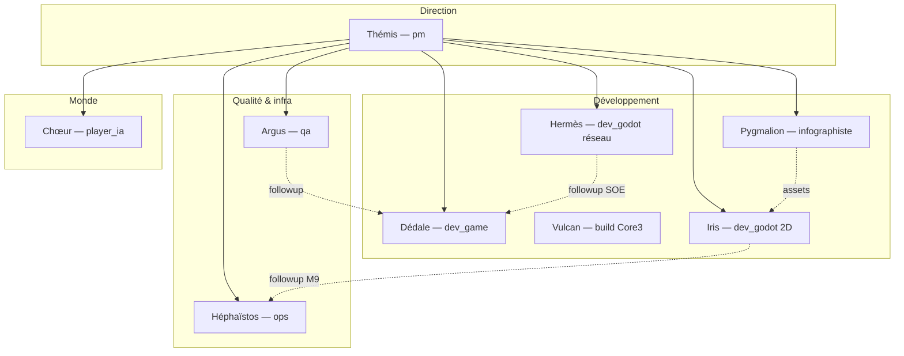
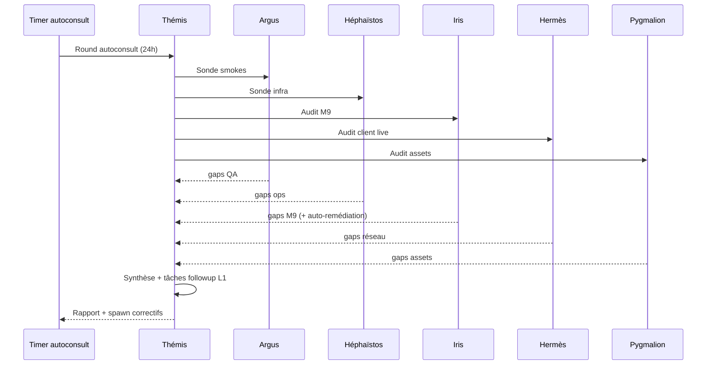

# Vision — Équipe studio type Fable / Claude (autonomie + autoconsultation)

**Date** : 2026-07-12  
**Statut** : cible produit — phase **E** (extension ADR 0014)  
**Références** : [architecture_equipe_virtuelle_studio.md](architecture_equipe_virtuelle_studio.md), [jalon_equipe_godot_dev_ia.md](jalon_equipe_godot_dev_ia.md)

---

## 1. Ambition

Une **équipe virtuelle complète**, calquée sur un studio Fable / équipe Claude Code :

| Propriété | Description |
|-----------|-------------|
| **Spécialisation** | Chaque agent = persona + domaine + sondes dédiées |
| **Autonomie L1** | Sondes, audits, remédiation scriptée sans humain |
| **Autoconsultation** | Les agents se consultent entre eux avant d'escalader |
| **Évolution** | Corriger infra + projet en boucle Plan → Act → Verify |
| **Garde-fous L2+** | Write / build / think-tick → token humain |

Ce n'est **pas** un remplacement de Cursor/Claude sur le poste dev : c'est la **couche 140** qui tourne 24/7, consulte le repo, l'infra LAN, et propose ou applique des correctifs bornés.

---

## 2. Roster cible (complet)



| Agent | Rôle API | Autonomie | Sondes / actions L1 |
|-------|----------|-----------|---------------------|
| **Thémis** | `pm` | L0–L1 | Brief réunification, synthèse autoconsult |
| **Argus** | `qa` | L1 | Smokes LAN, validation Godot |
| **Héphaïstos** | `ops` | L1 | Healthz, sync VM, storage, Ollama |
| **Dédale** | `dev_game` | L0–L1 | Forge gameplay, bugs, OpenGame |
| **Vulcan** | `dev_game` + `core3_build` | L1 plan / L2 build | Build Core3 ZB |
| **Iris** | `dev_godot` + `iris` | L1 | M9, UI Godot, export POI |
| **Hermès** | `dev_godot` + `hermes` | L1 | SOE, ZB, gateway lbg-ws/2 |
| **Pygmalion** | `dev_game` + infographiste | L1 | Manifest GLB, textures SVG |
| **Chœur** | `player_ia` | L1 probe / L2 think | Sidecar 246, Lia/Nix |

Déclarations : `agents/declarations/*.json` — registre central `team/agent_registry.py`.

---

## 3. Boucle autoconsultation (Fable-like)

Inspirée **Plan → Consult → Act → Verify → Synthesize** :



**Principe autoconsultation** : Thémis ne décide pas seule — elle **agrège les sondes** de chaque spécialiste, détecte les **conflits** (ex. POI serveur ≠ Godot), et **route** le gap au bon agent (Iris vs Hermès vs Pygmalion vs ops).

---

## 4. Niveaux d'autonomie (rappel)

| Niveau | Comportement | Exemples équipe |
|--------|--------------|-----------------|
| **L0** | Suggestion only | Forge OpenGame sans apply |
| **L1** | Read + scripts idempotents | Sondes, export POI, sync assets VM, smokes |
| **L2** | Write avec token | Build Core3, think/tick player_ia, deploy prod |
| **L3** | Write allowlist (futur) | Patch auto GDScript validé par smoke |

**Cible Fable** : maximiser **L1** (auto-remédiation) + **L2** avec token Pilot pour le reste.

---

## 5. Écart actuel → cible

| Capacité | Aujourd'hui | Cible |
|----------|-------------|-------|
| Roster personas | ✅ 9 agents | ✅ |
| Timers par piste | ✅ M9, Godot dev, QA, autoconsult 24h | Fusion unique timer (optionnel) |
| Followups auto | ✅ QA, Godot, M9 | ✅ cross-agent |
| Auto-remédiation | ✅ M9a export | Étendre ops sync, assets |
| Autoconsultation | ✅ Round Thémis (5 sondes + followups) | Hermès + Dédale dans le round |
| Forge GDScript auto | ✅ Iris L1 staging M9 | LLM + Hermès recettes |
| Registre agents | ✅ `agent_registry.py` + `/team/meta` | Timers par agent dans meta |
| dev_infra dédié | ❌ (ops) | Optionnel phase E+ |

---

## 6. Phase E — livrables techniques

| ID | Livrable | Statut |
|----|----------|--------|
| E-1 | Registre `agent_registry.py` + déclarations JSON | ✅ |
| E-2 | Workflow `autoconsult_workflow.py` | ✅ |
| E-3 | Timer `lbg-team-autoconsult-job` (24h) | ✅ |
| E-4 | Preset Pilot **Autoconsult équipe** | ✅ |
| E-5 | `GET /v1/team/meta` enrichi (agents, timers) | ✅ |
| E-6 | Forge GDScript Iris (gaps → patch proposal) | ✅ L1 staging |
| E-7 | L2 auto avec token semi-auto Pilot | existant jobs |

Install :
```bash
bash infra/scripts/install_team_autoconsult_job_vm.sh
```

Variables :
```bash
LBG_TEAM_AUTOCONSULT_JOB_ENABLED=1
LBG_TEAM_AUTOCONSULT_FOLLOWUP_AUTO_RUN=1
LBG_TEAM_M9_AUTO_REMEDIATE=1
```

---

## 7. Comment l'humain intervient (poste dev / Claude)

| Canal | Rôle |
|-------|------|
| **Pilot `#/team`** | Approuver L2, lancer presets, lire synthèses |
| **Cursor / Claude Code** | Implémenter ce que l'équipe ne peut pas (GDScript complexe, refactors) |
| **Brief réunification** | Valider priorités Thémis |
| **Token L2** | Build Core3, think/tick, deploy |

L'équipe **prépare le terrain** (gaps, scripts, sync) ; l'humain **valide** les actions à effet de bord.

---

## 8. Critères de succès phase E

- [x] Round autoconsult branché dans `_execute_pm` + preset Pilot
- [x] Hermès (SOE/gateway) inclus dans les sondes autoconsult
- [ ] Round autoconsult 24h actif sur 140 sans intervention
- [ ] Synthèse PM liste gaps par agent avec owner
- [ ] Followups L1 auto-run > 80 % des gaps infra/M9/assets
- [ ] `/v1/team/meta` expose les 9 agents + capacités
- [ ] M9 full vert sur 140 après round (sync + remédiation)

---

## 9. Roadmap phase F (post-E)

1. **Iris forge** — génération patches `.gd` / `.tscn` à partir des gaps (L2 review)
2. **Pygmalion pipeline** — export Blender → GLB automatique sur gap manifest
3. **Héphaïstos L2** — playbook Proxmox backup check avec token
4. **Mémoire équipe** — JSONL learnings par agent (`LBG_TEAM_MEMORY_PATH`)
5. **Chat inter-agents** — messages structurés (schéma JSON) type Fable crew

---

## Liens

- [equipe_autonome_godot.md](equipe_autonome_godot.md)
- [jalon_equipe_godot_dev_ia.md](jalon_equipe_godot_dev_ia.md)
- [jalon_m9_scrapaltai_map_minimap.md](jalon_m9_scrapaltai_map_minimap.md)
- [jalon_infographiste_ia.md](jalon_infographiste_ia.md)
