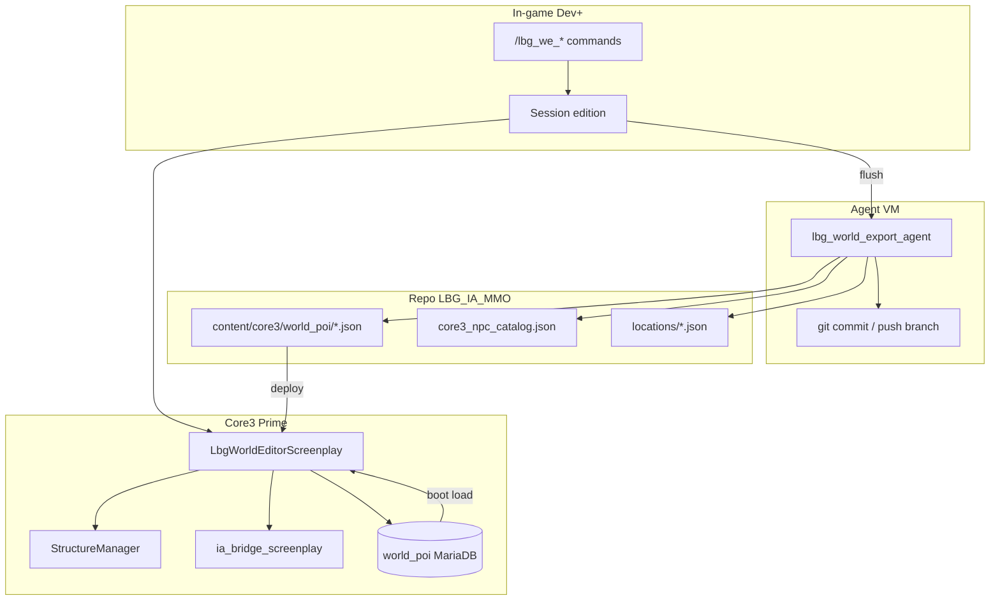
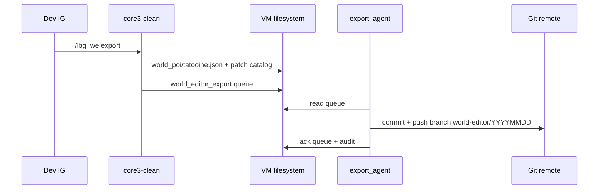

# Plan — Éditeur monde Prime (PNJ + POI bâtiment)

**Statut** : **v1 partiellement en service** (Lua spatial + export catalogue, juin 2026)  
**ADR** : [`docs/adr/0008-world-editor-world-poi.md`](adr/0008-world-editor-world-poi.md)  
**Cible** : serveur **Prime** (Core3-clean, VM 245, Tatooine)  
**Handoff / reprise** : [`docs/world_editor_handoff_demain.md`](world_editor_handoff_demain.md)  
**Décisions produit (2026-05-30)** : PNJ + centre ME · table `world_poi` · Dev+ · export auto repo via agent VM.

---

## Objectif v1

Permettre à un **Dev ou Admin** de :

1. **Placer / déplacer / supprimer** des PNJ IA (posts roster, entries simples) avec **x, y, z, cell, heading** capturés in-game.
2. **Poser / retirer** le **bâtiment POI** du centre d’entraînement Mos Eisley et lier ses **cellules** aux posts trainers.
3. **Exporter automatiquement** vers le repo Git (`content/core3/world_poi/` + mise à jour catalogue PNJ).

**POI pilote (historique ME)** : `poi:mos_eisley_training_center` — voir [`content/core3/locations/mos_eisley_training_center.json`](../content/core3/locations/mos_eisley_training_center.json).

**Cible produit (2026-06)** : hub **Lost Heaven** sur Scrapaltai — [`docs/adr/0009-scrapaltai-lost-heaven.md`](adr/0009-scrapaltai-lost-heaven.md), ancre [`content/core3/locations/lost_heaven_hub.json`](../content/core3/locations/lost_heaven_hub.json), export POI [`content/core3/world_poi/scrapaltai.json`](../content/core3/world_poi/scrapaltai.json).

---

## Périmètre et non-objectifs

| In scope v1 | Hors scope v1 |
|-------------|----------------|
| 7 rosters trainers ground ME + export cell | 3 rosters pilotes starport (phase 1b) |
| 1 structure POI (centre ME) | Multi-POI autres villes |
| Objets décor **liste blanche** (optionnel fin v1) | Décoration libre |
| Export JSON + audit | SUI graphique avancée |
| Reboot / reload screenplay | Hot-reload sans restart |

---

## Architecture



### Réutilisation « villes joueur » Core3

| Brique vanilla | Usage éditeur |
|----------------|---------------|
| `StructureManager::placeStructure` | Pose POI staff (comme `CreateSpawningElement spawn`) |
| Templates `object/building/player/...` ou POI custom | IFF centre ME (à choisir en recon) |
| Cellules structure | **Source de vérité** pour `post.cell` des trainers |
| Deeds / `PlaceStructureComponent` | **Non** — trop UX joueur |
| `CityRegion` / mairie | **Contourné** — flag `world_poi` bypass `isBuildingPermittedAt` pour compte `LBG_WORLD` |
| `playerstructures` DB | **Non** — table dédiée |

### Séparation Pixie Seat (mmo_server)

Grilles Watabou, `area_gen`, intérieurs 2D = **autre pipeline**. Pas de réutilisation directe pour Tatooine 3D en v1. Pont futur possible (layout 2D → liste templates 3D).

---

## Modèle de données

### Table SQL `world_poi`

Base : MariaDB Prime (même instance que comptes / structures).

```sql
CREATE TABLE world_poi (
  id              BIGINT UNSIGNED AUTO_INCREMENT PRIMARY KEY,
  poi_id          VARCHAR(64) NOT NULL UNIQUE COMMENT 'ex. poi:mos_eisley_training_center',
  zone            VARCHAR(32) NOT NULL DEFAULT 'tatooine',
  label           VARCHAR(128) NOT NULL,
  structure_template VARCHAR(255) NOT NULL COMMENT 'chemin template IFF',
  object_id       BIGINT UNSIGNED NULL COMMENT 'OID structure Core3 apres spawn',
  world_x         FLOAT NOT NULL,
  world_y         FLOAT NOT NULL,
  world_z         FLOAT NOT NULL,
  heading         FLOAT NOT NULL DEFAULT 0,
  root_cell_id    BIGINT UNSIGNED NULL COMMENT 'cell racine structure si connu',
  status          ENUM('draft','active','removed') NOT NULL DEFAULT 'draft',
  roster_links    JSON NULL COMMENT '["roster:mos_trainer_brawler", ...]',
  meta_json       JSON NULL COMMENT 'notes, building_ref, export_ts',
  created_by      VARCHAR(64) NULL,
  updated_at      TIMESTAMP DEFAULT CURRENT_TIMESTAMP ON UPDATE CURRENT_TIMESTAMP,
  INDEX idx_zone_status (zone, status)
) ENGINE=InnoDB DEFAULT CHARSET=utf8mb4;
```

### Table SQL `world_poi_npc_slot` (option v1 ou v1.1)

Snapshots des posts édités avant fusion catalogue :

```sql
CREATE TABLE world_poi_npc_slot (
  id              BIGINT UNSIGNED AUTO_INCREMENT PRIMARY KEY,
  poi_id          VARCHAR(64) NOT NULL,
  slot_key        VARCHAR(64) NOT NULL COMMENT 'ex. brawler_post',
  pilot_id        VARCHAR(64) NULL,
  roster_id       VARCHAR(64) NULL,
  mobile_template VARCHAR(64) NOT NULL,
  cell_id         BIGINT UNSIGNED NOT NULL DEFAULT 0,
  x               FLOAT NOT NULL,
  y               FLOAT NOT NULL,
  z               FLOAT NOT NULL,
  heading         FLOAT NOT NULL DEFAULT 0,
  updated_at      TIMESTAMP DEFAULT CURRENT_TIMESTAMP ON UPDATE CURRENT_TIMESTAMP,
  UNIQUE KEY uk_poi_slot (poi_id, slot_key),
  FOREIGN KEY (poi_id) REFERENCES world_poi(poi_id) ON DELETE CASCADE
) ENGINE=InnoDB DEFAULT CHARSET=utf8mb4;
```

### Fichier repo `content/core3/world_poi/tatooine.json`

```json
{
  "schema_version": 1,
  "zone": "tatooine",
  "exported_at": "2026-05-30T14:00:00Z",
  "exported_by": "lbg@vm245",
  "pois": [
    {
      "poi_id": "poi:mos_eisley_training_center",
      "label": "Centre d'entraînement Mos Eisley",
      "structure_template": "object/building/TBD_training_annex.iff",
      "world": { "x": 3460, "y": -4670, "z": 6, "heading": 0 },
      "root_cell_id": 0,
      "roster_links": [
        "roster:mos_trainer_brawler",
        "roster:mos_trainer_marksman",
        "roster:mos_trainer_scout",
        "roster:mos_trainer_medic",
        "roster:mos_entertainer_trainer",
        "roster:mos_trainer_politician",
        "roster:mos_trainer_artisan"
      ],
      "npc_slots": [
        {
          "slot_key": "brawler_post",
          "roster_id": "roster:mos_trainer_brawler",
          "service_post": { "x": 3462, "y": -4660, "z": 6, "heading": 180, "cell": 0 }
        }
      ]
    }
  ]
}
```

L’agent VM fusionne `npc_slots` → `core3_npc_catalog.json` (`service_post` + `binding.post` + `home` = post).

---

## Droits (Dev+ uniquement)

Référence : [`docs/lbg_admin_levels.md`](lbg_admin_levels.md), ADR 0006.

| Niveau | Accès éditeur |
|--------|----------------|
| 0–2 (Player, GM, Mod) | **Refusé** |
| **3 (Dev)** | **Oui** — place / export / POI draft |
| **4 (Admin)** | **Oui** — + promote POI `draft` → `active`, rollback |

Contrôle C++/Lua (double garde) :

```text
effectiveAdmin = min(account.admin_level, playerObject.adminLevel)
autorise si effectiveAdmin >= 3
```

Journal : `ia_bridge/world_editor_audit.jsonl` (actor, action, poi_id, pilot_id, coords, ts).

---

## Commandes staff v1 (proposition)

Préfixe **`/lbg_we`** (world editor) — à implémenter dans `LbgWorldEditorScreenPlay` ou module Lua dédié.

| Commande | Action |
|----------|--------|
| `/lbg_we session on\|off` | Active session édition (buffer local + audit) |
| `/lbg_we dump` | Affiche position + **cell** + heading sous les pieds |
| `/lbg_we npc place <pilot_id\|roster_post>` | Spawn / déplace PNJ IA au dump courant |
| `/lbg_we npc remove [target]` | Despawn + retire slot session |
| `/lbg_we poi place <poi_id> <structure_template>` | Pose structure via StructureManager (compte LBG_WORLD) |
| `/lbg_we poi remove <poi_id>` | Retire POI (status removed, despawn structure) |
| `/lbg_we poi cells <poi_id>` | Liste cell IDs enfants (debug) |
| `/lbg_we export` | Flush session → JSON + queue agent Git |
| `/lbg_we status` | POI actifs, slots pending export |

Alias court accepté plus tard ; v1 = commandes explicites.

---

## Agent export VM (auto → repo)

Script cible : `infra/scripts/lbg_world_export_agent.sh`  
Service : `infra/systemd/lbg-world-export-agent.service` (+ timer ou trigger post-`/lbg_we export`).

### Flux



### Prérequis VM

| Élément | Détail |
|---------|--------|
| Clone Git | `/opt/LBG_IA_MMO` (déjà utilisé pour content/core3) |
| Identité Git | Deploy key read/write limitée au repo |
| Branche | `world-editor/auto` ou PR depuis bot — **pas** push direct `main` sans review |
| Secrets | `LBG_WORLD_EXPORT_GIT_*` dans `lbg.env` (non versionné) |
| Idempotence | Export queue avec `export_id` UUID ; retry 3× |

### Fichiers produits par export

| Fichier | Action |
|---------|--------|
| `content/core3/world_poi/tatooine.json` | Créé / mis à jour |
| `content/core3/core3_npc_catalog.json` | Merge `service_post` + cells |
| `content/core3/locations/mos_eisley_training_center.json` | Sync posts + `building_cell` |
| `content/core3/world_poi/audit/*.jsonl` | Append-only (optionnel miroir repo) |

Post-export côté dev : review PR → `deploy_core3_ia_bridge_vm.sh --restart`.

---

## Phases d’implémentation

### Phase 0 — Prérequis (1–2 j)

- [ ] Migration SQL `world_poi` (+ `world_poi_npc_slot` si retenu)
- [ ] Compte système `LBG_WORLD` + perso technique (ou OID fixe structure)
- [ ] Documenter template IFF centre ME (recon IG + liste `object/building/...` candidates)
- [ ] Capturer **root_cell_id** + 1 post test en intérieur

### Phase 1 — PNJ editor (1–2 sem.)

- [x] `LbgWorldEditorScreenplay` : garde Dev+ (compte + perso), session, `lbg_we dump|npc place|npc remove` (spatial)
- [x] Export → merge catalogue / `world_poi/tatooine.json` (7 trainers ME, barmans, entertainers — juin 2026)
- [ ] Audit JSONL stable en prod
- [x] Tests IG : trainers intérieur ME (cells 1189634–1189639) après export + deploy
- [ ] Client `/lbgwe` (TRE optionnel) — voir handoff

**Livrable** : Bige / brawler au poste dans le centre (cell correcte). **Atteint** pour les 7 professions ME.

### Phase 2 — POI bâtiment centre ME (2–3 sem.)

- [ ] Hook `StructureManager::placeStructure` staff (bypass CityRegion pour `LBG_WORLD`)
- [ ] CRUD `world_poi` table + boot reload
- [ ] `/lbg_we poi place|remove|cells`
- [ ] Lier `poi_id` ↔ 7 rosters catalogue

**Livrable** : structure persistée + trainers alignés salles.

### Phase 3 — Agent export Git (1 sem.)

- [ ] `lbg_world_export_agent.sh` + systemd
- [ ] `/lbg_we export` enqueue
- [ ] PR auto ou branche `world-editor/auto`
- [ ] Runbook + smoke (export dry-run sans push)

**Livrable** : édition IG → commit Git sans SSH manuel catalogue.

### Phase 4 — Durcissement (backlog)

- [ ] SUI minimal (liste POI / slots)
- [ ] Undo session
- [ ] Objets décor liste blanche
- [ ] Réplication modèle Bestine / Mos Espa

---

## POI pilote — centre d’entraînement ME

| Champ | Valeur actuelle | Action éditeur |
|-------|-----------------|----------------|
| `poi_id` | `poi:mos_eisley_training_center` | Fixe v1 |
| Ancre monde | 3460, -4670, z=6 | `/lbg_we poi place` |
| `building_cell` | **0 (à corriger)** | `/lbg_we poi cells` après pose |
| 7 posts | [`mos_eisley_training_center.json`](../content/core3/locations/mos_eisley_training_center.json) | `/lbg_we npc place` par roster |
| Rosters | `core3_npc_catalog.json` | Export merge auto |

**Critère de succès v1** : en phase **travail**, exactement **7 instructeurs** (un par métier) visibles **dans** le centre, conversables, suffixe `(PNJ IA)`, sans doublon vanilla outdoor.

---

## Risques et mitigations

| Risque | Mitigation |
|--------|------------|
| Cell 0 → PNJ hors intérieur | Dump obligatoire en session ; export refuse si `cell=0` en intérieur |
| Navmesh après structure | Runbook restart zone ; test spawn avant export |
| Export Git conflit | Branche dédiée bot ; merge manuel |
| GM abuse | Garde `admin_level >= 3` serveur-side |
| Mélange POI / housing joueur | Table `world_poi` isolée ; owner `LBG_WORLD` |

---

## Tests

| Test | Type |
|------|------|
| Dev 3 place NPC intérieur | Manuel IG |
| GM 1 `/lbg_we dump` | Doit refuser |
| Export → JSON valide | Script `python3 -m json.tool` CI |
| Boot charge POI actif | Smoke post-restart |
| Catalogue pilots count ≥ 36 | VM `catalog_boot.log` |

Script smoke futur : `infra/scripts/smoke_core3_world_editor_export.sh`.

---

## Documentation liée

| Doc | Lien |
|-----|------|
| PNJ rollout | [`core3_ia_npc_rollout.md`](core3_ia_npc_rollout.md) |
| Admin levels | [`lbg_admin_levels.md`](lbg_admin_levels.md) |
| Housing / structures | [`core3_housing_swim_flight_study.md`](core3_housing_swim_flight_study.md) |
| Runbook deploy | [`core3_prime_runbook.md`](core3_prime_runbook.md) |
| Locations ME | [`content/core3/locations/mos_eisley_training_center.json`](../content/core3/locations/mos_eisley_training_center.json) |

---

## Backlog tickets (résumé)

| ID | Titre | Phase |
|----|-------|-------|
| WE-001 | Migration SQL `world_poi` | 0 |
| WE-002 | Compte `LBG_WORLD` | 0 |
| WE-003 | Screenplay `LbgWorldEditorScreenPlay` + garde Dev+ | 1 |
| WE-004 | Commandes `/lbg_we dump|npc *` | 1 |
| WE-005 | Merge export → catalogue (cell) | 1 |
| WE-006 | POI place/remove StructureManager | 2 |
| WE-007 | Boot load `world_poi` | 2 |
| WE-008 | Agent `lbg_world_export_agent` | 3 |
| WE-009 | Runbook + smoke export | 3 |
