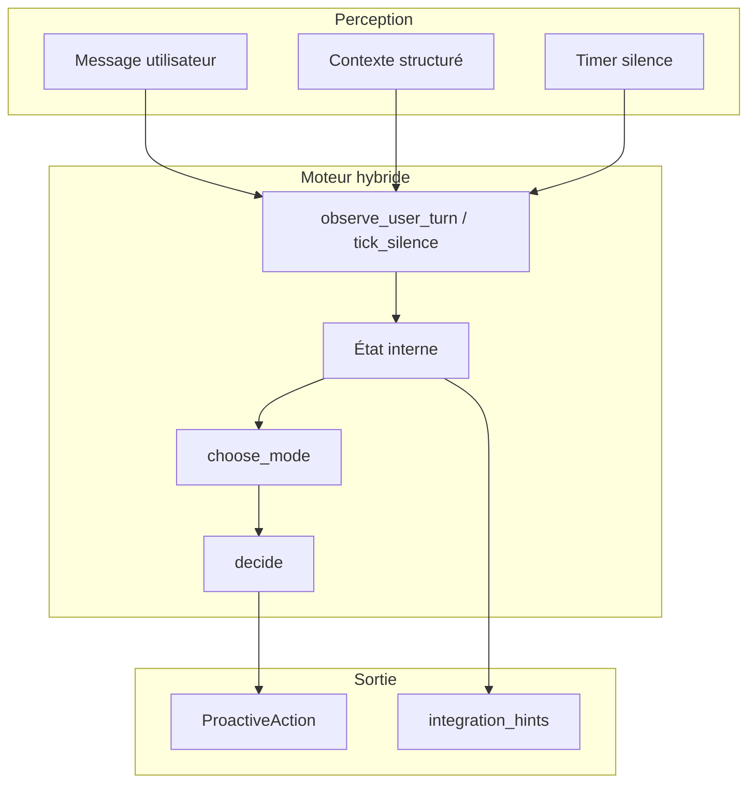

# Architecture

## Vue logique

## Modules

### `engine.py`

- **`AgentInternalState`** : `curiosite`, `tension`, `mode`, `objectifs`, `memoire_courte`, horodatage et estimation de silence.
- **`HybridProactiveEngine`**
  - **`observe_user_turn(message, context)`** : met à jour mémoire courte, objectifs, signaux dérivés du contexte (champs manquants, incohérence, formulations « floues »).
  - **`tick_silence(dt)`** : augmente tension / curiosité si l’utilisateur ne parle pas ; applique la pression de stagnation.
  - **`choose_mode(context)`** : règles de priorité **autonome** → **avancé** → **léger**.
  - **`decide(context)`** : produit une **`ProactiveAction`** (message + type + catégorie de question éventuelle).
- **`integration_hints(state, world_context)`** : dictionnaire **JSON-friendly** pour un orchestrateur (mode, jauges, drapeaux `suggest_clarify_intent`, `allow_autonomous_followup`, ids monde optionnels).

Heuristiques volontairement **simples** : prévisibles, testables, remplaçables par des modèles plus fins.

### `memory.py`

- **`LongTermMemoryStore`** : append en mémoire, persistance **JSONL** optionnelle, **`recall(query)`** par mots-clés, **`context_hints`** pour prompts.

### `team.py`

- **`MultiAgentProactiveCoordinator`** : trois instances de **`HybridProactiveEngine`** (rôles Architecte, Orchestrateur, Game designer), chacune reçoit la même observation avec un **léger biais** curiosité/tension.
- **`decide_with_memory`** : injecte les indices mémoire dans le contexte, puis retient l’action dont le **mode** a le rang le plus élevé (autonome > avancé > léger), avec **tie-break** sur le rôle actif.
- **`team_integration_hints`** : même principe que `integration_hints` mais pour l’état du moteur du rôle actif + champ `active_specialist`.

## Machine à modes (résumé)

| Mode | Conditions typiques (ordre de priorité) |
|------|----------------------------------------|
| `autonome` | `tension ≥ seuil` (défaut 0,6) **ou** silence long + objectif `bloque` |
| `proactif_avance` | objectif flou, `missing_info`, curiosité élevée, signaux contexte |
| `proactif_leger` | contexte relativement clair, tension modérée |

## Données de contexte recommandées

Champs **optionnels** mais utiles pour la décision :

| Clé | Effet |
|-----|--------|
| `intent` | Si absent en mode léger → question de clarification |
| `objectif`, `contraintes` | Manque → montée de curiosité |
| `objectif_flou`, `missing_info` | Pousse vers mode avancé |
| `incoherent` | Monte la tension, bloque l’objectif cohérence |
| `long_term_recall` | Rempli automatiquement par le coordinateur si mémoire branchée |

## Extension LLM

Le crochet **`message_generator(template, state, context)`** reçoit le gabarit sémantique courant et l’état ; tu peux y brancher un appel modèle pour personnaliser **`action.message`** sans changer la logique de mode.
